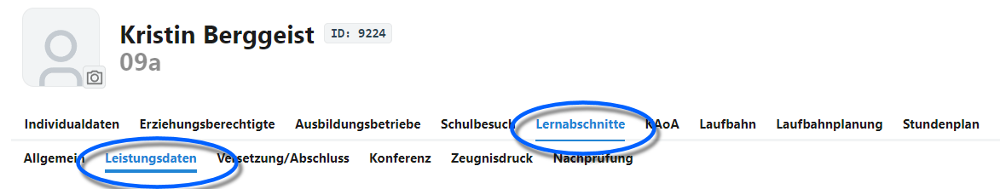
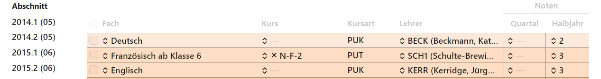
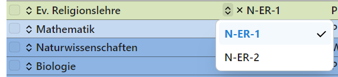
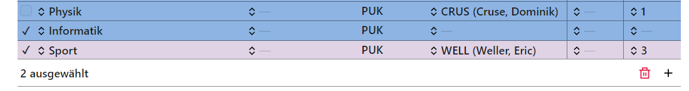

# Leistungsdaten 

Über die Leistungsdaten werden die zugeordneten Fächer und Kurse in einem Halbjahr bei einem Schüler angezeigt.

In der Auswahlliste finden sich alle für diesen Schüler vorhandenen **Lernabschnitte**. Wird einer dieser Lernabschnitte ausgewählt, werden die für in diesem Lernabschnitt belegten Fächer und Kurse anzeigt.

Zu jedem **Fach** lassen sich die Lehrkraft und die Noten erfassen. Im SVWS-Client können neben der tatsächlichen **Halbjahresnote** auch eine **Quartalsnote**, etwa in der gymnasialen Oberstufe oder für Elternsprechtage, erfasst werden.  

Normaler Fachunterricht im Klassenverband bekommt die Kursart *PUK*, dies steht für Pflichtunterricht im Klassenverband.

Andere Kursarten können für Kurse *PUT* ("Pflichtunterricht für Teile von Klassen") oder in der gymnasialen Oberstufe etwa die *GKS* für einen "Schriftlichen Grundkurs" oder *AB4* für das vierte Abiturfach sein.

Handelt es sich bei dem Unterricht um einen **Kurs**, ist der betreffende Kurs über ein Dropdown-Menü anzuwählen.

Über das Dropdown-Menü stehen die für das Fach und den Jahrgang definierten Kurse zur Verfügung. Hier im Beispiel werden Kurse für das Fach "Ev. Religionslehre" gesetzt.

Werden Einträge über die Checkboxen angewählt, lassen sie sich unten rechts mit dem roten Mülleimer 🗑 löschen.

Mit dem ***+*** lassen sich manuell Unterrichte hinzufügen und dann konfigurieren.

