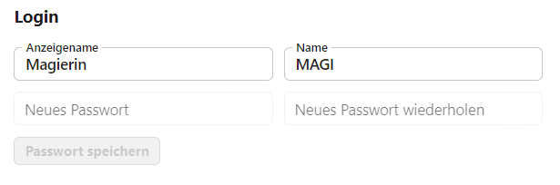
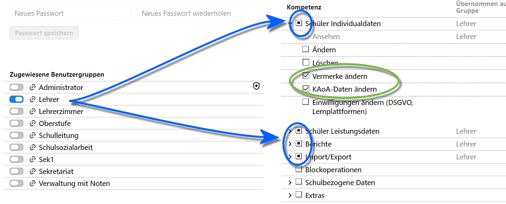

# Benutzerverwaltung

Im Bereich **Benutzer** werden die einzelnen Benutzer und ihre Berechtigungen eingerichtet.

Hierzu werden erst **Benutzergruppen** eingerichtet, die per Schalter für einzelne Benutzer aktiviert werden können. Die Nutzer erhalten dann die für diese Benutzergruppe definierten Berechtigungen. 

## Benutzer anlegen

)

Über die Auswahlliste erreichen Sie alle eingerichteten Benutzer, das Suchfeld grenzt Benutzer auf im Feld eingegebene Zeichenketten ein.

W#hlen Sie einen Benutzer an, um die **Berechtigungen** zu bearbeiten.

Per Checkbox angewhählte Benutzer können **gelöscht** werden.

Über das **+** werden neue Benutzer angelegt. Ein Klick öffnet das Fenster, in dem neue Benutzer erzeugt werden können:


Vergeben Sie einen **Anzeigenamen**, einen **Anmeldenamen** und ein erstes **Passwort**.

Beim Anmeldenamen empfiehlt es sich bei Lehrkräften, das *Kürzel* zu verwenden. Das Passwort muss unter Umständen Mindestanfordernungen in Bezug auf Lände, Groß- und Kleinschreibung und/oder Sonderzeichen genügen.

Das **X** oben rechts bricht die Eingabe ab.

Ein Klicka auf ```Weiter``` legt den Benutzer an.

## Benuter verwalten

Ein angelegter und dann in der Auswahhliste angewählter Benutzer kann bearbeitet werden.



Bei einem angewählten Benutzer lassen sich **Anzeigename**, der **Name** zur Anmeldung und das **Passwort** ändern.

## Rechte zuweisen

**Hinweis:** Konsultieren Sie zur Erstellung von Benutzergruppen den entsprechenden Artikel.

Weiterhin lässt sich ein in der Auswahlliste gewählter Benutzer **Benutzergruppen** zuordnen.



Dieser Benutzer hat nun die Rechte der Benutzergruppe.

Hat ein Benutzer ein Einzelrecht, wird dies durch einen Haken in der Checkbox ☑ kenntlich gemacht.

Manche Rechte sind in in Gruppen zusammengefasst, hat ein Nutzer alle Rechte in einer Gruppe, wird die ganze Gruppe ebenfalls mit einer abgehakten Checkbox ☑ gekennzeichnet. Hat ein Nutzer mindestens ein Recht in der Gruppe, aber nicht alle, wird eine mit einem Punkt markierte Checkbox verwendet.

Einem Benutzer können mehrere Benutzergruppen zugewiesen werden, so dass dieser Benutzer Rechte von mehreren Gruppen erhält. Eine Beutzergruppe entspricht einer Rolle, der die Person an Ihrer Schule nachkommt.

Zusätzlich können einem Benutzer indivdiuell weitere Rechte gegeben werden.

Hier im Screenshot ist zu sehen, dass die Person der Gruppe *Lehrer* zugeordnet wurde und zusätzlich noch individuell die Rechte *Vermerke ändern* und *KAoA-Daten ändern* erhält. 

Die **Benutzergrupppe Administrator** nimmt eine Sonderrolle ein. Ein Admininistrator darf alles. Zusätzlich kann unter Umständen konkret die Rolle "Ist Administrator" abgefragt werden. Etwa für die Anmeldung im AdminClient muss der verwendete Benutzer auch ein Administrator sein.

**Tipp:** Nutzen Sie für die tägliche Arbeit keinen Nutzer aus der Gruppe der Administratoren.

