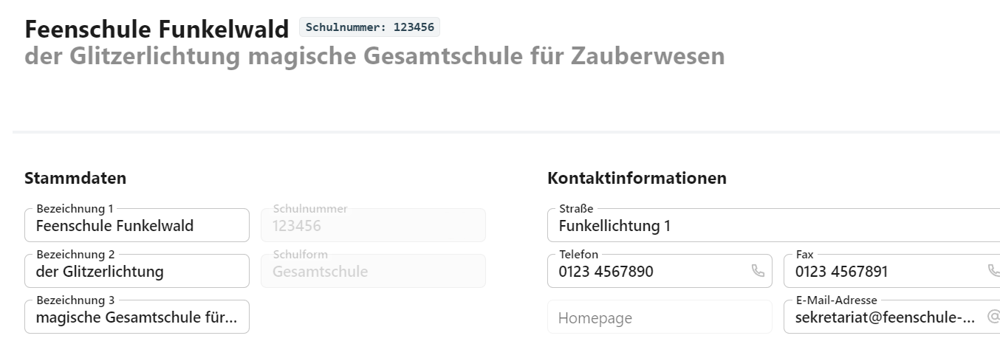

# Schule

## Stammdaten und Kontaktinformationen
In der Übersicht **Schule** werden allgemeine Angaben zur Schule aufgenommen.

Oben werden Name und Schulnummer angezeigt, darunter lassen sich die **Stammdaten** mit den drei Bezeichungen zur Schule wie auch die Adresse und andere Kontaktdaten angeben.

## E-Mail-Server

Geben Sie grundlegende Daten zur Verwendung eines SMTP-Mailservers zur Versendung von E-Mails ein.

Die konkreten Anmeldedaten werden in der Schaltfläche **Aktueller Benutzer** oben links in der Kopfzeile bezogen auf eben den aktuellen Nutzer eingegeben.

## Weitere Untermenüs

Über die linke Auswahlspalte sind von hier die Verwaltung für die **Benutzer** und ihre **Benutzergruppen** zu erreichen, mit denen die Recht der einzelnen Benutzer gesteirt werden.

Weiterhin ist hier der Bereich **Datenaustausch** zu öffnen, über den Exporte und Importe von und an Software oder Dateien ermöglicht wird.

**TODO**

