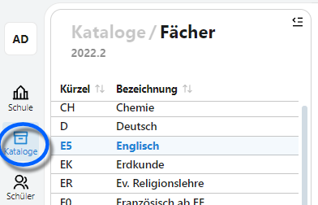
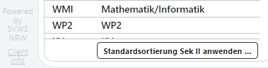
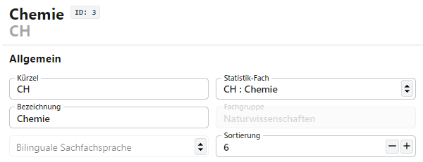
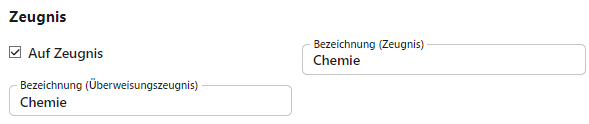
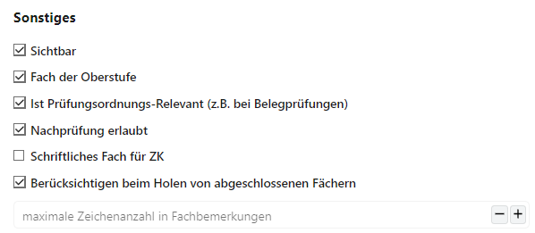

# Fächer

## Auswahlliste
Hier lassen sich die Fächer Ihrer Schule anlegen und konfigurieren.

In der Auswahlliste lassen sich die Fächer nach dem *Kürzel* oder der *Bezeichnung* sortieren.

Unten im Bereich der Auswahlliste können Sie die Fächer über **Standardsortierung der Sek II anwenden...** entsprechend sortieren. Die Sortierreihenfolge der Sek-II-Fächer wird geändert, die Fächer der Sek I bleiben unberührt.

Bestätigen Sie mit **OK**.

## Allgemein

Unter den allgemeinen Einstellungen legen Sie die grundsätzlichen Daten des Faches fest.
* Das **Kürzel** und die **Bezeichnung**
* Unter welcher Statistik-Bezeichnung das Fach erfasst wird. Beachten Sie hier die jeweils aktuellen *Eintragungshilfen* und *Schlüsseltabellen* von IT.NRW zur amtlichen Schulstatistik. Viele Fehler mit Fächern sind in der Praxis, etwa bei Abschlussberechungen und so weiter, auf fehlerhafte oder veraltete Statistikwerte zurückzuführen.
* Die **Fachgruppe**, zu der das Fach gehört, wird automatisch mit dem **Statistik-Fach** gesetzt.
* Wird das Fach bilungual unterrichtet, setzen Sie die **Bilungaule Sachfachsprache**.
* Über die **Sortierung** lässt sich die Reihenfolge des Faches im Katalog und den Dropdown-Menüs festlegen. Die Liste beginnt mit der Position *0*. Nutzen Sie die Pfeile, um eine andere Sortierung festzulegen oder tragen Sie direkt einen neuen Wert ein.

## Zeugnis

In diesem Bereich steuern Sie, ob und wie die Fächer auf Zeugnissen erscheinen.

Die **Bezeichungen** für das normale **Zeugnis** und das **Überweisungszeugnis** sollten so gesetzt werden, dass sie in die Felder auf den Stadandard-Zeugnisformularen passen.

Mit dem Schalter **Auf Zeugnis** lässt sich steuern, ob ein Fach grundsätzlich für Zeugnisse berücksichtigt werden soll.

## Sonstiges

Hier lassen sich für Fächer wesentliche Einstellungen vornehmen. 

* Über den Haken **Sichtbar** lässt sich steuern, ob ein Fach in Dropdown-Menüs zur Auswahl gestellt wird oder nicht. Halten Sie die Listen übersichtlich, indem Sie alle nicht-verwendeten Fächer auf nicht-sichtbar stellen. Entfernen Sie hierzu die Haken.

* Ist der Haken bei **Fach der Oberstufe** gesetzt, wird das Fach bei der entsprechenden Sortierungsfunktion beachtet. Weiterhin steht es zum konfigurieren als Oberstufenfach zur Verfügung und zur Laufbahnplanung konfiguriert werden kann.

* Über **Ist Prüfungsordnungs-Relevant** lässt sich steuern, ob das Fach grundsätzlich in z.B. Belegprüfungen herangezogen werden soll oder ignoriert wird.

* Steht das Fach bei Minderleistungen für eine eine Ausgleich ermöglichende Nachprüfungen zur Verfügung, setzen Sie den Haken bei **Nachprüfung erlaubt**, damit der Versetzungsalgorithmus das Fach vorschlagen kann.

* Markieren Sie das Fach über **Schrifliches Fach für ZK**, wenn das Fach bei Zentralen Prüfungen, wie der ZP10, bei den schriftlichen Prüfungen vorgesehen ist.

* Soll das Fach in vorherigen Schuljahren abgeschlossen werden, aber in späteren Zeugnissen berücksichtigt werden, ist es hier über **Berücksichtigen beim Holen von abgeschlossenen Fächern** zu markieren.

* Stellen Sie positive Werte für die **maximale Zeichenzahl in Fachbemerkungen** ein, um die frei oder nach Floskeln zu vergebende Fachbemerkungen in *Schüler ➜ aktueller Abschnitt ➜ Leistungsdaten* in der Eintragslänge zu begrenzen. **Hinweis:** Sollten Sie hier eine Grenze vorgeben wollen, achten Sie darauf, dass alle eventuell zugelassenen Floskeln diesen Anforderungen genügen.
