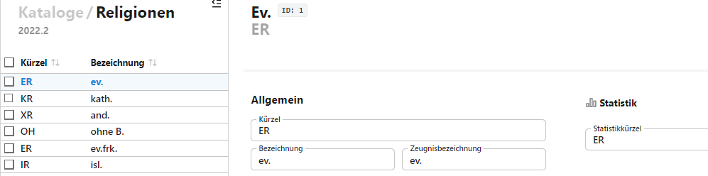

# Religionen

Über diesen Katalog werden die möglichen Religionszugehörigkeiten definiert.

Stellen Sie das intern verwendete **Kürzel**, die angezeigte **Bezeichnung** und die auf Zeugnissen ausgegebenee **Zeugnisbezeichnung** ein.

Achten Sie bei letzterer darauf, dass diese in die Felder der offziellen Zeugnisformulare passt.

Stellen Sie zur korrekten Erfassung der Religionszugehörigkeiten das dazugehörende **Statistikkürzel** ein.

:: danger Konfessionen werden nach den Schlüsseltabellen zugeordnet
Sie können an Ihrer Schule Konfessionen frei nach Bedarf erfassen. Konsultieren Sie bei der Einstellung der *Statistikzuordnung* unbedingt die Eintragungshilfen und Schlüsseltabellen von IT.NRW der amtlichen Schulstatistik zur aktuell korrekten Erfassung der Religionszugehörigkeiten. Diese spiegeln mitunter politische Entscheidungen wieder.
:::