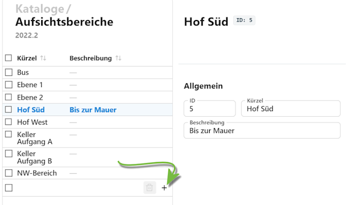

# Aufsichtsbereiche

Die Katalogeinträge für *Räume*, *Pausenzeiten*, *Zeitraster*, *Klassen* und *Aufsichtsbereiche* werden bei der Stundenplanerstellung zusammengeführt.

Über den Katalog Aufsichtsbereiche lassen sich eben diese für die Schule definineren.

Für jeden Aufsichtsbereich lässt sich ein **Kürzel** und eine **Beschreibung** festlegen, nach der sich die Aufsichtsbereiche in der Auswahlliste sortieren lassen.

Über das **+** lassen sich neue Aufsichtsbereiche anlegen.