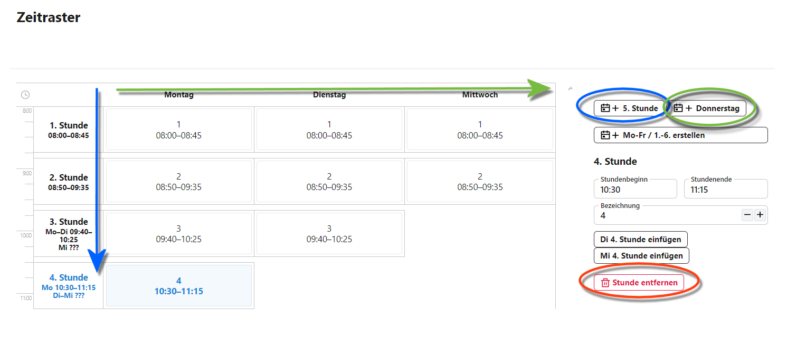
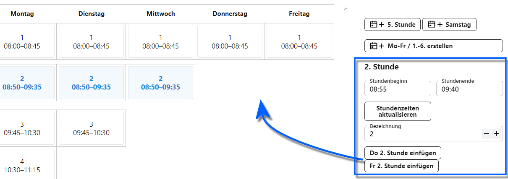
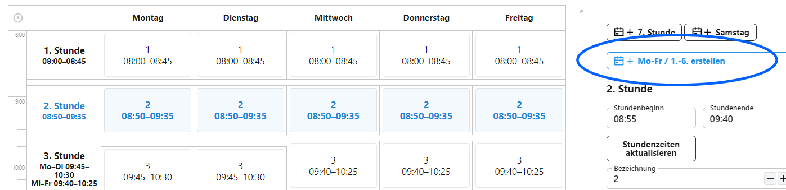

# Zeitraster

Die Vorlageneinträge für *Räume*, *Pausenzeiten*, *Zeitraster*, *Klassen* und *Aufsichtsbereiche* werden bei der Stundenplanerstellung zusammengeführt.

Über *Allgemeine Vorlagen ➜ Zeitraster* können Stundenraster angelegt werden.

**Hinweis:** Die angelegten Stunden sollten sich mit den Pausenzeiten aus *Kataloge ➜ Pausenzeiten* decken.

Über die *blau markierte* Schaltfläche lassen sich **Wochenstunden** erzeugen. Sie fügen also grundsätzlich eine 1. Stunde, 2. Stunde und so weiter dem Zeitraster hinzu.

Per Standard wird diese erste Stunde für Montag angelegt.

Sie können Stunden bis 24:00 anlegen.

Mit der *grün markierten* Schaltfläche werden von links nach rechts weitere Stunden für die **Wochentage** erzeugt.

Sie können Zeitraster von Montag bis Sonntag anlegen.

Wählt man eine **Stunde** oder eine **Spalte für Wochenstunden** an, lassen sich diese Bereiche mit der *roten* Schaltfläche **entfernen**.

Analog lässt sich bei einer Anwahl des **Wochentags** dieser mit der dann **Wochentag entfernen** genannten Schaltfläche entfernen.

Beim Hinzufügen von Stunden lassen sich die Zeiten für **Beginn** und **Ende** angegeben. 

Die Schaltfläche **Stundenzeiten aktualsieren** passt alle schon für diese Woche in der aktuellen Spalte eingetragenen Stunden an die neue Zeit an.

Die Schaltflächen passen sich nun dynamisch an die vorhandenen Wochentage an, die in der aktull gewählten Spalte noch keine Stunde haben. Somit lassen sich die Stunden für die jeweiligen Wochentage hinzufügen.

Die Schaltfläche **Mo-Fr / 1.-6. erstellen** erzeugt ein Standardraster für die ganze Woche mit üblichen Stundenzeiten. Diese lassen sich im Anschluss komfortabel über die Funktion **Stundenzeiten aktualisieren** an die gewünschten Stundenzeiten anpassen.

Das Zeitraster lässt es zu, dass sich Stunden überschneiden.