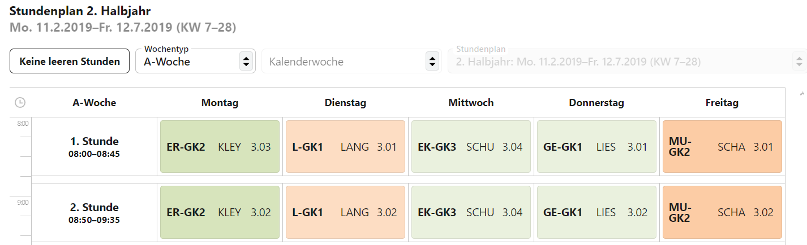
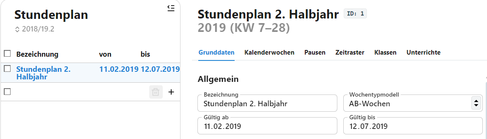
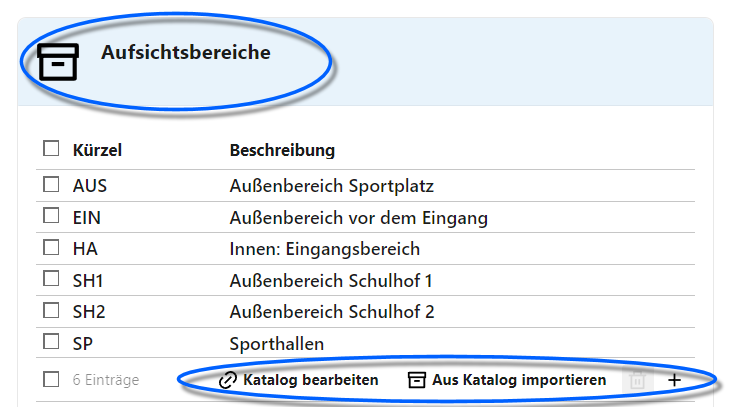
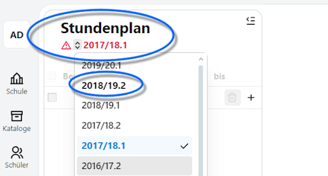
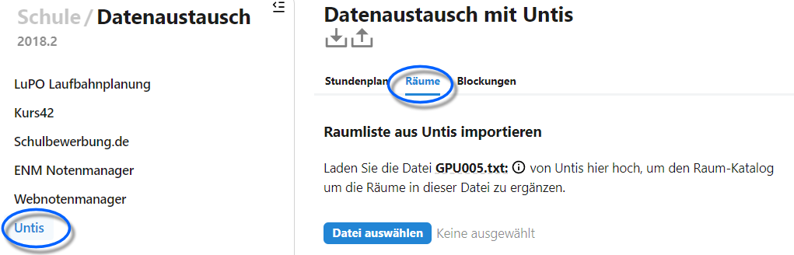
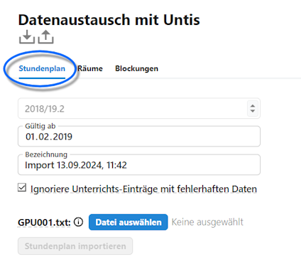

# Stundenplanerstellung



## Stundenpläne abrufen und nutzen

Fertige Stundenpläne können über die **App Stundenpläne** abgerufen werden. Etwa kann man sich in den **Tabs** in dieser App die *Pausen*, zu den *Zeitrastern* oder *Klassen* zugeordneten Unterichte abrufen.

Weiterhin sind derzeit aktive Stundenpläne auch über die Apps zu *Schülern*, *Lehrkräften* oder *Klassen* zu den jeweils gewählten Einträgen abrufbar. 

## Grundlgende Funktion des Stundenplans

Im SVWS-Server lassen sich alle Daten hinterlegen, die für einen Stundenplan benötigt werden und auch der Stundenplan selbst kann über den SVWS-Client abgerufen werden.

Der SVWS-Client selbst ist kein Stundenplanprogramm, daher ist kein Erstellungsalgorithmus hinterlegt. Ebenso wird die Unterrichtsverteilung, auf welcher ein Stundenplan erzeugt wird, nicht über den SVWS-Client erstellt.

Stundenpläne lassen sich manuell selbst erstellen und für einfachere Schulformen ist dies auch ein gangbarer Weg, zusammen mit den Leistungsdaten Stunden und Aufsichten zu planen.

## Zusammenhang der Kataloge mit dem Stundenplan

Es lassen sich im SVWS-Client mehrere Stundenpläne erzeugen, die jeweils ihren Geltungsbereich haben.

Dies hat zur Folge, dass Änderungen an den Katalogen nicht direkt in existierenden Stundenplänen auftauchen können.

Beispiel: Das Angebot der Räume der Schule ändert sich etwa durch Umbenennung oder Umbauten, so dass Räume dazukommen oder wegfallen. Hiermit würde eine Änderung im Katalog für das kommende Schuljahr alte oder aktuelle Stundenpläne falsche Daten darstellen lassen oder gar verplante Räume entfernen.

Daher verfügt jeder definierte Stundenplan eigene "Stundenplan-Kataloge", die bei der Erstellung des Stundenplans aus den echten Katalogen übernommen werden und dann in Zukunft immer einzeln und bewusst anzupassen sind.

## Vorherige Dateneingabe

Mit dem SVWS-Client lassen sich für die Schule **Stundenpläne** erstellen.



Die Voraussetzung hierfür sind, dass unter den jeweiligen Katalogen schon die notwendigen Daten eingetragen sind. Um einen Stundenplan zu erstellen, ist es notwendig, dass diese Daten vorhanden und *korrekt befüllt* sind:
* Die Schule muss über ein **Zeitraster** verfügen.
* Es müssen **Pausenzeiten** und entsprechende
* **Aufsichtsbereiche** vorliegen.
* Auch müssen **Räume** mit einer Bezeichnung und passenden maximalen Personenzahlen angelegt sein.

Bezüglich der Schülerverwaltung sind zuvor
* **Jahrgänge** und
* **Klassen** zu definieren.
* Sollen **Kurse** verwendet werden, sind diese ebenfalls anzulegen.

Weiterhin sind in der Schule **Unterrichte** zu planen. Dieses geschieht über das Zuweisen von Klassen- oder Kursunterrichte in den Leistungsdaten der Schüler.

Ganz links in der Auswahlliste finden sich unterschiedliche Stundenpläne in der Übersicht.

Sofern andere Programme genutzt werden, um etwa *Räume* zu verwalten, kann die Liste hier in einem Textformat als Katalog importiert werden. Zum Aufbau dieser Importdatei findet sich mehr beim *Katalog zu den Räumen*. 


Sofern einer der Einträge aus einem *Katalog* kommt, kann im zugehörigen Bereich der jeweilige Katalog direkt *bearbeitet* oder *importiert* werden.

Unter den **Grunddaten** eines jeden Stundeplans lälsst sich seine **Bezeichnung** und der Gültigkeitssbereich mit **Gültig ab** und **Gültig bis** einstellen. 

Ebenso wählen Sie bei Bedarf ein **Wochentypmodell** (siehe ersten Screenshot). Zur Auswahl stehen hier
* *keins* für keine Wechselwochen und dann
* *Ab-Wochen*, *ABC-Wochen* oder *ABCD-Wochen* für entsprechend zwei-, drei- oder vierwöchtigen Wechsel.
* Sollten noch mehr Wochen wechseln, lässt sich mit *weitere* eine Wahl treffen, bei der zusätzlich ein Feld *Wochentypmodell* eingeblendet wird, bei dem sich eine ganze Zahl für den Wochentyp anwählen lässt.

Wird ein Wechselwochenmodell gewählt, lassen sich auch die **Kalenderwochen** whählen, jeweils mit der *KW* und ihrem Datumsbereich und welcher *Wochentyp* - also A, B, C usw. - für diese KW gelten soll. Somit sind auch unregelmäßige Muster einstellbar.

## Übersicht in Unterrichte

**TODO** Wie man die Übersicht nutzt und filtert

**TODO**

**TODO**

## Erstellen und Importieren eines Stundenplans

Für ein Halbjahr können mehrer Stundenpläne für unterschiedliche Geltungsbereiche angelegt werden.

Eine Konsequenz hieraus ist, dass auch Stundenpläne zur Planung für die Zukunft erstellt und angelegt werden können.



Der aktuell gewählte Abschnitt ist mit einem Haken ✓ markiert, der aktuell Lernabschnitt der Schule ist **fett** hinterlegt.

Der Stundenplan kann nun in einfachen Fällen manuell erstellt werden oder über ein Stundenplanprogramm berechnet werden.

Sind die grundsätzlichen Einstellungen vorhanden, wir ein kompletter Stundenplan über **Datenaustausch Untis** eingelesen und einem definierten Stundenplan zugewiesen.



Die verwendete Datei ist eine .csv-Datei mit einer UTF-8-Enocidierung ohne BOM. Trennzeichen ist das Semikolon **;** und Textinhalte werden in Anführungszeichen **"** eingeschlossen.

Weiterhin lässt sich auch ein kompletter Stundenplan aus Units importieren.

Das Untis-Format wurde leicht verändert, so dass auch ein *wochentyp* angegeben werden kann: *null* ist hier der Standard mit nur einer Woche, *1* und *2* werden zu A- und B-Wochen.



Es gelten die gleichen Kriterien zum Import wie oben genannt. 

Wählen Sie zuerst einen **Lernabschnitt**, dann den Bereich, ab dem der Stundenplan **gültig** sein soll und schließlich eine **Bezeichnung**.

Ist der Haken bei der Einstellung gesetzt, **Fehler zu ignorieren**, werden keine Fehlermeldungen ausgeben, sondern nur Logeinträge erzeugt. Weiterhin werden Unterrichte ignoriert, bei denen die Kürzel für Klassen, Kurse und Lehrkräfte nicht in der SVWS-Datenbank vorhanden sind.

Nach der Wahl einer Datei und einem Klick auf ```Stundenplan importieren``` wird der Stundenplan mit der gewählten Bezeichnung im Lernabschnitt angelegt.

## Stundenplan manuell erstellen und anpassen

Um einen Stundenplan komplett neu zu erstellen oder einen existierenden anzupassen, werden Unterrichte - die über eine Zuordnung von Klassen- und Kursunterrichten in den Leistungsdaten stammen - über Drag & Drop in das in die Rasterübersicht unter **Klassen** gezogen. 

Auch wenn die Gymnasiale Oberstufe keine *Klasse*, sondern ein *Jahrgang* ist, ist sie hier unter dem Tab Klassen zu verwalten.

Wurde ein Wochentyp mit Wechselwochen eingerichtet, werden hier auch die Unterrichte in die passenden Wochen-Plätze gezogen.

Lesen Sie für die detallierte Erklärung bitte **Anleitungen ➜ Stundenpläne**. 


