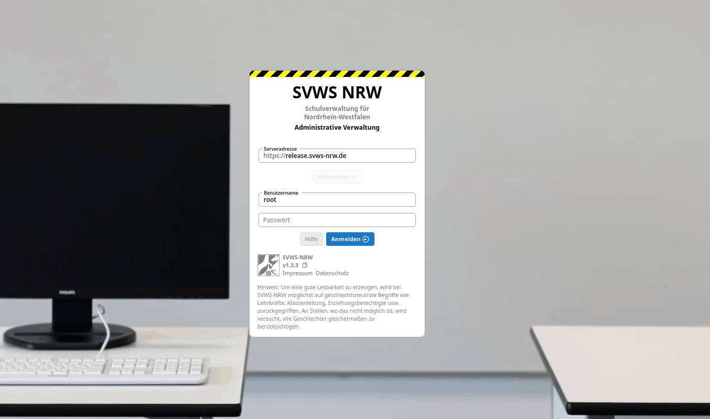
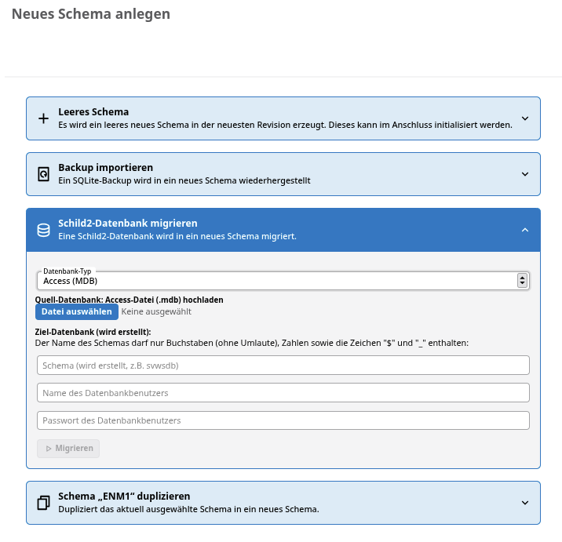

# Datenmigration

Bei der Datenmigration werden neue Schemata oder vorhandene Schemata in der Datenbank des SVWS-Servers angelegt und die Daten einer existierenden Datenbank in diese migriert.

Zur Datenmigration mit dem AdminClient nutzen Sie das [Benutzerhandbuch zum AdminClient](../../adminclient/index.md).

[https://github.com/SVWS-NRW/SVWS-TestMDBs](https://github.com/SVWS-NRW/SVWS-TestMDBs)

## Übersicht

Es gibt mehrere Möglichkeiten, ein Schema in der Datenbank anzulegen bzw. zu befüllen:

+ per SVWS-AdminClient (empfohlen)
+ per API (für den Einsatz in Skripten)

## Migration per SVWS-AdminClient (empfohlen)



### Kurzübersicht

+ Rufen Sie unter `https://MeinSVWS-Server/admin` Ihren SVWS-AdminClient auf.
+ Melden Sie sich als root an der MariaDB an.
+ Drücken Sie auf das + Zeichen
+ Wählen Sie Schild2-Datenbank migrieren aus.
+ geben Sie die entsprechenden Daten ein.



Alternativ zum Mariadb-Root kann auch ein anderer Datenbankbenutzer verwendet werden. Die verfügbaren Datenbanken und Funktionen richten sich dabei nach den im Mariadb-Server vergebenen Berechtigungen.

Mit dem AdminClient können – abhängig von den Rechten des Datenbankbenutzers – folgende Aufgaben durchgeführt werden:

+ Datenbankschema für SVWS anlegen und in die `svwsconfig.json` aufnehmen
+ Datenbank mit Schulnummer initialisieren
+ SchILD-NRW 2 Datenbank in Schema migrieren
+ SQLite-Backup ausführen
+ SQLite-Backup wieder einspielen
+ Datenbankschema löschen

::: tip weitere Informationen:
[Benutzerhandbuch SVWS-AdminClient](../../adminclient/index.md).

:::

## Migration per API

```bash
curl --user "%1:%2" -k -X POST "https://localhost/api/schema/root/migrate/mdb/%3"
-H "accept: application/json"
-H "Content-Type: multipart/form-data"
-F "databasePassword=%4"
-F "schemaUsername=%5"
-F "schemaUserPassword=%6"
-F "database=@%7"
```

+ %1: Benutzer der Datenbank mit `GRANT`-Rechten, zum Anlegen neuer Datenbanken
+ %2: Passwort der o.g. Benutzers
+ %3: Name der neu anzulegenden Datenbank - Achtung: existierende Datenbanken werden überschrieben!
+ %4: Das SchILD-NRW 2 - Passwort, um die MDB-Datenbank zu öffnen.
+ %5: Der neue MariaDB-Benutzer für die neue Datenbank (Schuldatenbankadmin im Backend)
+ %6: Passwort des o.g. Benutzers
+ %7: vollständiger Pfad zur MDB auf dem Server - MIT @ davor!

Beispiel:

```bash
curl --user "root:mariabd_root_pw" -k -X "POST" "https://server.svws-nrw.de/api/schema/root/migrate/mdb/svwsdb" \
 -H "accept: application/json"  \
 -H "Content-Type: multipart/form-data" \
 -F "databasePassword=kannManWissen" \
 -F "schemaUsername=svwsuser" \
 -F "schemaUserPassword=svwsadmin_PW" \
 -F "database=@/root/SVWS-TestMDBs/GOST_Abitur/Abi-Test-Daten-01/GymAbi.mdb"
```

Sie können die API des SVWS-Server auch mit der Swagger Oberfläche ansteuern bzw.ausprobieren. 

[API SVWS Server](../../development/API/index.md)

## Download von Testdaten

Für Testzwecke und Schulungen werden anonymisierte Datenbanken verschiedener Schulformen vorgehalten. Zu bestimmten Datenbanken sind auch passende WebLuPO Dateien etc. vorhanden, um sich passende Testfälle anzusehen.

::: danger Anonymisiert
Die Daten sind vollständig anonymisiert!
:::

Download auf Github: [SVWS-TestMDBs](https://github.com/SVWS-NRW/SVWS-TestMDBs)

## bekannte Fehlerquellen

In einigen Situation kann eine Migration misslingen.

Hier einige [Beispiele](./Fehlerquellen.md) und wie man damit umgehen kann.
