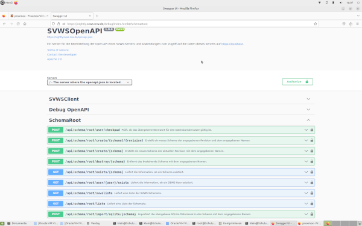

# Datenmigration

Neue Schemata oder vorhandene Schemata in der Datenbank des SVWS-Servers anlegen.

## Download von Testdaten

Für Testzwecke und Schulungen werden anonymisierte Datenbanken verschiedener Schulformen vorgehalten.
Zu bestimmten Datenbanken sind auch passende Lupo Dateien etc. vorhanden, um sich passende Testfälle anzusehen.  
**Die Daten sind vollständig anonymisiert!**


[https://github.com/SVWS-NRW/SVWS-TestMDBs](https://github.com/SVWS-NRW/SVWS-TestMDBs)

## Übersicht

Es gibt mehrer Möglichkeiten ein Schemata in der Datenbank anzulegen bzw. zu befüllen: 

+ per Admin-Webclient
+ per Swagger UI
+ per Curl Befehl
+ per Shell Skript
+ aus einer SQLite Datensicherung 
+ aus einem SQL-Dump

## Benutzung des Admin-Webclient


Melden Sie sich mit root und dem Kennwort an der MariaDB an.
Sie können auch einen anderen Datenbankuser wählen, dieser sieht dann die vorhandenen Datenbanken entsprechnd seiner Rechte.

Im Adminclient können je nach Rechtevergabe des Datenbankusers folgende Arbeiten erledigt werden:

- Datenbankschema für SVWS anlegen und in die svwsconfig.json aufnehmen
- Datenbank mit Schulnummer initialisieren
- Schild-NRW2 Datenbank in Schema migrieren
- SQLite-Backup ausführen
- SQLite-Backup wieder einspielen
- Datenbankschema löschen

Zur Datenmigration mit dem AdminClient nutzen Sie das [Benutzerhandbuch zum AdminClient](../../adminclient/index.md).

## Einfügen per SwaggerUI

Eine Übersicht über die Web-Services bietet die SwaggerUI. 
Hier kann man über *Try it Out* -- Buttons jeweils die Services ausprobieren bzw. benutzen.
Die Swagger UI aufrufen:

```bash
		https://<YourServerDomainName>/debug/
```




   
**Achtung:** Um auf der SwaggerUI diesen Service bzw. die mit "Root" gekennzeichneten Services nutzen zu können, muss man sich zuerst authentisieren, indem man auf ein rechts abgebildetes Schloss klickt. 


Hier nun den User `root` der MariaDB-Installation und das entsprechende Passwort angeben. 


**Hinweis** Möchte man andere "nicht root - Services" nutzen, so muss man sich mit dem SchILD-NRW 3.0-Benutzer bzw. SVWS-Benutzer anmelden.
 


Dann unter dem Abschnitt  
	-> "SchemaRoot /api/schema/root/migrate/mdb/{schema}"   
	-> *Try it Out*-Button  
drücken, so dass man diese Ansicht erhält:


Anschließend die folgenden Einträge unter der Maske ausfüllen:

+ **schema**: Hier steht der Name, der auch auf der Anmeldemaske dargestellt wird, z.B. Testschule. 
+ **Databasefile**: Hier können Sie z.B. eine SchILD-NRW 2.0-MDB-Datenbank aus der o.g. SVWS-TestMDBs einstellen.
+ **databasePassword**: Hier das SchILD-NRW 2.0 Access-Passwort angeben.
+ **SchemaUsername**: Einen beliebigen Usernamen angeben, z.B. svwsadmin, der bei der Einrichtung des Schemas auf der Datenbank für dieses Schema GRANT-Rechte erhält. 

Es kann auch ein schon existierender Benutzer genommen werden. 
Falls ein schon existierender Benutzer verwendet wird, muss das anschließend abgefragte Passwort natürlich passen.

++ **SchemaUserPasswort**: Passwort der o.g. (neu angelegte) MariaDB Users. 


# Schemata per Curl erstellen

```bash
 --user "%1:%2" -k -X POST "https://localhost/api/schema/root/migrate/mdb/%3" 
-H "accept: application/json" 
-H "Content-Type: multipart/form-data" 
-F "databasePassword=%4" 
-F "schemaUsername=%5" 
-F "schemaUserPassword=%6" 
-F "database=@%7"
```

+ %1: Benutzer der Datenbank mit GRAND-Rechten zum Anlegen neuer Datenbanken
+ %2: Passwort der o.g. Benutzers
+ %3: Name der neu anzulegenden Datenbank - Achtung: existierende Datenbanken werden überschrieben!
+ %4: Das allseits bekannte SchILD-NRW 2.0 - Passwort, um die MDB-Datenbank zu öffnen. 
+ %5: Der neue MariaDB User für die neue Datenbank (Schuldatenbankadmin im Backend)
+ %6: Passwort der o.g. Benutzers
+ %7: vollständiger Pfad zur MDB auf dem Server - MIT @ davor!


Beispiel: 
```bash
curl --user "root:mariabd_root_pw" -k -X "POST" "https://server.svws-nrw.de/api/schema/root/migrate/mdb/svwsdb" \
	-H "accept: application/json"  \
	-H "Content-Type: multipart/form-data" \
	-F "databasePassword=kannManWissen" \
	-F "schemaUsername=svwsuser" \
	-F "schemaUserPassword=svwsadmin_PW" \
	-F "database=@/root/SVWS-TestMDBs/GOST_Abitur/Abi-Test-Daten-01/GymAbi.mdb"
```

# Fehlerquellen
In einigen Situation kann eine Migration misslingen. Hier einige Beispiele und wie man damit umgehen kann.

## Tabellen verwenden Kleinschreibung

MariaDB/MySQL auf Windows oder macOs sind case insensitive, d.h. Groß- Kleinschreibung spielt keine Rolle.
Dies führt aber unweigerlich zu Problemen, wenn man diese Datenbanken, z.B. nach einem Dump/Restore auf einem Linux-Server weiter betreibt.

Der Fehler wird nicht sofort korrekt erkannt, es wird lediglich ausgegeben, dass keine Schulnummer in der Tabelle `EigeneSchule` zu finden war, obwohl dort eine gültige Schulnummer eingetragen ist.

Um die Tabellen mit der "korrekten" Schreibung wiederherzustellen, kann der SQL-Dump mittels `sed` korrigiert werden. Dazu werden alle
Tabellen gesucht und mit der anderen Schreibweise ausgetauscht:

```shell
sed -i -e 's/zuordnungreportvorlagen/ZuordnungReportvorlagen/g' -e 's/versetzung/Versetzung/g' -e 's/users/Users/g' -e 's/usergroups/Usergroups/g' -e 's/textexportvorlagen/TextExportVorlagen/g' -e 's/stundentafel_faecher/Stundentafel_Faecher/g' -e 's/stundentafel/Stundentafel/g' -e 's/schulleitung/Schulleitung/g' -e 's/schuljahresabschnitte/Schuljahresabschnitte/g' -e 's/schulformen/Schulformen/g' -e 's/schulecredentials/SchuleCredentials/g' -e 's/schuelerzuweisungen/SchuelerZuweisungen/g' -e 's/schuelerzp10/SchuelerZP10/g' -e 's/schuelerwiedervorlage/SchuelerWiedervorlage/g' -e 's/schuelervermerke/SchuelerVermerke/g' -e 's/schuelertelefone/SchuelerTelefone/g' -e 's/schuelerstatus_keys/SchuelerStatus_Keys/g' -e 's/schuelersprachpruefungen/SchuelerSprachpruefungen/g' -e 's/schuelersprachenfolge/SchuelerSprachenfolge/g' -e 's/schuelerreportvorlagen/SchuelerReportvorlagen/g' -e 's/schuelermerkmale/SchuelerMerkmale/g' -e 's/schuelerliste_inhalt/SchuelerListe_Inhalt/g' -e 's/schuelerliste/SchuelerListe/g' -e 's/schuelerlernplattform/SchuelerLernplattform/g' -e 's/schuelerlernabschnittsdaten/SchuelerLernabschnittsdaten/g' -e 's/schuelerleistungsdaten/SchuelerLeistungsdaten/g' -e 's/schuelerld_psfachbem/SchuelerLD_PSFachBem/g' -e 's/schuelerkaoadaten/SchuelerKAoADaten/g' -e 's/schuelergsdaten/SchuelerGSDaten/g' -e 's/schuelerfotos/SchuelerFotos/g' -e 's/schuelerfoerderempfehlungen/SchuelerFoerderempfehlungen/g' -e 's/schuelerfhrfaecher/SchuelerFHRFaecher/g' -e 's/schuelerfhr/SchuelerFHR/g' -e 's/schuelerfehlstunden/SchuelerFehlstunden/g' -e 's/schuelererzadr/SchuelerErzAdr/g' -e 's/schuelereinzelleistungen/SchuelerEinzelleistungen/g' -e 's/schuelerdatenschutz/SchuelerDatenschutz/g' -e 's/schuelerbkfaecher/SchuelerBKFaecher/g' -e 's/schuelerbkabschluss/SchuelerBKAbschluss/g' -e 's/schuelerankreuzfloskeln/SchuelerAnkreuzfloskeln/g' -e 's/schuelerabitur/SchuelerAbitur/g' -e 's/schuelerabifaecher/SchuelerAbiFaecher/g' -e 's/schuelerabgaenge/SchuelerAbgaenge/g' -e 's/schueler_allgadr/Schueler_AllgAdr/g' -e 's/schueler/Schueler/g' -e 's/schildfilter/SchildFilter/g' -e 's/schild_verwaltung/Schild_Verwaltung/g' -e 's/schema_status/Schema_Status/g' -e 's/schema_core_type_versionen/Schema_Core_Type_Versionen/g' -e 's/schema_autoinkremente/Schema_AutoInkremente/g' -e 's/religionen_keys/Religionen_Keys/g' -e 's/personengruppen_personen/Personengruppen_Personen/g' -e 's/personengruppen/Personengruppen/g' -e 's/personaltypen/PersonalTypen/g' -e 's/organisationsformenkatalog_keys/OrganisationsformenKatalog_Keys/g' -e 's/noten/Noten/g' -e 's/nichtmoeglabifachkombi/NichtMoeglAbiFachKombi/g' -e 's/nationalitaeten_keys/Nationalitaeten_Keys/g' -e 's/logins/Logins/g' -e 's/lernplattformen/Lernplattformen/g' -e 's/lehrermehrleistung/LehrerMehrleistung/g' -e 's/lehrerlernplattform/LehrerLernplattform/g' -e 's/lehrerleitungsfunktion_keys/LehrerLeitungsfunktion_Keys/g' -e 's/lehrerlehramtlehrbef/LehrerLehramtLehrbef/g' -e 's/lehrerlehramtfachr/LehrerLehramtFachr/g' -e 's/lehrerlehramt/LehrerLehramt/g' -e 's/lehrerfunktionen/LehrerFunktionen/g' -e 's/lehrerfotos/LehrerFotos/g' -e 's/lehrerentlastung/LehrerEntlastung/g' -e 's/lehrerdatenschutz/LehrerDatenschutz/g' -e 's/lehreranrechnung/LehrerAnrechnung/g' -e 's/lehrerabschnittsdaten/LehrerAbschnittsdaten/g' -e 's/kurslehrer/KursLehrer/g' -e 's/kursfortschreibungsarten/KursFortschreibungsarten/g' -e 's/kurse/Kurse/g' -e 's/kursartenkatalog_keys/KursartenKatalog_Keys/g' -e 's/kompetenzgruppen/Kompetenzgruppen/g' -e 's/kompetenzen/Kompetenzen/g' -e 's/klassenlehrer/KlassenLehrer/g' -e 's/klassenartenkatalog_keys/KlassenartenKatalog_Keys/g' -e 's/klassen/Klassen/g' -e 's/kaoa_zusatzmerkmal_keys/KAoA_Zusatzmerkmal_Keys/g' -e 's/kaoa_sbo_ebene4_keys/KAoA_SBO_Ebene4_Keys/g' -e 's/kaoa_merkmal_keys/KAoA_Merkmal_Keys/g' -e 's/kaoa_kategorie_keys/KAoA_Kategorie_Keys/g' -e 's/kaoa_berufsfeld_keys/KAoA_Berufsfeld_Keys/g' -e 's/kaoa_anschlussoption_keys/KAoA_Anschlussoption_Keys/g' -e 's/k_zertifikate/K_Zertifikate/g' -e 's/k_vermerkart/K_Vermerkart/g' -e 's/k_textdateien/K_Textdateien/g' -e 's/k_telefonart/K_TelefonArt/g' -e 's/k_sportbefreiung/K_Sportbefreiung/g' -e 's/k_schwerpunkt/K_Schwerpunkt/g' -e 's/k_schulfunktionen/K_Schulfunktionen/g' -e 's/k_schule/K_Schule/g' -e 's/k_religion/K_Religion/g' -e 's/k_ortsteil/K_Ortsteil/g' -e 's/k_ort/K_Ort/g' -e 's/k_lehrer/K_Lehrer/g' -e 's/k_kindergarten/K_Kindergarten/g' -e 's/k_haltestelle/K_Haltestelle/g' -e 's/k_foerderschwerpunkt/K_Foerderschwerpunkt/g' -e 's/k_fahrschuelerart/K_FahrschuelerArt/g' -e 's/k_erzieherfunktion/K_ErzieherFunktion/g' -e 's/k_erzieherart/K_ErzieherArt/g' -e 's/k_entlassgrund/K_EntlassGrund/g' -e 's/k_einzelleistungen/K_Einzelleistungen/g' -e 's/k_einschulungsart/K_EinschulungsArt/g' -e 's/k_datenschutz/K_Datenschutz/g' -e 's/k_beschaeftigungsart/K_BeschaeftigungsArt/g' -e 's/k_ankreuzfloskeln/K_Ankreuzfloskeln/g' -e 's/k_ankreuzdaten/K_Ankreuzdaten/g' -e 's/k_allgadresse/K_AllgAdresse/g' -e 's/k_adressart/K_Adressart/g' -e 's/jahrgaenge_keys/Jahrgaenge_Keys/g' -e 's/impexp_eigeneimporte_tabellen/ImpExp_EigeneImporte_Tabellen/g' -e 's/impexp_eigeneimporte_felder/ImpExp_EigeneImporte_Felder/g' -e 's/impexp_eigeneimporte/ImpExp_EigeneImporte/g' -e 's/herkunftsart_schulformen/Herkunftsart_Schulformen/g' -e 's/herkunftsart_keys/Herkunftsart_Keys/g' -e 's/herkunftsart/Herkunftsart/g' -e 's/herkunft_schulformen/Herkunft_Schulformen/g' -e 's/herkunft_keys/Herkunft_Keys/g' -e 's/herkunft/Herkunft/g' -e 's/floskeln/Floskeln/g' -e 's/floskelgruppen/Floskelgruppen/g' -e 's/fachkatalog_schulformen/FachKatalog_Schulformen/g' -e 's/fachkatalog_keys/FachKatalog_Keys/g' -e 's/fachkatalog/FachKatalog/g' -e 's/fachgruppen/Fachgruppen/g' -e 's/fach_gliederungen/Fach_Gliederungen/g' -e 's/erzieherlernplattform/ErzieherLernplattform/g' -e 's/erzieherdatenschutz/ErzieherDatenschutz/g' -e 's/einschulungsartkatalog_keys/EinschulungsartKatalog_Keys/g' -e 's/eigeneschule_zertifikate/EigeneSchule_Zertifikate/g' -e 's/eigeneschule_texte/EigeneSchule_Texte/g' -e 's/eigeneschule_teilstandorte/EigeneSchule_Teilstandorte/g' -e 's/eigeneschule_schulformen/EigeneSchule_Schulformen/g' -e 's/eigeneschule_merkmale/EigeneSchule_Merkmale/g' -e 's/eigeneschule_kursart/EigeneSchule_Kursart/g' -e 's/eigeneschule_kaoadaten/EigeneSchule_KAoADaten/g' -e 's/eigeneschule_jahrgaenge/EigeneSchule_Jahrgaenge/g' -e 's/eigeneschule_faecher/EigeneSchule_Faecher/g' -e 's/eigeneschule_fachteilleistungen/EigeneSchule_FachTeilleistungen/g' -e 's/eigeneschule_fachklassen/EigeneSchule_Fachklassen/g' -e 's/eigeneschule_abteilungen/EigeneSchule_Abteilungen/g' -e 's/eigeneschule_abt_kl/EigeneSchule_Abt_Kl/g' -e 's/eigeneschule/EigeneSchule/g' -e 's/credentialslernplattformen/CredentialsLernplattformen/g' -e 's/credentials/Credentials/g' -e 's/client_konfiguration_global/Client_Konfiguration_Global/g' -e 's/client_konfiguration_benutzer/Client_Konfiguration_Benutzer/g' -e 's/berufskolleg_fachklassen_keys/Berufskolleg_Fachklassen_Keys/g' -e 's/berufskolleg_berufsebenen3/Berufskolleg_Berufsebenen3/g' -e 's/berufskolleg_berufsebenen2/Berufskolleg_Berufsebenen2/g' -e 's/berufskolleg_berufsebenen1/Berufskolleg_Berufsebenen1/g' -e 's/berufskolleg_anlagen/Berufskolleg_Anlagen/g' -e 's/benutzerkompetenzen/BenutzerKompetenzen/g' -e 's/benutzergruppenmitglieder/BenutzergruppenMitglieder/g' -e 's/benutzergruppenkompetenzen/BenutzergruppenKompetenzen/g' -e 's/benutzergruppen/Benutzergruppen/g' -e 's/benutzeremail/BenutzerEmail/g' -e 's/benutzerallgemein/BenutzerAllgemein/g' -e 's/benutzer/Benutzer/g' -e 's/allgemeinemerkmalekatalog_keys/AllgemeineMerkmaleKatalog_Keys/g' -e 's/allgadransprechpartner/AllgAdrAnsprechpartner/g' dump.sql
```

Anschließend kann ein `restore` durchgeführt werden und die Migration sollte keine Probleme mit den Tabellennamen haben.

