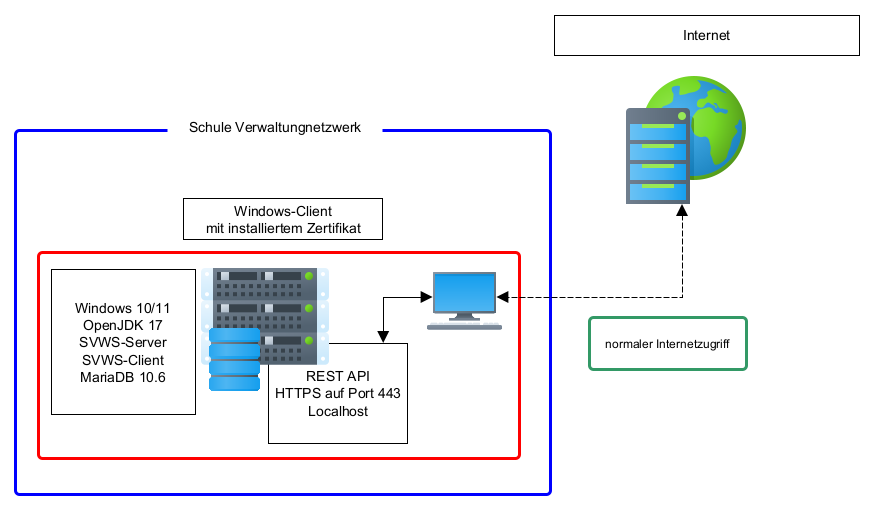
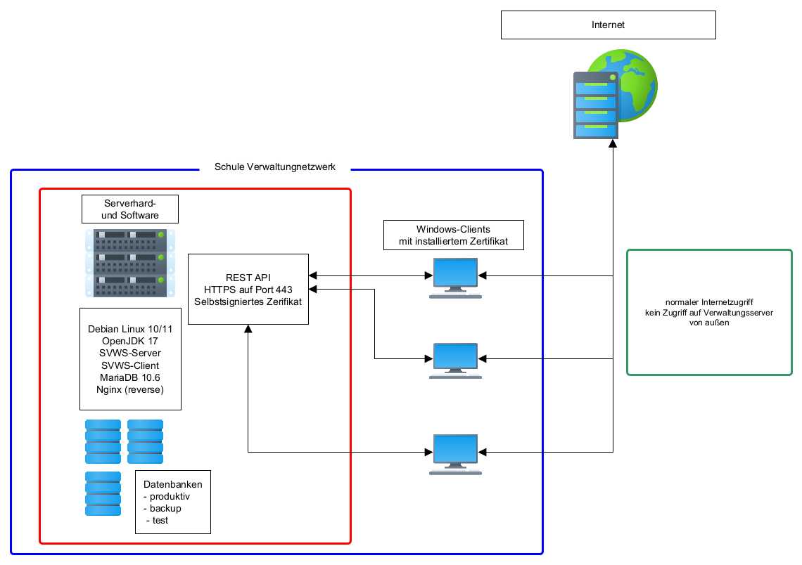
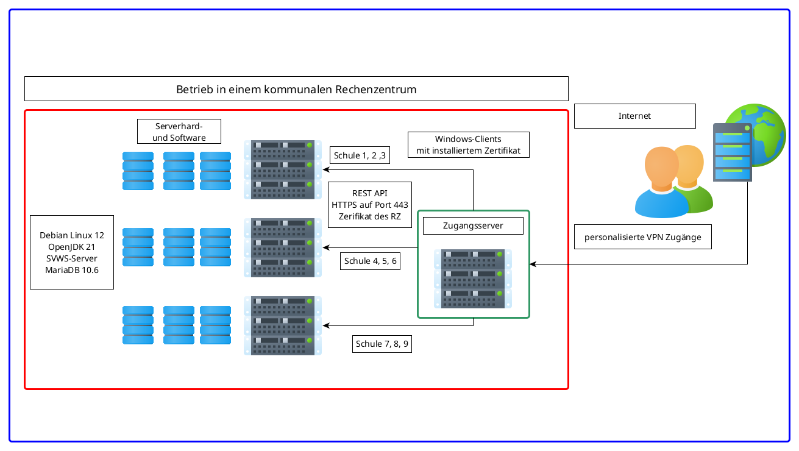

# IT-Umgebungen

## Szenarien

Der SVWS-Server ist so konzipiert, dass er in allen schulischen Einsatzszenarien betrieben werden kann. Grundlage hierfür ist der in Nordrhein-Westfalen verfolgte dezentrale Betriebsansatz.

Das Spektrum der Betriebsmodelle reicht von kleinen Grundschulen, die ihre Schulverwaltungssoftware gegebenenfalls auf einem einzelnen Rechner betreiben, über größere Schulen mit einer oder mehreren dedizierten Serverinstallationen bis hin zu Schulen, die den Betrieb durch einen externen IT-Dienstleister übernehmen lassen. Darüber hinaus unterstützt der SVWS-Server auch den zentralen Betrieb in Rechenzentren.

Durch diese Flexibilität kann der SVWS-Server an die jeweiligen technischen und organisatorischen Rahmenbedingungen der Schulträger und Schulen angepasst werden.

## Einzelplatz Installation

Mithilfe des Windows-Installers können der SVWS-Server und SchILD-NRW 3 auf einem einzelnen PC mit Windows 11 installiert werden.

Der SVWS-Server stellt seine Dienste über Port 443 bereit, sodass der SVWS-Client auch von anderen Rechnern im Netzwerk genutzt werden kann.

Ein vollständiger Serverbetrieb ist dabei jedoch nicht gewährleistet, da der Arbeitsplatzrechner außerhalb der Nutzungszeiten üblicherweise heruntergefahren wird.

Diese Variante eignet sich insbesondere für sehr kleine Schulen ohne eigene Serverinfrastruktur oder IT-Unterstützung.

## Server im Schulverwaltungsnetz

Die Installation eines SVWS-Servers erfolgt üblicherweise im Verwaltungsnetzwerk betrieben, getrennt vom pädagogischen Netzwerk. Der SVWS-Server stellt seine Dienste über Port 443 beziehungsweise 8443 bereit und kann sowohl auf Windows- als auch auf Linux-Systemen betrieben werden. Die Linux-Installation ermöglicht dabei einen vollständig lizenzkostenfreien Betrieb.

Das bei der Installation erzeugte Serverzertifikat sollte per Gruppenrichtlinie oder manuell an die Clients verteilt werden, damit Browser die Verbindung als sicher erkennen. Alternativ kann der Server über einen Reverse-Proxy mit einem Zertifikat, beispielsweise über Certbot, abgesichert werden.

SchILD-NRW 3 kann über eine Dateifreigabe oder per Gruppenrichtlinie auf den Verwaltungsrechnern verteilt werden. Aktuell benötigt SchILD-NRW 3 neben der Verbindung zum SVWS-Server zusätzlich einen direkten Zugriff auf die MariaDB-Datenbank. Perspektivisch wird dieser Zugriff vollständig über die REST-Schnittstelle des SVWS-Servers erfolgen.

## Kommunaler Server im Rechenzentrum

In kommunalen Umgebungen können mehrere Schulen gemeinsam auf einem SVWS-Server betrieben werden. Die Trennung der Schuldaten erfolgt dabei über separate Datenbankbenutzer und voneinander getrennte Datenbankschemata.

Die Datenhaltung kann je nach Betriebsmodell entweder über einzelne, den jeweiligen SVWS-Servern zugeordnete MariaDB-Instanzen oder über eine zentral verwaltete Datenbankumgebung erfolgen.

Die Anbindung der Schulen kann über VPN-Verbindungen realisiert werden. Dadurch ist ein lizenzkostenfreier Betrieb des SVWS-Servers auf Linux-Basis auch in zentralen Rechenzentrumsumgebungen möglich.

SchILD-NRW 3 kann an den Schulen kostenfrei über eine Netzwerkfreigabe bereitgestellt werden, analog zur bisherigen Bereitstellung von SchILD-NRW 2.

## best Praktice - Serverdimensionierung

Fragen zur Serverdimensionierung des SVWS-Servers (ohne Schild 3) sind naturgemäß in hohem Maße vom jeweiligen Nutzungsverhalten abhängig. Aus diesem Grund führen wir Lasttests durch, um kritische Prozesse zu identifizieren und gegebenenfalls geeignete Optimierungsmaßnahmen zu ergreifen.

Erfahrungswerte einzelner IT-Dienstleister und Schulungszentren können dabei als Orientierung dienen und aufzeigen, wie vergleichbare Umgebungen dimensioniert wurden.

Gerne nehmen wir auch Ihre Erfahrungen und Spezifikationen entgegen – insbesondere im Hinblick auf Virtualisierungslösungen auf Basis von Linux KVM, LXC oder Docker. Diese Rückmeldungen helfen uns dabei, unsere Empfehlungen zur Serverdimensionierung weiter zu verbessern und praxisnah auszurichten.

### Beispiel: Windowsserver im komunalen Umfeld

Die Windowsserver sind virtualisiert auf VMWare Basis, so dass bei Bedarf aufgestockt werden kann.

+ 10 Schulen mit 20 Datenbanken
+ Windows Server 2019 und 2025
+ 4 CPUs,
+ 16 GB RAM,
+ ca. 100 GB SSD (Bereitstellung je Schule)

Zitat: *"Die größte Last ist bisher das nächtliche Curl-Backup."*

### Beispiel: Proxmox Schulungsumgebung

Die Proxmox Vitualisierung bietet hier die Basis für 40 Debian Linux Container. Der Speicherplatz, Arbeitspeicher und CPU-last wird dabei dynamisch bis zu eingestelleten Obergrenze bereitgestellt.

+ 20 SVWS-Server mit 20 Mariadb-Server (unter Debian im LX-Container)
+ 20 Webserver für WeNoM und WebLuPO
+ 24 CPU
+ 128 GB RAM
+ 1000 GB SSD

Zitat: *"Bei der letzten Schulung haben wir mal an 15 Arbeitsplätzen gleichzeitig eine Datensicherung einlesen lassen. Dabei hatte der Server eine Prozessorauslaustung von ca. 15% (...), auch der benötigte Speicherplatz blieb auf wenige Gigabyte begrenzt. Unter Linux ist der SVWS-Server also relativ genügsam."*

## Support

Sie können Ihre Fragen jederzeit gerne an uns richten. Informationen zu den verfügbaren Supportangeboten finden Sie auf unserer [offizielle Supportseite](https://svws.nrw.de/support-service).

Insbesondere für IT-Dienstleister, Fachberatungen und kommunale Schulträger steht außerhalb der Schulferien der [Supports für IT-Dienstleiter](https://svws.nrw.de/service/hinweise-fuer-it-dienstleister) zur Verfügung. Bitte nutzen Sie hierfür die Hinweise und Kontaktmöglichkeiten auf der entsprechenden Seite für IT-Dienstleister.
