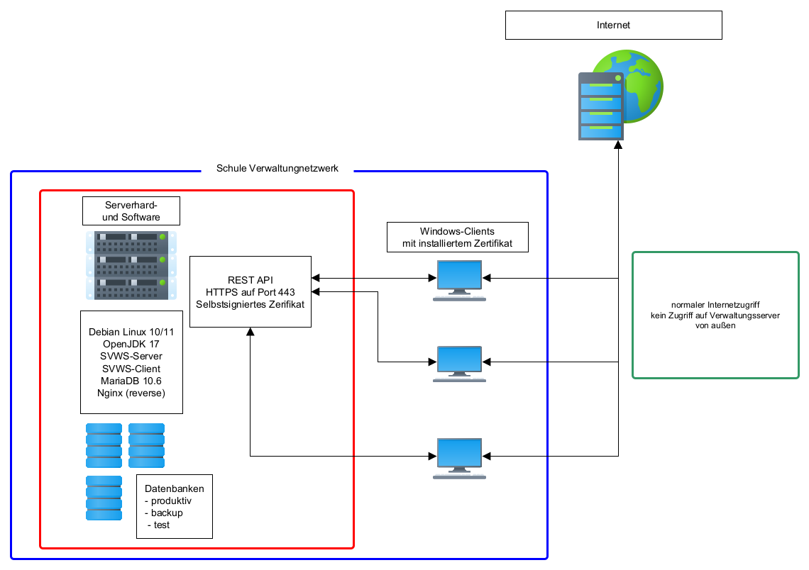

# IT-Umgebungen


## Szenarien

Der SVWS-Server ist so ausgelegt, dass er in allen schulischen Umfeldern eingesetzt werden kann. Wichtige Grundlage ist dabei weiterhin der dezentrale Ansatz, der im Land NRW vertreten wird:   

Kleine Grundschulen haben die Schulverwaltungssoftware gegebenfalls auf einem Rechner installiert, größere Schulen besitzen unter Umständen einen oder mehrere Server. Andere Schulen haben IT-Dienstleister, die sie mit Serverinstallationen unterstützen. Am oberen Ende findest sich der zentrale Einsatz in Rechenzentren. 

## Einzelplatz-Rechner

Mit Hilfe des Windows-Installers können der SVWS-Server und SchILD-NRW 3 auf einem einzelnen PC mit MS Windows 10 oder Windows 11 Betriebssystem (64 bit) installiert werden. 

Der SVWS-Server öffnet dabei den Port 443, so dass der SVWS-Client auch von anderen Computern im Netzwerk erreicht werden kann.

Ein echter Server-Betrieb ist dadurch allerdings nicht gewährleistet, da der Einzelplatzrechner beim Ende der Nutzer-Arbeitszeit in der Regel heruntergefahren wird.

Diese Installationsvariante ist für sehr kleine Schulen ohne weitere IT-Umgebung beziehungsweise IT-Unterstützung denkbar.


## Server im Schulverwaltungsnetz

Die Variante einen Server in der Schule zu betreiben, der im Verwaltungsnetzwerk abgekoppelt vom pädagogischen Netzwerk betrieben wird, ist die häufigste Installations-Art.

Auch hier wird der Port 443 intern geöffnet, so dass der SVWS-Web-Client mit einem Web-Browser im Verwaltungsnetz aufgerufen werden kann. 

Der SVWS-Server kann hierbei sowohl auf einem windows- als auch auf einem linuxbasierten Rechner betrieben werden.

Die Installation auf Linuxbasis ermöglicht den Schulen beziehungsweise den Schulrägern eine komplett lizenzkostenfreie Installation des SVWS-Servers basierend auf Open Source Software. 

Das bei der Installation erstellte Zertifikat sollte an die Clients per Gruppenrichtlinie oder manuell verteilt werden, damit der Browser die Verbindung auch als *sicher* einstuft und keine Warnung beim Aufrufen ausgibt.

Alternativ kann der Server per Certbot gegebenfalls über einen dazwischengeschalteten ReverseProxy zertifiziert werden. 

Über eine Dateifreigabe im lokalen Netz oder eine Gruppenrichtlinie kann SchILD-NRW 3 auf den Windows-Clients verteilt werden. Vorerst muss SchILD-NRW 3 eine Verbindung zum SVWS-Server und auch direkt zur MariaDB des SVWS-Servers einrichten und aufbauen.

Perspektivisch wird der Zugriff auf die MariaDB durch Nutzung entsprechender Web-Services des SVWS-Servers ersetzt werden, so dass nur noch eine Verbindung zum SVWS-Server benötigt wird.



## Kommunaler Server im Rechenzentrum

In größeren Umgebungen sind verschiedene Varianten der Installation denkbar. So können mehrere SVWS-Server auch die Funktionalität von SchILD*zentral* übernehmen. 

Die Trennung der Schemata ist hier eine wichtige Datenschutzmaßnahme. Dies kann innerhalb eines großen MariaDB-Servers oder auch mit mehreren kleinen MariaDB Instanzen erfolgen. 

In Rechenzentren macht es aus lizenzgründen Sinn auf Linux-Systeme zu setzen, so dass hier mit Docker-Containern oder auch LX-Containern gearbeitet werden kann.Des Weiteren können auch einzelne virtuelle Maschinen (KVM) in Virtualisierungssystemen wie zum Beispiel Proxmox, VMWare, HyperV, etc. erstellt und den jeweiligen Schulen zugeordnet werden. Es ist auch möglich, jedoch eher für Schulsysteme oder Dependancen sinnvoll, mehrere Schul-Schemata über einem SVWS-Server bereitzustellen. 

Welche Kombination der Installationsmöglichkeiten die Beste ist, sollte  anhand der lokalen Gegebenheiten und den hier zugänglichen Ressourcen entschieden werden. 


## ReverseProxy 

Beim Betrieb eines RevereseProxyservers als Zugangsserver sind die folgenden Einstellungen empfehlenswert: 

```bash 
    client_max_body_size 100M;
    add_header 'Content-Security-Policy' 'upgrade-insecure-requests';
    proxy_set_header X-Content-Type-Options nosniff;
    proxy_set_header X-Frame-Options "SAMEORIGIN";
    proxy_set_header Host $host;
    proxy_set_header X-Real-IP $remote_addr;
    proxy_set_header X-Forwarded-For $proxy_add_x_forwarded_for;

    proxy_http_version 1.1;
    proxy_read_timeout 300;
    proxy_connect_timeout 300;
    proxy_send_timeout 300;
```

Ggf. können die Einstellungen in der Paketgröße und den Timeouts je nach Größe der Schule und Geschwindigkeit der Internetverbindung noch angepasst werden. 


## FAQ

### Was bedeuten die Begriffe SVWS-Server und SchILD-NRW 3

Der SVWS-Server ist ein in Java geschriebener Web-Server, der eine API und einen Web-Client zur Verfügung stellt.

Der SVWS-Client, mit dem sich die Inhalte über eine Weboberfläche aufrufen lassen, hat in der Version 1.0.0 ab Oktober 2024 zunächst die Funktionalitäten von Kurs42 und Lupo übernommen, da diese Programme die neue Datenbankstruktur nicht mehr unterstützen. Nach und nach wurden und werden weitere Features hinzugefügt.

Der Server muss zuerst nur von Schulformen mit gymnasialer Oberstufe genutzt werden, wenn Blockung und Klausurterminplanung gewünscht sind.

SchILD-NRW 3 ist ein in Delphi geschriebenes Programm, welches auf Windows-Systemen betrieben werden muss. Es ist eine Clientanwendung, mit der auf den SVWS-Server und dessen Daten zugeriffen wird. SchILD-NRW 3 unterstützt viele für die Schul- und Leistungsdatenverwaltung hilfreiche Funktionen.

Das Programm benötigt in einer Übergangsphase weiterhin Zugriff auf die Datenbank. Dieser Zugriff wird sukzessive auf Zugriffe über die API umgestellt.

SchILD-NRW 3 wird in den kommenden Jahren auch weiter genutzt werden müssen.

### Welche Browser werden vom SVWS-Web-Client unterstützt?

Der Web-Client wird mit Firefox, Chrome, Edge und Safari getestet.

### Warum wird ein selbstsigniertes Zertifikat genutzt und kann man das ändern?

Bei der Installation wird ein selbstsigniertes Zertifikat erstellt, welches in einem internen Netzwerk verwendet werden kann.

Eigene Zertifikate können in den Keystore des SVWS-Server geladen werden. Eine Anleitung dazu wird zur Verfügung gestellt.

### Wird pro Schule ein eigener virtueller Server benötigt?

Nein. Ein Server kann so konfiguriert werden, dass er von mehreren Schulen datenschutzsicher genutzt werden kann.

Abhängig von den lokalen Gegebenheiten, kann das sinnvoll sein.

### Liegt die Datenbank auf einem seperaten Server?

Das kann individuell konfiguriert werden. Beide Varianten sind möglich.

### Welche Systemvoraussetzungen müssen erfüllt werden?

Dies muss noch umfassender getestet werden. In einer virtuellen Testumgebung wird der SVWS-Server mit 2 Cores und 8 GB RAM betrieben.

### Wer benötigt Zugriff auf den SVWS-Server?

Alle Personen, die auch jetzt schon mit SchILD-NRW arbeiten.

### Benötigt der SVWS-Server eine Internetverbindung?

Momentan nicht. Jedoch werden in Zukunft viele Prozesse dazu kommen, die eine Internetverbindung benötigen, etwa ein Web-Notenmanager, Schnittstellen für SchülerOnline, digitales Zeugnisse, Updates oder Ähnliches.

---
