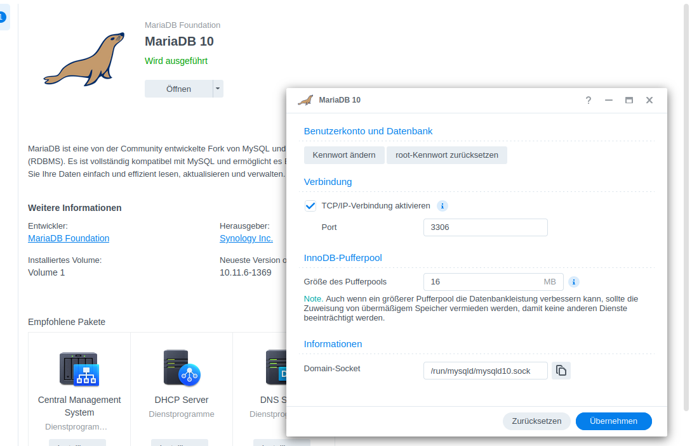
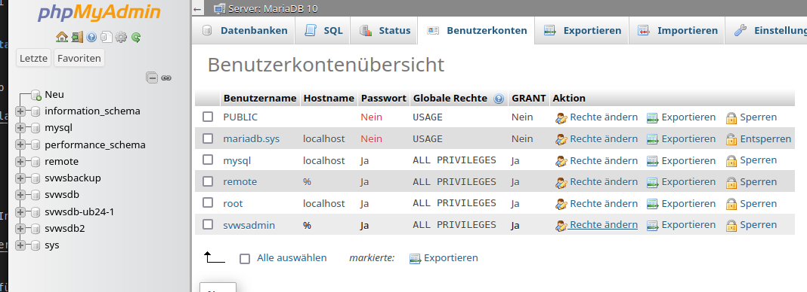
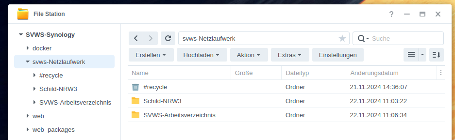
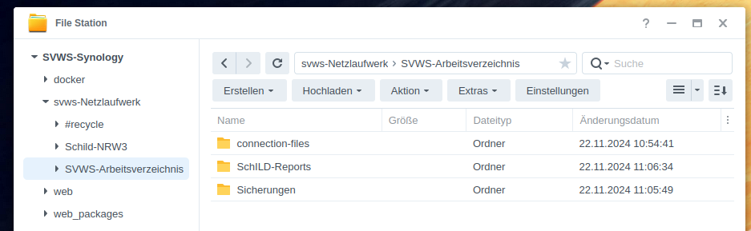

# Installation auf modernen NAS-Systemen

## Aktivierung des SSD-Caches

Wenn vorhanden, dann sollten SSDs mit dem internen Cache verwendet werden.
Dadurch werden Datenbankzugriffe deutlich beschleunigt.

Dazu im Speichermanager die SSD zu einem Raid1-Cache aktivieren.

Achtung! Schreib-/Lese-Cache kann bei Strom- oder Netzwerkausfall zu Datenverlust führen.

## Installation benötigter Pakete

1. mariaDB
2. phpmyadmin (webstation, php8.0)
3. VirtualMaschine-Manager


## MariaDB konfigurieren

In der Einstellung des MariaDB-Pakets TCP freigeben.



PHPmyAdmin aufrufen und den User root mit identischen Rechten duplizieren (Beispiel remote) aber mit Zugriff host=%.



## VirtualMaschine-Manager

Ein Debian-ISO-Image oder ein Ubuntu-Live-Server-Image herunterladen und im VM-Manager hinterlegen.

Eine VM mit dem gewünschten Image installieren.
S-ATA-Treiber bei der Verwenung der Festplatte einstellen.
Einstellung mit UEFI Bios booten. Hier wurden zwei CPUs mit 8 GByte RAM gewählt.


## Installation des SVWS-Server mit dem Linux-installieren


Mit wget das aktuellen install-x.x.x.sh von Github laden.

https://github.com/SVWS-NRW/SVWS-Server/releases/latest


``` bash
    wget https://github.com/SVWS-NRW/SVWS-Server/releases/latest
    chmod +x install-x.x.x.sh
    ./install-x-x-x.sh
```

Dabei die Installationsschritte, wie unter Linux-Installer beachten.

https://doku.svws-nrw.de/deployment/Linux-Installer

Aufruf des AdminClients ist nun möglich.
Darin kann eine Migration oder ain Backup durchgeführt werden.

## Schild-NRW 3 Freigabe

Einen neuen Netzwerkfreigabe-Ordner anlegen.

Darin zwei Unterordner Für Schild-NRW3 und das SVWS-Arbeitsverzeichnis anlegen.



Das Schild-NRW3-ZIP-Paket herunterladen und im Schild-NRW3-Ordner entpacken.
Dort eine Admin.ini als Textdatei anlegen und bei GroupDir= die Url zum Arbeitsverzeichis eintragen.



Im SVWS-arbeitsverzeichnis einen Ordner Connection-Files und einen Ordner Schild-Reports anlegen.

Basisreportsammlung herunterladen und im Report-Ordner entpacken.

https://github.com/SVWS-NRW/Schild-NRW-Reports/releases

Im Ordner Schild-NRW3 das Programm Schild_DBConfig.exe starten und die CON-Datei nach Eintragung aller Parameter in den Ordner Connection-Files speichern.


