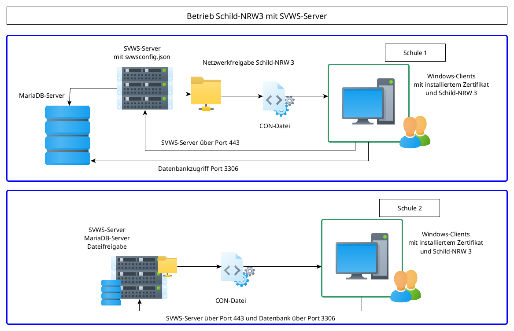

# Betrieb von Schild-NRW 3 und dem SVWS-Server

Grundsätzlich benötigt Schild-NRW 3 immer einen laufenden SVWS-Server.
Schild-NRW 3 prüft beim Start, ob der SVWS-Server erreichbar ist und vergleicht über die jeweiligen Versionsnummern, ob eine gültige Kombination vorliegt. Die gültigen Kombinationen können aus der Versionsgeschichte (Release Notes) entnommen werden.

Der SVWS-Server läuft unter Linux und Windows und ist in Java geschrieben.
Über die API können nicht nur die Daten zur Visualisierung abgerufen werden, sondern auch Statistik-Kataloge.
Zusätzlich können Operationen wie Backups oder Migrationen über den SVWS-Server abgewickelt werden.
Momentan benötigt Schild-NRW 3 aber noch den direkten Zugriff auf die MariaDB-Datenbank.

Es ist geplant im Laufe des Jahres 2025 Schild-NRW 3 so umzustellen, dass Schild-NRW 3 alle notwendigen Operationen über die API ausführen kann.
Dann würde der Zugriff auf die MariaDB entfallen können. Ob das mit den zur Verfügung stehenden Ressourcen schon in 2025 leistbar ist, ist momentan noch unklar.

## Übersicht

Der SVWS-Server kann auf Linux oder Windows betrieben werden.
Dazu muss ein JDK installiert werden. Beide Installer, sowohl Linux, als auch Windows bringen das JDK mit.
Die MariaDB-Datenbank kann separat betrieben werden. Diese kann aber auch auf dem selben Server installiert sein.

Schild-NRW 3 benötigt, so wie Schild-NRW 2, eine Konfigurationsdatei in der die notwendigen Angaben für die Zugänge stehen. Diese hat die Endung .con und enthält die URL (und Port) zum SVWS-Server und zur MariaDB-Datenbank.
Das Programm Schild-NRW 3 kann nach wie vor über eine Dateifreigabe an die Windows-Clients ausgeliefert werden.

Wie im Schaubild zu sehen, kann der SVWS-Server und die MariaDB auf getrennten Servern liegen.
Auch die Ports können in den Konfigurationsdateien eingestellt werden.
Wie im unteren Schaubild zu sehen, kann auch alles auf einem Server bereitgestellt werden.
Diese Auswahl hängt auch vom Grad der Virtualisierung ab, die vewendet wird.
Auch die Anzahl der Server pro Schulen kann je nach Umgebung bestimmt werden.

Der momentan noch im Aufbau befindliche Web-Client steht über den SVWS-Server immer auch zur Verfügung und kann über die URL (und ggf. den Port) im Browser aufgerufen werden. Getestet werden Firefox, Edge, Chrome und Safari.

## Installation SVWS-Server

Da Schild-NRW 3 erst startet, wenn ein SVWS-Server zur Verfügunmg steht, sollte mit dieser Installation begonnen werden.

https://github.com/SVWS-NRW/SVWS-Dokumentation/blob/main/deployment/Linux-Installer/index.md

https://github.com/SVWS-NRW/SVWS-Dokumentation/blob/main/deployment/Windows-Installer/index.md

Für IT-Dienstleister, die mehrere Schulen betreuen, kann es sinnvoll sein, den SVWS-Server ohne eine erste Datenbank zu installieren.
Der SVWS-Server startet auch, wenn bei der Installation keine neue Datenbank erzeugt wird.

Über den Admin-Client können dann die gewünschten Datenbanken migriert oder erstellt werden.

## Installation Schild-NRW 3

Die Installation von Schild-NRW 3 kann danach vorgenommen werden.

https://schulverwaltungsinfos.nrw.de/svws/wiki/index.php?title=Schnellinstallation_SVWS-Server_und_SchILD-NRW_3

## Konfigurationen

Schild-NRW 3 benötigt für jede Datenbank eine .con-Datei, die im Unterordner "Connection-Files" des Schild-NRW 3-Arbeitsverzeichnisses liegt.
Diese .con-Datei ist eine reine Textdatei im UTF-8 Format.

Der SVWS-Server erstellt bei der Installation eine svwsconfig.json. Diese Datei enthält alle benötigten Angaben für den Betrieb des SVWS-Servers.

https://doku.svws-nrw.de/deployment/Einrichtung/

Die Einstellungen des SVWS-Server können nach Bedarf gesetzt werden.
Der Bereich der Schema-Einstellungen wird vom SVWS-Server z.B. durch den Admin-Client gesetzt!

https://doku.svws-nrw.de/adminclient/administration/
