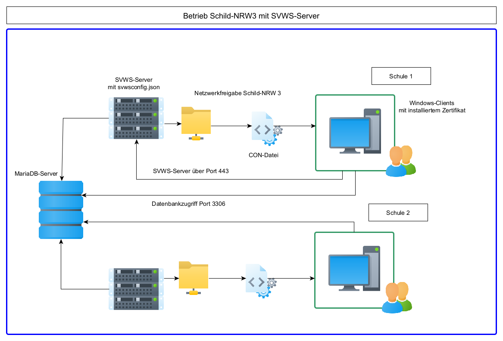

# SchILD-NRW 3

## Übersicht

Neben dem SVWS-Client, der per Browser aufgerufen wird, kann das Windowsprogamm **SchILD-NRW 3** genutzt werden.

>[!TIP]Installationsvoraussetzungen
> SchILD-NRW 3 benötigt als Grundlage einen laufenden SVWS-Server!



Derzeit greift SchILD-NRW 3 auf die Webschnittstelle des SVWS-Server (SVWS-API) und zusätzlich auch direkt auf die MariaDB-Datenbank zu. Zukünftig soll dieser Zugriff entfallen, da alle Funktionen über die SVWS-API laufen sollen.

Der SVWS-Server und die MariaDB können:

+ auf getrennten oder demselben Server betrieben werden,
+ unter Windows oder Linux laufen,
+ in unterschiedlichen Virtualisierungsumgebungen eingesetzt werden.

SchILD-NRW 3 verwendet Konfigurationsdateien (.con) für die Verbindungsdaten zu SVWS-Server und Datenbank. Beim Start wird die Erreichbarkeit und Versionskompatibilität prüft.

Die Bereitstellung der Anwendung Schild-NRW 3 kann analog zu Schild-NRW 2 weiterhin über eine Dateifreigabe erfolgen.

## Installation SVWS-Server

+ [Installation unter Linux](../Linux-Installer/index.md)
+ [Installation unter Windows](../Windows-Installer/index.md)
+ [Installation unter Docker](../Docker/index.md)

Über den [AdminClient](../../adminclient/) können anschließend [Datenbanken migriert](../Datenmigration/index.md) oder neu erstellt werden.

## Installation SchILD-NRW 3

Laden Sie das aktuelle [SchILD-NRW 3-Release](https://github.com/SVWS-NRW/Schild-NRW-3/releases) herunter und entpacken beziehungsweise installieren Sie die Anwendung. Richten Sie anschließend die Verbindung zum SVWS-Server ein.

## MariaDB für Schild-NRW 3 konfigurieren

SchILD-NRW 3 benötigt den Zugriff auf den SVWS-Server sowie in einer Übergangsphase zusätzlich den direkten Zugriff auf die Datenbank. Neben dem HTTPS-Zugriff auf den SVWS-Server muss daher auch der direkte Datenbankzugang entsprechend freigeschaltet werden.

Damit der MariaDB-Server auch von anderen Rechnern erreichbar ist, muss die Bind-Adresse in der Datein `/etc/mysql/mariadb.conf.d/50-server.cnf` angepasst werden:

```shell
bind-address 0.0.0.0
```

Je nach Firewall-Konfiguration muss zusätzlich der Port 3306 für den Zugriff aus dem entsprechenden Netzwerk geöffnet werden.

## Datenbankverbindung konfigurieren

SchILD-NRW 3 benötigt für jede Datenbank eine eigene `.con`-Datei. Diese liegt im Unterordner `Connection-Files` des SchILD-NRW-3-Arbeitsverzeichnisses und enthält die Verbindungsinformationen im UTF-8-Format.

::: danger Schema-Namen unter Windows!
Achten Sie auch unter Windows auf die korrekte Groß- und Kleinschreibung des Schema-Namens in der `.con`-Datei. Die REST-Schnittstelle arbeitet **case sensitive**, daher muss der Schema-Name exakt übereinstimmen.
:::

[TODO] Screenshot Einrichtung Schild NRW

## Beispiel 

Schulungsumgebung all in one Server