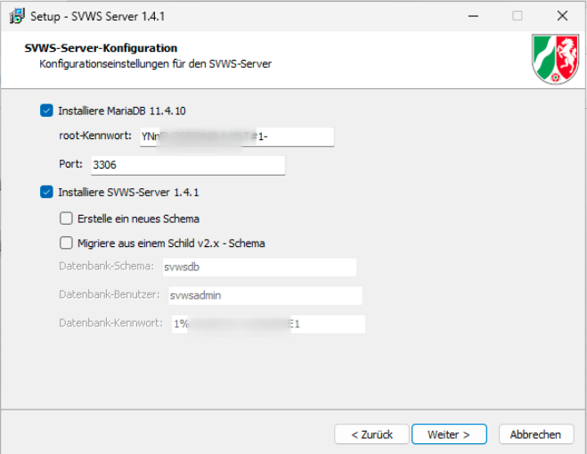
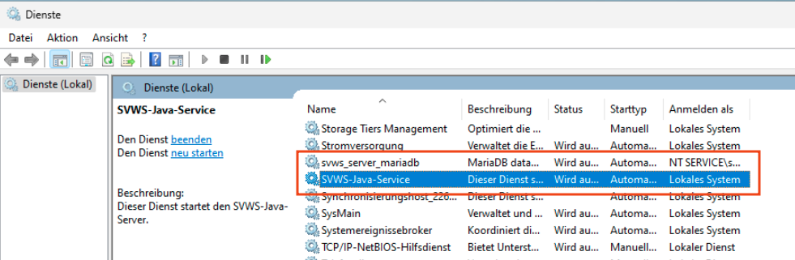
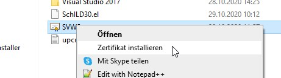
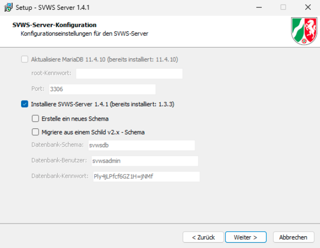

# Windows-Installation

## Download

Laden Sie die aktuelle Datei von unseren Githubseiten herunter: 

[win64-installer-x.y.z.exe](https://github.com/SVWS-NRW/SVWS-Server/releases) 

## Systemvoraussetzungen

+ MS Windows 11 (64bit)
+ 16 GB RAM 
+ Auflösung mindestens 1920x1080 FullHD
+ 300 MB freier Speicherplatz

Hinweis: Der SVWS-Server benötigt nicht 16GB Ram, jedoch ist dies für Betrieb eines Windows-Servers und die hiermit verbundenen anderen Dienste für den Mehrbenutzerbetrieb ratsam. Ressourcenschonender kann der SVWS-Server unter Linux oder Docker eingesetzt werden. 

## Installation

### Installationshinweise

Der SVWS-Installer wird für Windows-64Bit mit InnoSetup erstellt. Er installiert die im Folgenden genannten Komponenten und startet alle Dienste. Eine Migration kann optional durchgeführt werden.

Der SVWS-Installer übernimmt die folgenden Aufgaben:

+ Installation einer MariaDB-Instanz, wenn nicht vorhanden
+ Update einer bestehenden MariaDB-Instanz
+ Installation der Java-Laufzeitumgebung, wenn nicht vorhanden
+ Update der Java-Umgebung
+ Installation des SVWS-Servers, wenn nicht vorhanden
+ Update des SVWS-Servers
+ Abfrage aller notwendigen Passwörter für MariaDB und SVWS-Server
+ Abfrage aller benötigten Informationen für den Keystore und das SSL-Zertifikat
+ Registrieren und Starten des MariaDB-Dienstes
+ Registrieren und Starten des SVWS-Server-Dienstes
+ Anlegen eines leeren Schemas in MariaDB
+ Anlegen eines selbstsignierten SSL-Zertifikats
+ Abspeichern des Zertifikats im Verzeichnis `Dokumente` des angemeldeten Benutzers
+ Anlegen der Freigaben für die Windows Firewall, damit der Server auch für andere Clients erreichbar ist
+ Ggf. Migration aus einer bestehenden Datenbank in das neue Schema

### Pakete im SVWS-Installer von Open-Source-Fremdherstellern

+ curl
+ mariadb
+ innoextract
+ innosetup
+ jdk
+ winsw

### Wichtige Pfade

Als Default-Verzeichnisse werden bei der Installation folgende Verzeichnisse vorgeschlagen:

| Pfad | Beschreibung |
| --- | --- |
| `C:\Program files\SVWS-Server` | Alle Programm-Dateien inklusive MariaDB und Java-Umgebung |
| `C:\ProgramData\SVWS-Server` | Alle Daten und Logs und Einstellungsdateien |
| `C:\Users\{Username}\AppData\Local\Temp` | Log-Files des Installers und Uninstallers |
| `C:\Users\{Username}\Dokumente` | Das Zertifikat für die Browser |

### Installationseinstellungen

Zu Beginn der Installation erscheinen nach der Annahme der Lizenzvereinbarungen folgende Optionen:

::: danger Speichern Sie Ihre Passwörter!
Es werden für MariaDB und den Datenbank-Benutzer Zufallspasswörter generiert! Ändern Sie diese nach Ihren Wünschen oder verwenden Sie diese Vorschläge, aber **dokumentieren Sie in jedem Fall Ihre Eingabe**.

Ohne diese Passwörter kann Ihnen später im Supportfall nicht geholfen werden!
:::

### Installation MariaDB

Der Installer erkennt anhand der Registry-Einträge, ob MariaDB bereits installiert ist und in welcher Version.

Wenn ein eigener MariaDB-Server installiert wird, muss entweder ein anderer Port verwendet werden oder später eine Verbindung zu dem bereits bestehenden Server hergestellt werden. Ist die Option deaktiviert und es wird keine `svwsconfig.json` gefunden, erscheint eine Seite zur Eingabe der Zugangsdaten für den bestehenden MariaDB-Server. Ist die Option aktiviert, wird der MariaDB-Server in den Programmverzeichnissen installiert. Anschließend wird der Dienst als Windows-Service registriert und gestartet.

Programmverzeichnis MariaDB: `C:\Programme\SVWS-Server\db`

Datenverzeichnis MariaDB: `C:\ProgramData\SVWSServer\data`

Die sort_buffer_size wird in der my.ini im data-Verzeichnis auf 16777216 gesetzt!

### Installation JDK

Mit dem Installer wird auch das verwendete JDK ausgeliefert.

Dieses ist an den SVWS-Server gekoppelt und kann in zukünftigen Versionen nur in Kombination mit dem eigentlichen Server installiert oder aktulisiert werden.

Zielverzeichnis JDK: `C:\Programme\SVWS-Server\java`

### Installation SVWS-Server

Die notwendigen Dateien des SVWS-Server werden standardmäßig unter `C:/Programme/SVWS-Server/svws-server` installiert.

Da diese mit der ausgelieferten OpenJDK-Version zusammen passen müssen, werden diese beiden Teile miteinander verbunden und können nicht separat installiert werden.

Die Aufrufe werden in Form von Batch-Dateien mit der Endung `.cmd` im Hauptverzeichnis ausgeliefert.

Die Dienste MariaDB und SVWS-Server werden in der Computerverwaltung registriert und automatisch gestartet.

::: warning Port 443 für den SVWS-Server
Der SVWS-Server wird immer auf Port 443 installiert. Dies kann nach der Installation in der `svwsconfig.json` geändert werden. Das sollte allerdings nur in Ausnahmefällen geschehen.
:::

### Registrierung der Dienste

Der SVWS-Server und der Mariadb-Server werden als Dienst registriert. Diese können in der Computerverwaltung überprüft werden.

::: warning Rechte zum Starten der Dienste
Mögliche Fehlerquelle: Das (Dienst-)Konto, mit dem der Dienst gestartet werden soll, muss auch die Berechtigungen hierfür haben. Eventuell hilft es, das MariaDB-Dienstkonto in die Default Controllers Policy mit der Berechtigung "Anmelden als Dienst" aufzunehmen (2025).
:::

## optional: Keystore

Optional kann ein eigener Keystore mit Zertifikat erstellt werden.

Im Keystore des SVWS-Server wird ein selbstsigniertes Zertifikat erstellt. Der öffentliche Teil wird im Ordner `C:\Users\{Benutzername}\Dokumente` gespeichert.

Dieses Zertifikat muss anschließend in den Zertifikatsspeicher von Windows übertragen werden.

**Ort:** Vertrauenswürdige Stammzertifikate

Bitte beachten Sie, dass nur Chrome und Edge automatisch diese Zertifikate nutzen.

**Firefox** muss in der `about:config` die Einstellung `security.enterprise_roots.enabled` auf `true` gesetzt haben.

## Update

Um den SVVS-Server zu aktualisieren, laden Sie bitte das aktuelle Release von unserer GitHub-Seite herunter.

Starten Sie anschließend das Excel-Programm. Es erkennt automatisch, dass bereits ein SVVS-Server installiert ist. Die installierte Versionsnummer wird mit der Version des aktuellen Releases verglichen. Falls eine neuere Version verfügbar ist, wird Ihnen angeboten, den Server zu aktualisieren.

Wenn eine neuere Version von MariaDB vorliegt, wird auch deren Versionsnummer überprüft. Ist ein Update verfügbar, wird Ihnen ebenfalls angeboten, MariaDB zu aktualisieren.

## Uninstaller

Im Programmverzeichnis des SVWS-Server befindet sich auch ein signierter Uninstaller, mit dem alle Installationsdateien wieder entfernt werden können.

Bitte beachten Sie, dass Dateien, die nach der Installation hinzugefügt wurden, nicht erfasst werden.

Außerdem sollte kontrolliert werden, ob auch alle Dienste entfernt wurden. Windows 10 gibt in einigen Fällen die Dienste nicht schnell genug frei, so dass die Löschung scheitert.

## Einrichtung

Sie haben nun einen laufenden SVWS-Server eingerichtet. Um den Server mit Daten zu befüllen und an die Anforderungen Ihrer Schule anzupassen, fahren Sie bitte mit dem Artikel **[Einrichtung](../Einrichtung/index.md)** fort.
