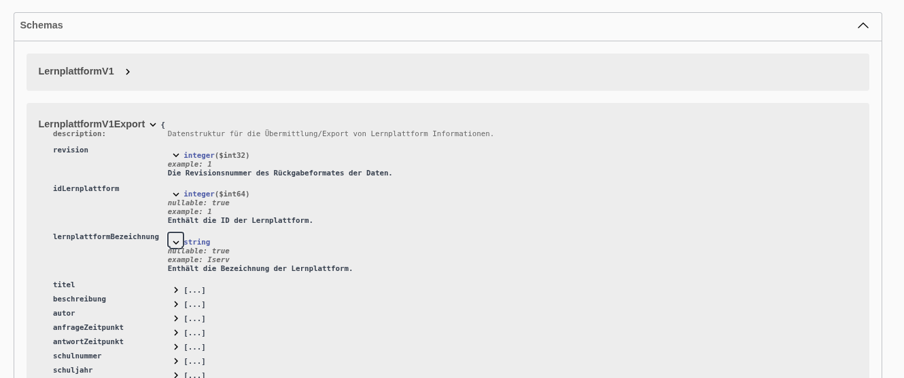

# API-Endpunkt für den Export zu Lernplattformen

Es wurden vier Endpunkte für Anbieter von externen Lernplattformen geschaffen. Mit dieser API soll ein automatisierter Abgleich von Schüler- und Lehrkräftedaten ermöglicht werden.

Die Endpunkte können nur im internen Verwaltungsnetz aufgerufen werden und benötigen einen SVWS-Benutzer mit entsprechenden Rechten.

## Versionierung

Über die URL ist eine Versionierung /v1, /v2, ... angegeben. Ältere Versionen werden voraussichtlich bis zu 12 Monate weiter supportet, damit eine Umstellung auf neuere Versionen stattfinden kann.

## Endpunkte URLs

Zur Verfügung stehen vier Endpunkte.

Ein Datenexport unkomprimiert:

```bash
/api/external/{schema}/v1/lernplattformen/{idLernplattform}/{idSchuljahresabschnitt}
````

Ein Datenexport als gzip:

```bash
/api/external/{schema}/v1/lernplattformen/{idLernplattform}/{idSchuljahresabschnitt}/gzip
````

Eine Übersicht aller im Schema vorhandenen Lernplattformen mit ID:

```bash
/api/external/{schema}/v1/lernplattformen
```

Eine Übersicht aller verfügbaren Schuljahresabschnitte:

```bash
/api/external/{schema}/v1/schuljahresabschnitte
```

## Aufbau des JSON

Der Aufbau des übergebenen Jsons und eine aktuelle Dokumentation kann über die [Swagger UI](../index.md#swagger-ui---bedienung) des SVWS-Server abgerufen werden.

Hier ein Beispiel:


