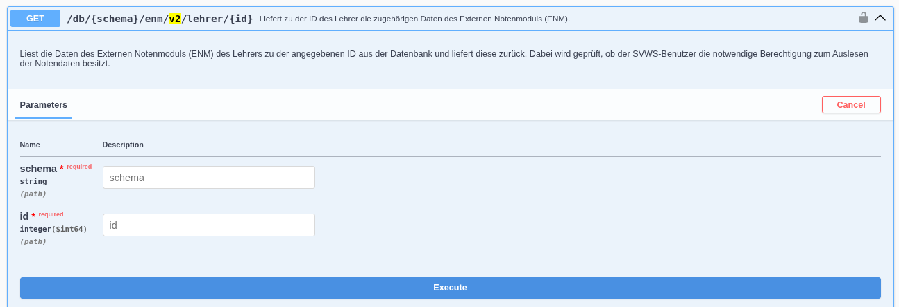

# API externe Notenmanager

API-Endpunkt für den Export zu externen Notenmanagern

Es wurden fünf Endpunkte für externe Notenmanager, wie zum Beispiel [**SVWS-WeNoM**](../../../wenom/index.md) geschaffen. Mit dieser API soll ein automatisierter Abgleich von Schülerleistungsdaten und Zeugnisbemerkungen seitens der Lehrer und der Schulverwaltung ermöglicht werden.

Die Endpunkte können nur im internen Verwaltungsnetz aufgerufen werden und benötigen einen SVWS-Benutzer mit entsprechenden Rechten.

## Versionierung

Über die URL ist eine Versionierung /v1, /v2, ... angegeben. Ältere Versionen werden vorraussichtlich bis zu 12 Monate weiter supportet, damit eine Umstellung auf neuere Versionen stattfinden kann.

Hinweis: Bisher sind diese Schnittstellen in der Swagger UI noch unter "Server API" und noch nicht bei "external API" eingruppiert.

## Endpunkte URLs

Zur Verfügung stehen effektiv 3 Endpunkte und zwei davon zusätzlich in optionaler gezippter Version:

```bash
/db/{schema}/enm/v2/alle
````

Exportiert die Daten des Externen Notenmoduls (ENM) aus der Datenbank. Dabei wird geprüft, ob der SVWS-Benutzer die notwendige Berechtigung zum Auslesen der Notendaten besitzt.

```bash
/db/{schema}/enm/v2/alle/gzip
````

Analog zum o.g., jedoch liefert dieser Endpunkt die Daten GZip-komprimiert.

```bash
/db/{schema}/enm/v2/lehrer/{id}
````

Exportiert die Daten des Externen Notenmoduls (ENM) eines Lehrers zu der angegebenen ID aus der Datenbank. Dabei wird geprüft, ob der SVWS-Benutzer die notwendige Berechtigung zum Auslesen der Notendaten besitzt.

```bash
/db/{schema}/enm/v2/import
````

Importiert die übergebenen ENM-Daten. Dabei wird die Aktualität der zu importierenden Daten anhand der Zeitstempel in den ENM-Daten geprüft.

```bash
/db/{schema}/enm/v2/import/gzip
````

Analog zum o.g., jedoch erwartet dieser Endpunkt die Daten GZip-komprimiert.

## Aufbau des JSON

Der Aufbau des übergebenen Jsons und eine aktuelle Dokumentation kann über die [Swagger UI](../index.md#swagger-ui---bedienung) des SVWS-Server abgerufen werden.

Hier ein Beispiel:


