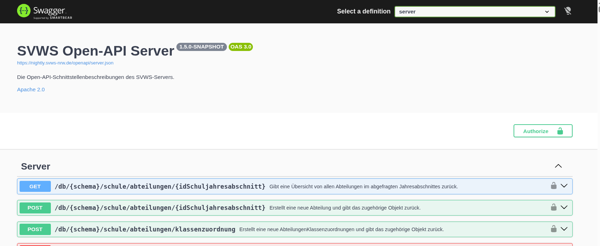
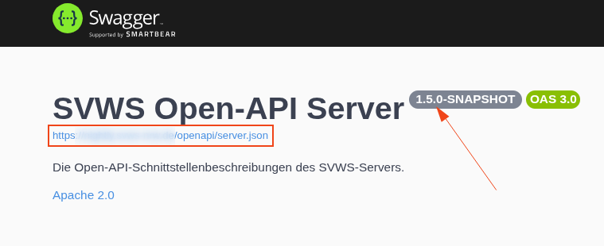

# API des SVWS-Servers

Unter `https://<mein-server>/debug` befindet sich die Swagger-UI des SVWS-Servers. Sie stellt eine grafische Oberfläche zur Dokumentation und zum Testen der APIs des SVWS-Servers bereit.

## Übersicht

Die Swagger-Oberfläche gliedert sich in drei Bereiche:

+ **Server API**  
In der Server API sind alle Schnittstellen definiert, die für den Webclient benötigt werden. Die vorhandenen Endpunkte können hier direkt an einem Schema, das einer Schule zugeordnet ist, getestet werden.
+ **Externe API**  
In der Externen API sind alle Endpunkte zusammengefasst, die über feste Versionen verfügen. Durch diese Versionierung eignen sie sich besonders für den Zugriff durch externe Dienstleister oder weitere Programme, da sichergestellt wird, dass Schnittstellenänderungen kontrolliert und nachvollziehbar erfolgen.
+ **Privileged API**  
Die Privilege API enthält die Schnittstellen für Aufgaben, die vom technischen Administrator ausgeführt werden. Dazu gehören beispielsweise das Anlegen einer neuen Datenbank, das Erstellen von Backups oder weitere administrative Funktionen.

## Swagger UI - Bedienung

Verwendung der Swagger-UI zum Testen von API-Endpunkten

Die Swagger-Oberfläche des SVWS-Servers ermöglicht es, API-Endpunkte über eine grafische Benutzeroberfläche direkt auszuprobieren und die erforderliche Syntax sowie die verfügbaren Parameter zu analysieren.

Zu Beginn muss der Benutzer auswählen, welche API verwendet werden soll:

+ Server API
+ Externe API
+ Privilege API

Im nächsten Schritt erfolgt die Authentifizierung über den Button „Authorize“. Dabei ist zwischen den unterschiedlichen Aufgabenbereichen und Rollen der Benutzer zu unterscheiden.

Für die Privilege API ist eine Authentifizierung mit einem privilegierten MariaDB-Benutzer erforderlich, da diese Schnittstellen direkte administrative Aufgaben auf Datenbankebene ermöglichen. Beispiele hierfür sind das Anlegen von Datenbanken oder das Durchführen von Sicherungsoperationen.

Für alle anderen API-Zugriffe, die keine direkten Datenbankadministrationsaufgaben ausführen, erfolgt die Anmeldung mit einem Benutzerkonto, das innerhalb des jeweiligen schulbezogenen Datenbestands über die erforderlichen Berechtigungen verfügt. Dies kann beispielsweise ein Benutzerkonto der Schulleitung mit einem entsprechenden SVWS-Account sein.

Nach erfolgreicher Autorisierung wird der gewünschte API-Endpunkt aufgeklappt. Über die Schaltfläche „Try it out“ kann der Endpunkt für einen Testlauf aktiviert werden. Anschließend werden die erforderlichen Parameter und Eingabewerte eingetragen und die Anfrage über „Execute“ ausgeführt.

Das Ergebnis der Anfrage wird anschließend direkt in der Swagger-Oberfläche angezeigt oder – abhängig vom jeweiligen Endpunkt – als Datei zum Download bereitgestellt.

## Dokumentation der API-Endpunkte

Unter `https://<mein-server>/openapi/server.json` kann eine umfassende, maschinenlesbare Dokumentation des aktuellen Stands der OpenAPI-Spezifikation des SVWS-Servers abgerufen und heruntergeladen werden.

Die jeweilige Versionsnummer der API ist direkt in dieser Dokumentation ersichtlich.

Da sich der SVWS-Server aktuell in einem schnellen Entwicklungszyklus befindet, werden sowohl die verfügbaren API-Endpunkte als auch die zugehörige Dokumentation in der Swagger-UI regelmäßig erweitert und angepasst. Dadurch können sich insvesondere die internen Schnittstellen kurzfristig verändern.

Eine maschinenlesbare API-Beschreibung bietet hierbei einen wesentlichen Vorteil: Sie ermöglicht es Programmen, Entwicklungswerkzeugen und insbesondere KI-gestützten Anwendungen, die vorhandenen Schnittstellen automatisiert zu analysieren und gezielt zu nutzen.

Gerade bei der Entwicklung neuer Anwendungen, die auf die Endpunkte des SVWS-Servers zugreifen, erleichtert die OpenAPI-Spezifikation die Integration erheblich, da verfügbare Funktionen, Parameter und Rückgabewerte strukturiert und eindeutig beschrieben sind.

## API per Curl aufrufen