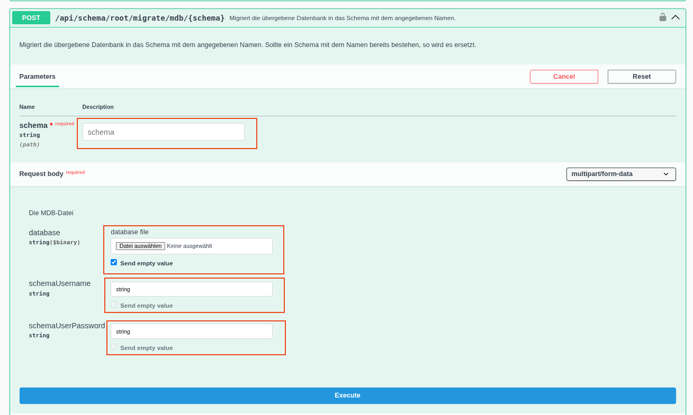

# Privileged API

Im Gegensatz zur Server API oder der Externen API enthält die **Privilege API** ausschließlich Schnittstellen für Aufgaben, die von einem technischen Administrator ausgeführt werden. Hierzu gehören beispielsweise das Anlegen neuer Datenbanken, das Erstellen und Wiederherstellen von Backups sowie weitere administrative Verwaltungsaufgaben.

Für den Zugriff auf diese Schnittstellen sind entsprechende administrative Berechtigungen erforderlich. So muss der verwendete Benutzer beispielsweise die Berechtigung besitzen, auf dem MariaDB-Server neue Datenbanken anzulegen oder andere administrative Operationen auszuführen.

## Beispiel Swagger UI

Ein Beispiel für einen Endpunkt der Privileges API ist:

`/api/schema/root/migrate/mdb/{schema}`

Dieser Endpunkt dient dazu, eine Microsoft-Access-Datenbank (.mdb) in ein angegebenes MariaDB-Schema zu migrieren.

Die Beschreibung des Endpunkts ist in der Swagger UI unter dem Eintrag „Migriert die übergebene Datenbank in das Schema …“ zu finden.

Für den Aufruf des Endpunkts müssen folgende Parameter beziehungsweise Daten bereitgestellt werden:

+ Schema: Name des Zielschemas in der MariaDB, in das die Daten importiert werden sollen.
+ MDB-Datei: Die zu migrierende Datenbank im .mdb-Format wird als Datei hochgeladen.
+ Datenbankbenutzer: Name des neu anzulegenden Datenbankbenutzers.
+ Passwort: Passwort für den neu anzulegenden Datenbankbenutzer.

Der Endpunkt importiert die Daten aus der hochgeladenen .mdb-Datei in das angegebene MariaDB-Schema und richtet dabei den angegebenen Datenbankbenutzer mit dem zugehörigen Passwort ein.

## Beispiel Curl Befehl

Analog zum oben beschriebenen Migration per Swagger Schnittstelle kann auch der zugehörige Curl Befehl beschrieben werden.

Siehe dazu Kapitel Installation: [Datenmigration](../../../deployment/Datenmigration/index.md#migration-per-api)
