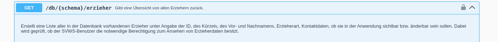

# Server API

In der **Server API** sind alle Schnittstellen definiert, die vom Webclient verwendet werden. In der Regel sind hier die Endpunkte zusammengefasst, die direkt auf das einer Schule zugeordnete Datenbankschema zugreifen. Für die Authentifizierung und Autorisierung sind daher die Berechtigungen maßgeblich, die dem jeweiligen Benutzer innerhalb dieses Datenbankschemas – also für die jeweilige Schule – zugewiesen wurden.

So kann beispielsweise eine Fachlehrkraft ihre Unterrichtsnoten abrufen oder bearbeiten, während eine Klassenlehrkraft darüber hinaus auch die Zeugnisbemerkungen der Schülerinnen und Schüler ihrer Klasse einsehen und verwalten kann.

Da sich der SVWS-Server derzeit in einer intensiven Entwicklungsphase befindet, werden sowohl die verfügbaren API-Endpunkte als auch die zugehörige Dokumentation in der Swagger-UI regelmäßig erweitert und überarbeitet. Insbesondere sie internen Server API Schnittstellen können sich daher kurzfristig ändern.

## Beispiel

Der API Endpunkt `/db/{schema}/erzieher`ist ein einfaches Beispiel für ein Server API Endpunkt, der für die interne Nutzung im Web-Client vorgesehen ist. Es befindet sich in der Swagger UI zu allen Endpunkten eine kurze Dokumentation:

"Erstellt eine Liste aller in der Datenbank vorhandenen Erzieher ..."
