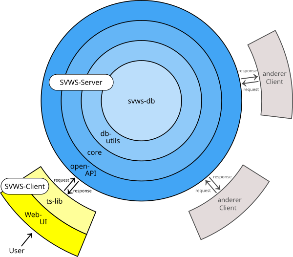

# SVWS-Server

## Zwiebelmodell Komponenten-Hierarchie

Von innen nach außen übernehmen die Schichten die folgenden Rollen:

SVWS-Server:
- svws-db: Basisprojekt für die Datenbank
- db-utils: Stellt Funktionalitäten zum Datenbankzugriff zur Verfügung
- core: (Hier passiert das Meiste)
- OpenAPI: Diese Schnittstelle nimmt Anfragen von Clients entgegen und liefert Antworten zurück

SVWS-Client:
- ts-lib: Diese Komponente des Clients (TypeScript-lib) ist für die Kommunikation mit der OpenAPI verwantwortlich. Sie enthält (auch) transpilierte Anteile aus den Server-Schichten 'core' und 'OpenAPI'.
- Web-UI: Die graphische Benutzeroberfläche für den Benutzer (mit vue.js-Komponenten)

## Übersicht zur Funktionalität der CORE-API

Die Core-API soll zukünftig alle User-Interaktionen mit der Datenbank kontrollieren. Sie ist damit maßgeblich für den Schutz der Daten vor unerlaubten Zugriffen, aber auch für die Konsistenz der Datenbank zuständig. Außerdem stellt sie eine standardisierte Schnittstelle für die User-Interfaces dar.

## Die OpenAPI
Die Schnittstelle ist auf Basis von OpenAPI definiert:

## Debugging: SwaggerUI
Im Debugging kann die Schnittstelle mit der SwaggerUI aufgerufen werden, mit der die Eingaben und Ausgaben getestet werden können. Hier stehen alle GET-, PUT- und POST-Befehle zur Verfügung!

