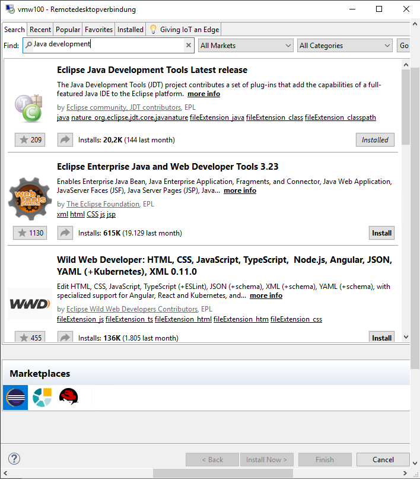
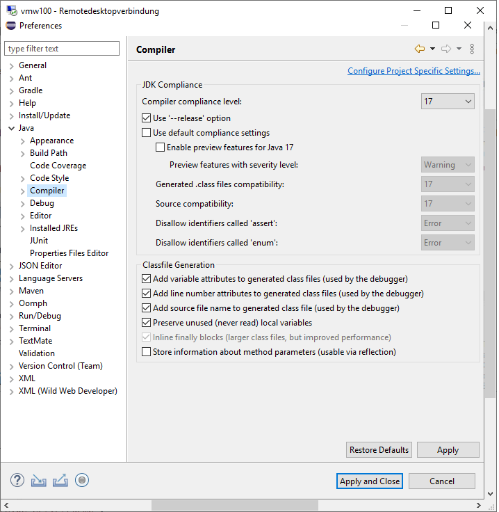
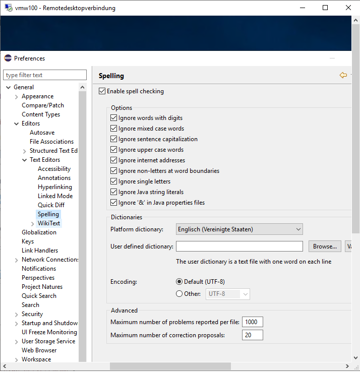
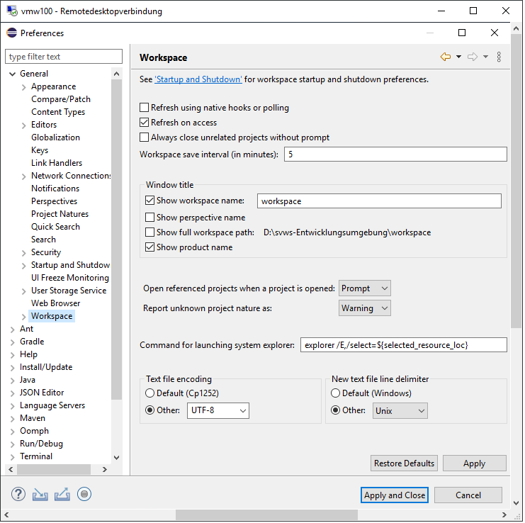

***Installation unter Windows 10 64bit***
====================

# Systemvoraussetzungen und Installationshinweise
Die gesammte Entwicklungsumgebung belegt in etwa 3 GB und sollte auf einem lokalem Laufwerk liegen.

# Maria db installieren

+ download : Maria db 10.6 -> https://mariadb.org/download/?t=mariadb&p=mariadb&r=10.6.5&os=windows&cpu=x86_64&pkg=msi&m=netcologne
+ root user einrichten

# JDK 17 installieren

+ Download des jdk-17 -> https://download.oracle.com/java/17/latest/jdk-17_windows-x64_bin.zip
+ Entpacken in z.B. D:\svws_Entwicklungsumgebung\jdk-17\
+ Path setzen: 
    + Über das Windowssymbol den Editor für die Umgebungsvariablen öffnen 
    + die Variable Path bearbeiten und einen weiteren Eintrag zum Java Verzeichnis einfügen

# NodeJS installieren 

+ Install node.js 16er Version -> https://nodejs.org/dist/v16.13.0/node-v16.13.0-x64.msi

# Eclipse installieren und konfigurieren

+ Installieren eclipse-inst-win64.zip (2021-09) (Eclipse IDE for Java Developers)-> https://www.eclipse.org/downloads/download.php?file=/technology/epp/downloads/release/2021-09/R/eclipse-jee-2021-09-R-win32-x86_64.zip&mirror_id=17
+ Einmaliger Start Eclipse und festlegen des Workspace: `D:\\svws_Entwicklungsumgebung\workspace\`
+ Bei Bedarf den Speicher hochsetzen: per texteditor `D:\svws_Entwicklungsumgebung\workspace\eclipse.ini` entsprechend z.B. aus der 512 eine 2048 machen

+ Eclipse > Window > Preferences > Java > installed JREs -> Add 
  Java 17 Verzeichnis eintragen:

+ Eclipse > Help > Marcet Place -> Java 17 suchen und "Eclipse Java Development Tools Latest Release" installieren

+ Eclipse > Help > Marcet Place -> JSON editor suchen und "JSON Editor Plugin 1.1.2" installieren

+ Eclipse > Window > Preferences > Java > Compiler -> 17 eintragen

+ Eclipse > Window > Preferences > General > Editors > Text Editors > Spelling > UTF-8

+ Eclipse > Window > Preferences > General > Workspace > Text file encodig > Other UTF-8

## Git Repositories in Eclipse einrichten 

+ Eclipse > Windows > Perspektive > Open Perspective > Other  -> Git

### Quellen aus GitLab eintragen:

+ Repositories in Eclipse clonen: rechte Maustaste Git > Clone a Git Repository
+ URL und Passwort eingeben

Hier benötigt man als "Passwort" in Eclipse den persönlichen Github Token.

+ https://github.com/FPfotenhauer/SVWS-Server (Mono-Repository mit Core, DB und Apps)
+ https://github.com/FPfotenhauer/SVWS-Client
+ https://github.com/SVWS-NRW/SVWS-UI-Framework

Anschließend git clone ausführen.

## Gradle Projekte laden

Nun müssen nur noch in der "gradle perspektive" die im git Verzeichnis liegenden gradle Projekte importiert werden. 

# optionale Software 

## DBeaver
+ download: https://dbeaver.io/download/

## VSCodeUserSetup
+ Install VSCodeUserSetup-x64-latest.exe (optional)

## git per terminal auf Windows 

+ Ohne Administrationsrechte installierbar
+ hier die Anleitung auf heise.de -> https://www.heise.de/tipps-tricks/Git-auf-Windows-installieren-und-einrichten-5046134.html
+ download:  https://git-scm.com/download/win
+ Im MSB noch den Proxy eintragen: git config --global http.proxy http://10.64.128.22:3128

# Installation in einer Proxy-Umgebung
Eclipse > Windows > Preferences > General > Network Connection

den Http und den Https-Proxy eintragen. (Sollte er automatisch finden, wenn konfiguriert.)

Powershell öffnen im Ordner SVWS-Server
Proxy Config für NodeJS

		npm config set proxy http://proxy.company.com:8080
		npm config set https-proxy http://proxy.company.com:8080

