***Installation unter Windows 10 64bit im MSB***
================================================

# Systemvoraussetzungen und Installationshinweise
Die gesammte Entwicklungsumgebung belegt in etwa 3 GB. Die Installation auf einem Netzlauferk sollte vermieden werden, da gemappte Laufwerke unter Windows, 
wie es zum Beipiel im MSB-User Homeverzeichnis der Fall ist, im Kompiliervorgang zu Abbrüchen beim 'gradle build' führen. 
Daher am Besten alles lokal auf der Partition D:\ installieren und möglichst noch Puffer einplanen.  
Installation unter:
`D:\svws-Entwicklungsumgebung\`
mit den jeweiligen Unterverzeichnissen:
+ `jdk-17`
+ `workspace`
+ ... 

# Maria db installieren

+ download : Maria db 10.6 -> https://mariadb.org/download/?t=mariadb&p=mariadb&r=10.6.5&os=windows&cpu=x86_64&pkg=msi&m=netcologne
+ root user einrichten z.B. svwsadmin
+ Installationsordner im MSB auch unter D:\svws-Entwicklungsumgebung\ , weil man sonst nur mit admin rechten an die Datenbank von außen gelangt

# JDK 17 installieren

+ Download des jdk-17 -> https://download.oracle.com/java/17/latest/jdk-17_windows-x64_bin.zip
+ Entpacken in z.B. `D:\svws-Entwicklungsumgebung\jdk-17\`
+ Path setzen: Über das Windowssymbol den Editor für die Umgebungsvariablen öffnen ...
	
	
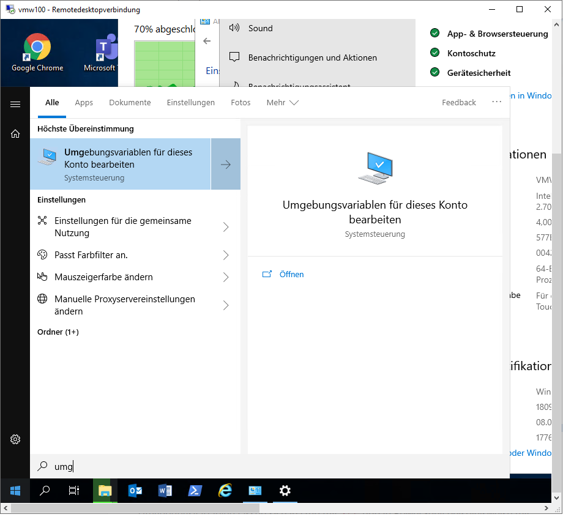
    
	
+ die Variable "Path" bearbeiten und einen weiteren Eintrag zum Java Verzeichnis einfügen: 
	`D:\svws-Entwicklungsumgebung\jdk-17\bin`

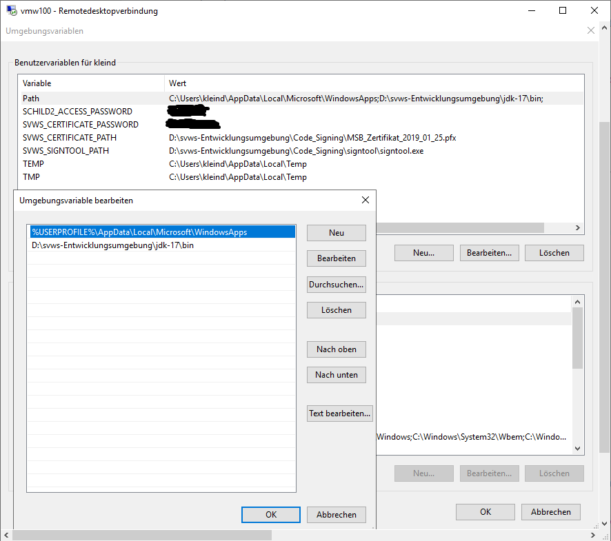

# NodeJS installieren 

+ Install node.js 16er Version -> https://nodejs.org/dist/v16.13.0/node-v16.13.0-x64.msi

# Eclipse installieren und konfigurieren

+ Installieren eclipse-inst-win64.zip (2021-09) (Eclipse IDE for Enterprise Java and Web Developers)-> https://www.eclipse.org/downloads/download.php?file=/technology/epp/downloads/release/2021-09/R/eclipse-jee-2021-09-R-win32-x86_64.zip&mirror_id=17
unter `D:\svws-Entwicklungsumgebung\eclipse\`
+ Einmaliger Start Eclipse und festlegen des Workspace: `D:\svws-Entwicklungsumgebung\workspace\`
+ Bei Bedarf den Speicher hochsetzen: per texteditor `D:\svws-Entwicklungsumgebung\eclipse\eclipse.ini` entsprechend z.B. aus der 512 eine 2048 machen

+ ... und bei der Verwendung von Java 17 die entsprechende Zeile `D:\svws-Entwicklungsumgebung\eclipse\eclipse.ini` löschen:
	
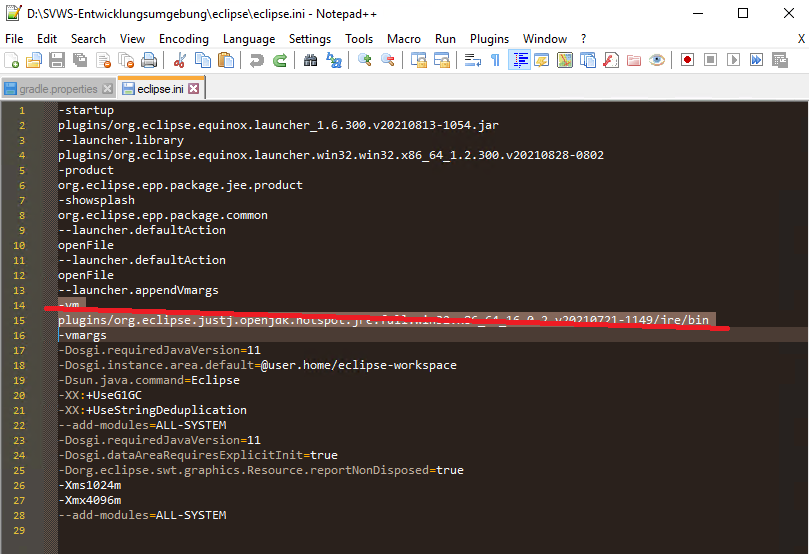

+ Eclipse > Window > Preferences > Java > installed JREs -> Add 
  Java 17 Verzeichnis eintragen:

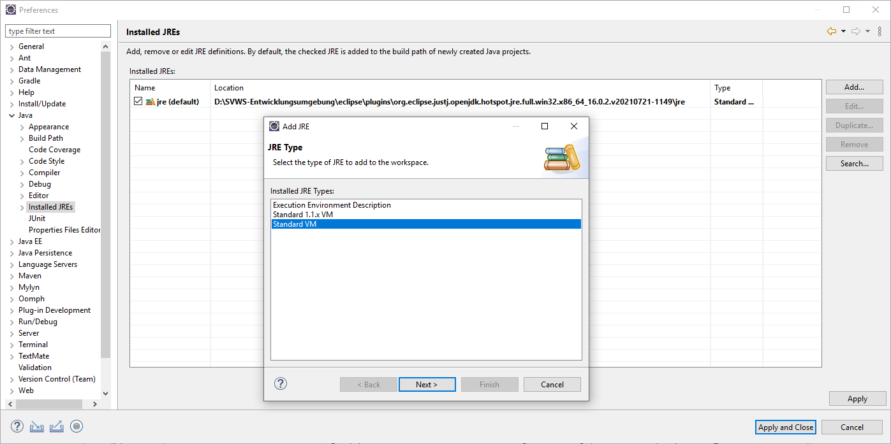

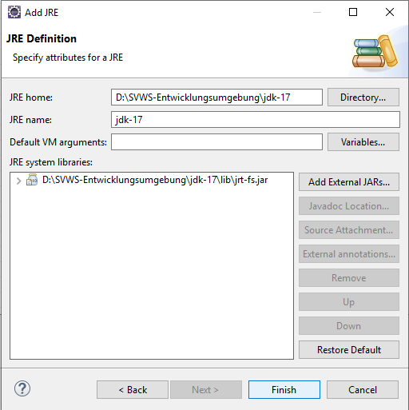

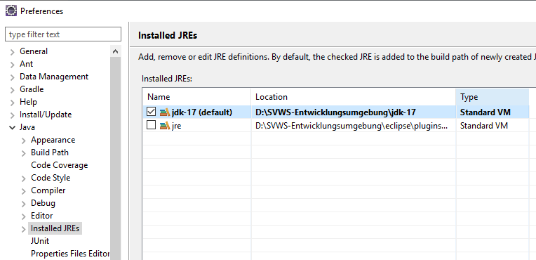

+ Eclipse > Help > Marcet Place -> Java 17 suchen und "Eclipse Java Development Tools Latest Release" installieren

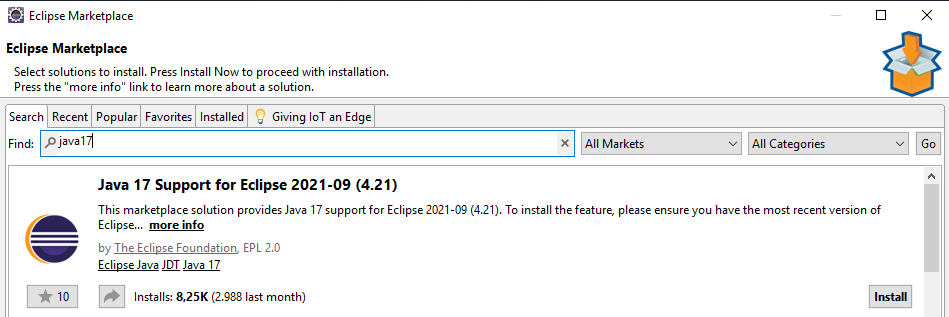

bei der Installation alle 4 Optionen auswählen

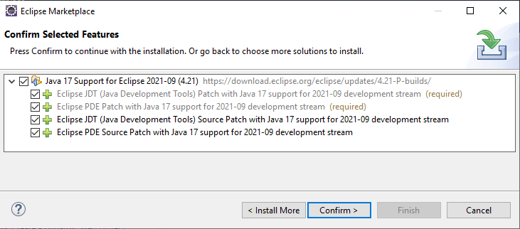

+ Eclipse > Help > Marcet Place -> Java development suchen und kontrollieren, ob "Eclipse Java Development Tools Latest Release" bereits installiert ist; ansonsten installieren
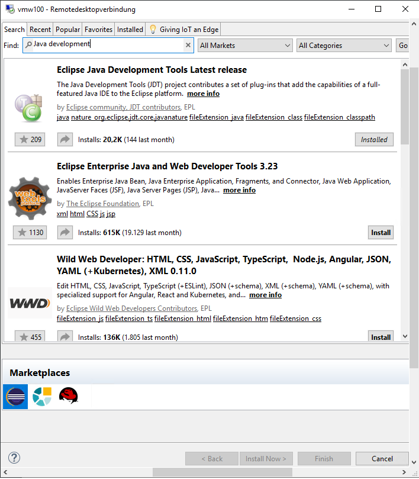

+ Eclipse > Help > Marcet Place -> JSON editor suchen und "JSON Editor Plugin 1.1.2" installieren

+ Eclipse > Window > Preferences > Java > Compiler -> 17 eintragen

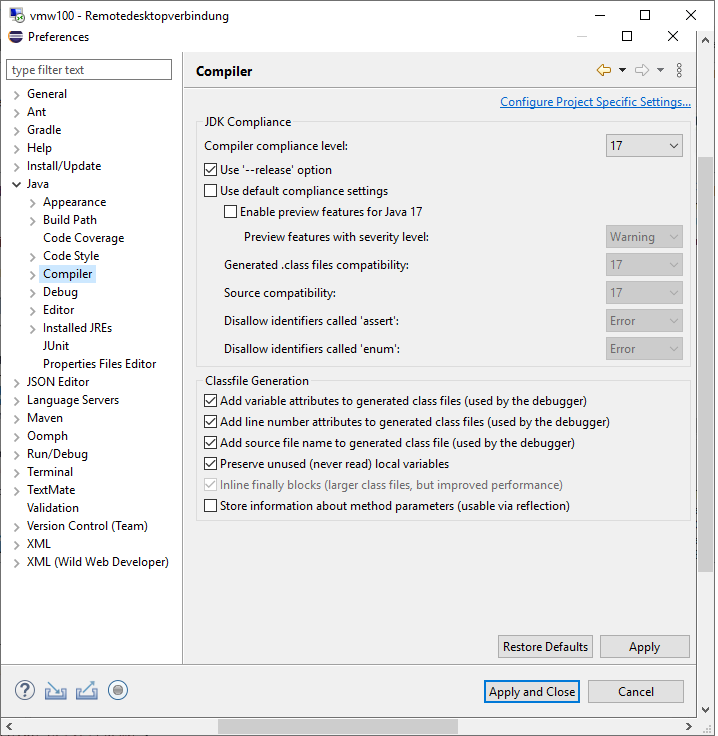

+ Eclipse > Window > Preferences > General > Editors > Text Editors > Spelling > UTF-8

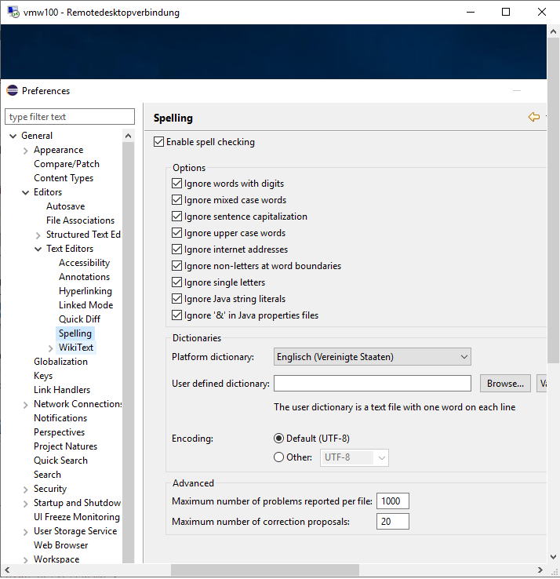

+ Eclipse > Window > Preferences > General > Workspace > Text file encodig > Other UTF-8

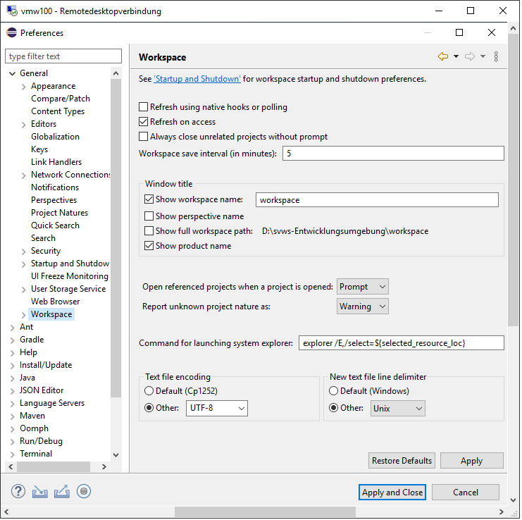

## Git Repositories in Eclipse einrichten 

+ Eclipse > Windows > Perspektive > Open Perspective > Other  -> Git

### Quellen aus GitLab eintragen:

+ Repositories in Eclipse clonen: rechte Maustaste Git > Clone a Git Repository
+ URL und Passwort eingeben
+ gerne auch in einem Unterverzeichnis `D:\svws-Entwicklungsumgebung\git\`

#### URLs: 

		https://git.svws-nrw.de/svws/SVWS-Server
		https://git.svws-nrw.de/svws/SVWS-UI-Framework
		https://git.svws-nrw.de/svws/SVWS-Client
		https://git.svws-nrw.de/svws/svws-dokumentation

optional zum Testen des MDB-Datenbankimports:

		https://git.svws-nrw.de/svws/SVWS-TestMDBs

### Alternative Quellen in GitHub.com (für Externe)
Hier benötigt man als "Passwort" in Eclipse den persönlichen Github Token 

		https://github.com/FPfotenhauer/SVWS-Server
		https://github.com/FPfotenhauer/SVWS-Client
		https://github.com/SVWS-NRW/SVWS-UI-Framework

## Arbeiten in Eclipse

In Eclipse kann man jeweils die "Perspective" ändern und direkt auf und mit den Git Repositories arbeiten oder in der Java Entwicklungsumgebung

### Git Perspective
Eclipse im Git Perspective geöffnet (rechts oben): 
+ rechte Maustaste pull holt sich die aktuellen Änderungen
+ Wechseln in SVWS-Server den dev-Branch (wenn dev-Branch aktiv), um die aktuellste Entwicklung zu testen
+ Check out as new Local Branch

### Java Perspective einrichten
Wechseln in Java-Perspective (rechts oben): 
+ Eclipse > File > Import > Import existing Gradle-Project
+ Import der vier Repositories als Gradle-Projekt
+ Eclipse schließen
+ ggf. unter `window preferences` das gradle Homeverzeichnis sinnvoll setzten.
+ in den Umgebungsvariablen oder im .gradle/gradle.config das Github_token, den Github_actor und das Schildpasswort wie folgt eintragen: 

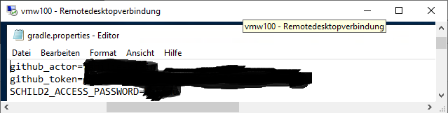

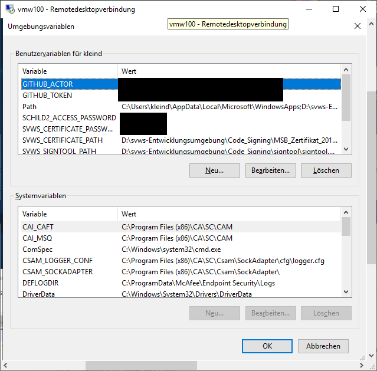

### Server, Client, etc bauen

+ View > Gradle Tasks > SVWS-Server > Run Clean 
+ View > Gradle Tasks > SVWS-Server > Run Build
+ Beachte: der Server und das UI müssen vor dem Client fertig gebaut sein und in der passenden Versionsnummer vorliegen

### svwsconfig.json anpassen

unter svws-server -> svws-server-app -> src/main/resources  findet man die Datei

   svwsconfig.json.example

diese kann man als Vorlage benutzen und in svws-server -> svws-server-app -> svwsconfig.json.example kopieren und die entsprechenden Eintragungen machen. 

Hier ein Beispiel

       
      {
       "EnableClientProtection" : null,
       "DisableDBRootAccess" : false,
       "DisableAutoUpdates" : false,
       "UseHTTPDefaultv11" : false,
       "PortHTTPS" : 443,
       "UseCORSHeader" : true,
       "TempPath" : "tmp",
       "TLSKeyAlias" : null,
       "TLSKeystorePath" : ".",
       "TLSKeystorePassword" : "svwskeystore",
       "ClientPath" : "D:/svws-Entwicklungsumgebung/git/SVWS-Client/build/output",
       "LoggingEnabled" : true,
       "LoggingPath" : "logs",
       "DBKonfiguration" : {
       "dbms" : "MARIA_DB",
       "location" : "localhost",
       "defaultschema" : "svwsdb",
       "SchemaKonfiguration" : [ {
       "name" : "svwsdb",
       "svwslogin" : false,
       "username" : "svwsadmin",
       "password" : "svwsadmin"
       } ]
      } 
    }'

### Importieren einer MDB Datenbank

Run configuration editieren für den Import der MDB

siehe: 

migration svsw-db utils-> src/main/java/ -> app -> migrate.java

### Starten des Servers
svws-server -> svws server app- /src/main/java/ -> de.nwr ... -> main.jve

# SVWS Installer (optional):

Soll der Windows Installer (.exe) gebaut werden, so benötigt man noch zusätzlich Software, Zertifikat und Passwort zum zertifizieren der Installationsdatei gegenüber Microsoft. 

## Variablen setzen
Die folgenden Umgebungsvariablen werden benötigt (Vorgehen: vgl. oben) 

	SCHILD2_ACESS_PASSWORD
	SVWS_CERTIFICATE_PASSWORD 
	SVWS_CERTIFICATE_PATH 
	SVWS_SIGNTOLL_PATH

## signtool installieren

# optionale Software 

## DBeaver
+ download: https://dbeaver.io/download/

## VSCodeUserSetup
+ Install VSCodeUserSetup-x64-latest.exe (optional)

## git per terminal auf Windows 

+ Ohne Administrationsrechte installierbar
+ hier die Anleitung auf heise.de -> https://www.heise.de/tipps-tricks/Git-auf-Windows-installieren-und-einrichten-5046134.html
+ download:  https://git-scm.com/download/win
+ Im MSB noch den Proxy eintragen: git config --global http.proxy http://10.64.128.22:3128

