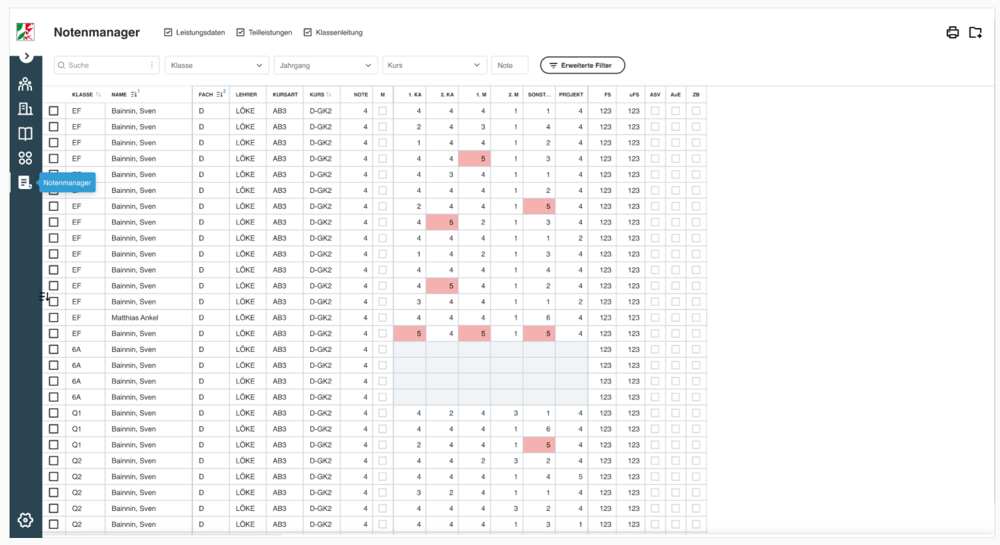
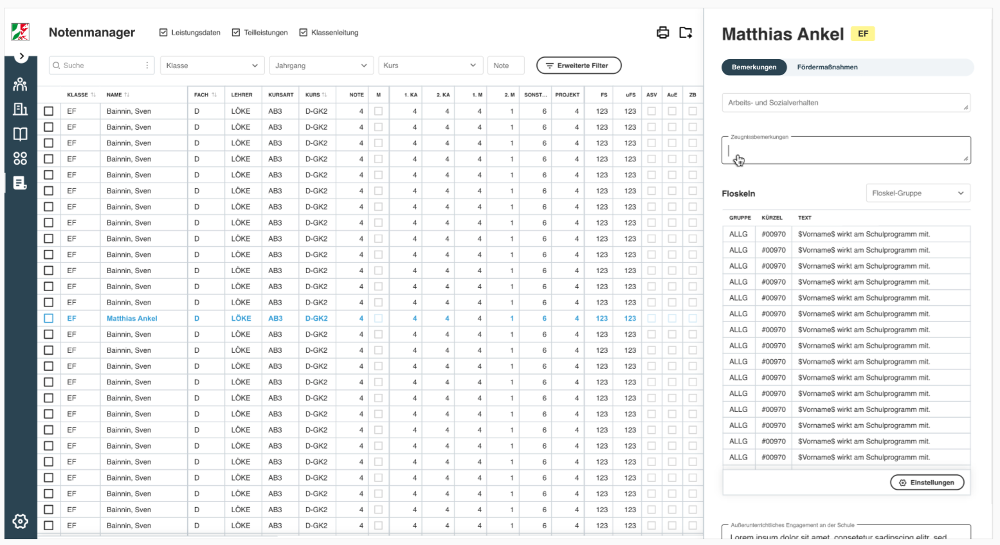
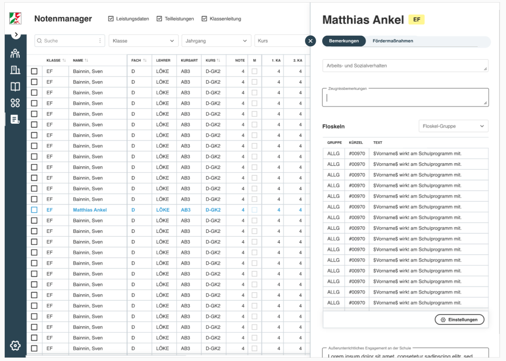
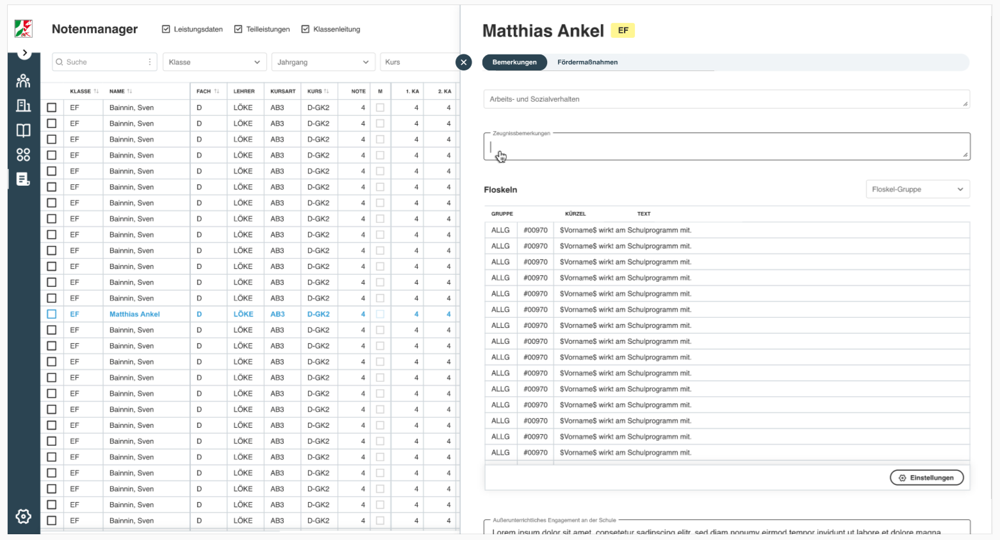
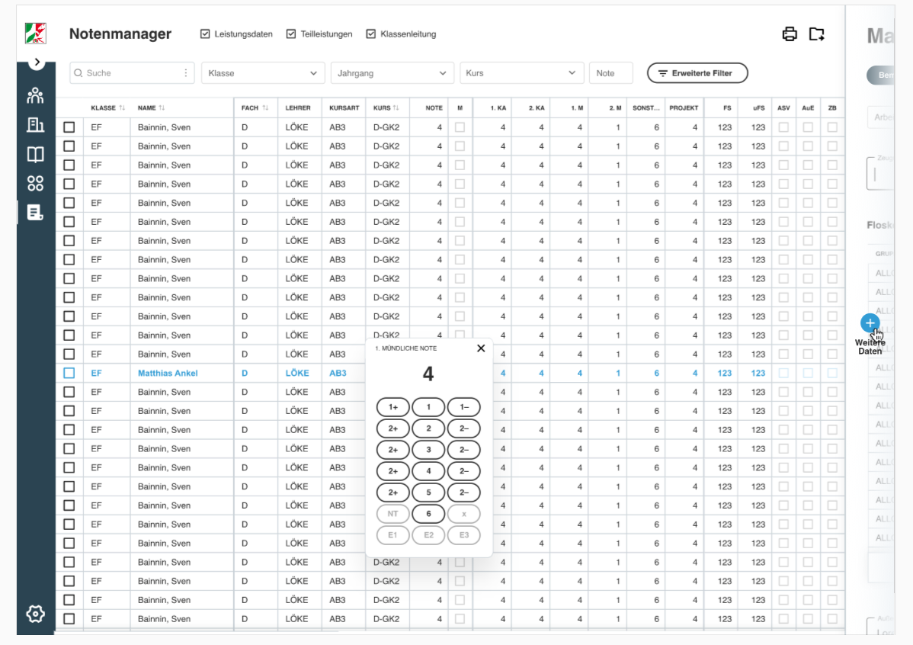
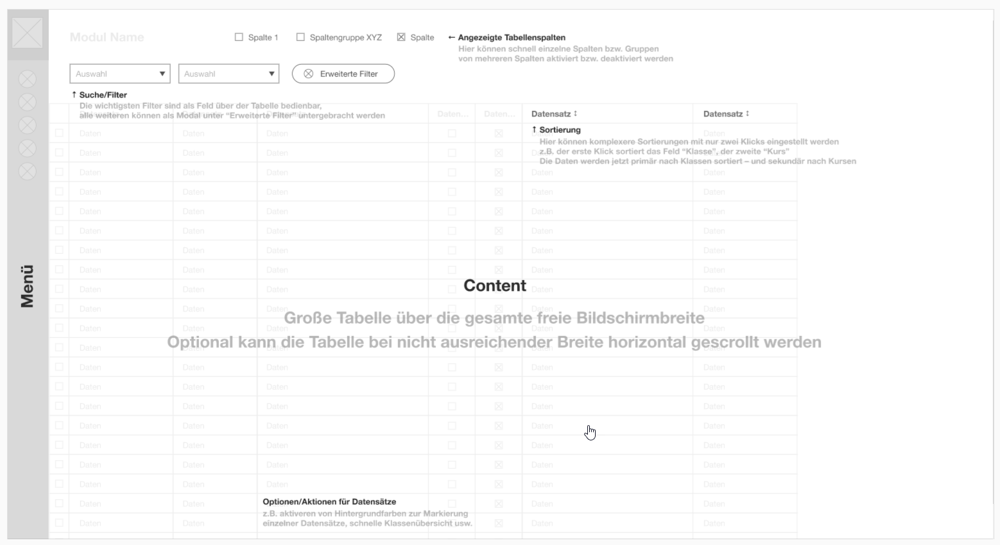
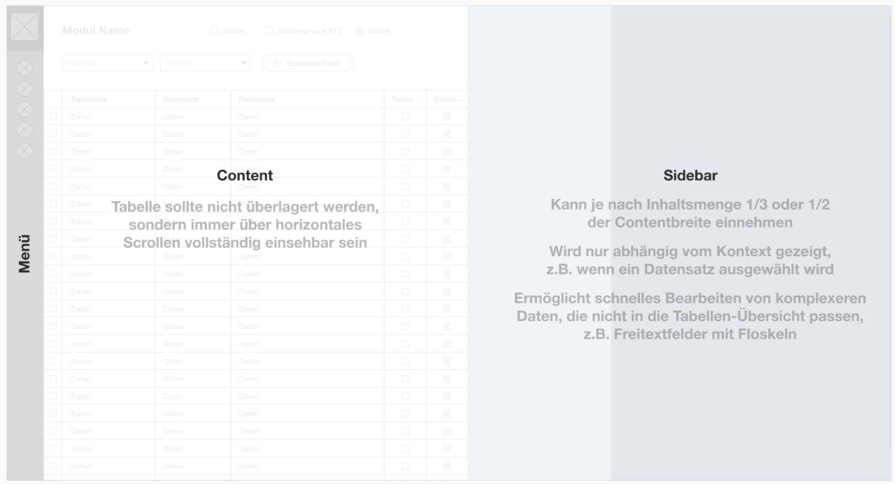

# Notenmanager

Der Notenmanager kann im Grunde auf zwei Arten aufgerufen werden: 
Einerseits als Teil ist der Notenmanager Teil des [SVWS-Clients](README.md), also der Eingabemaske, die auch im Verwaltungsnetz und ggf. darüber hinaus zur Verfügung steht. 
Der Notenmanager wird als Teil des SVWS-Servers bei der Installation mitgeliefert. 
Andererseits kann der Notenmanager in der Form des Web-Notenmanagers (WeNoM) aufgerufen werden. 

## WeNoM

Bei WeNoM, dem Web-Notenmanager handelt es sich um eine eigenständige Installation auf einer üblichen Webumgebungen. 
Als Voraussetzung kann hier ein kleiner Webspache bei einem Hoster mit einer Mysql Datenbank und vorinstallierem PHP genügen. 
Ggf. steht dies schon im Zuge der Schulhomepage zur Verfügung und kann durch eine Subdomain realisiert werden.
WeNoM und der orginäre Notenmanager sollen sich nur wenig unterscheiden. Installation, Einrichtung und Unterschiede in der Bedienung werden unter [WeNoM](WeNoM.md) beschrieben. 

## Styleguide und Bedienkonzept des Notenmoduls

Der Styleguide und das Bedienkonzept richten sich in großen Teilen nach den Vorgaben durch den SVWS-Client. Eine ausführliche Einführung dazu befindet sich in den Abschnitt Styleguide und Bedienkonzept des [SVWS-UI-Framework](../SVWS-UI-Framework/README.md).

### Styleguide

Der [Styleguide](https://xd.adobe.com/view/04217600-e7ff-4dfd-a433-806082ab30bc-5172/screen/bd3cd73f-1a58-4844-b1e2-32f3b98a684d) wurde mit Adobe XD erstellt.

#### Screenshots

Sortierbar und Filterbare Gesamtansicht der Notenliste mit markierten Defiziten:

Aus der Sidebar einblendbare Detailansichtdes einzelnen Schülers für Zeugnisbemerkungen, Fördermaßnahmen, etc.: 

Ansicht bei kleinerer Fensterbreite: 

Große Sidebar für längere Eingaben, wie es zum Beispiel bei Textbausteinen für Grundschulzeugnissen nötig ist:

Noteneingabetool für die Bedienung per touchscreen: 

### Bedienkonzept des Notenmanagers

Das gesammte [WireFrame-Modell](https://xd.adobe.com/view/6d18872d-ab80-40ca-a57b-929c9f649297-384b/).

#### Screenshots

Funktionen der Hauptseite:

Aufbau und Größenordnung der Seite inkl. Sidebar:

