# Proxmox-Virtualisierungs-Server

Proxmox ist eine OpenSource-Virtualisierungsplattform. 

Diese kombiniert KVM- und Container-basierte Virtualisierung und verwaltet virtuelle Maschinen, Container, Storage, virtuelle Netzwerke und Hochverfügbarkeit-Cluster übersichtlich über die zentrale Managementkonsole.
Das web-basierte Verwaltungs-Interface läuft direkt auf dem Server. Zudem kann die Virtualisierungsumgebung via SSH administriert werden.
Die Virtualisierungsplattform ist auch in der schulischen IT Umgebung anderer Bundesländer weit verbreitet. 

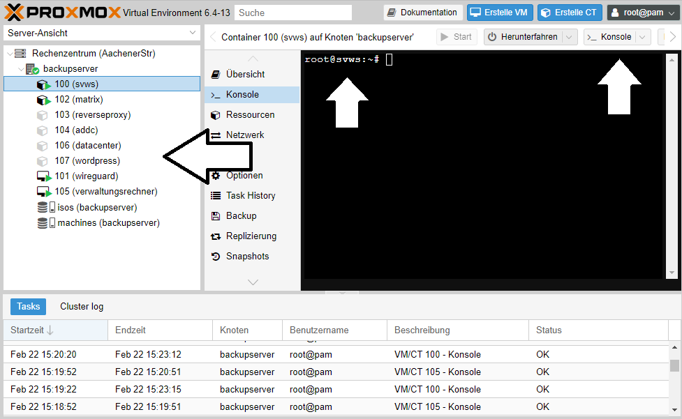

Im oben gezeigten Bild: Jede Nummer steht für einen Server, der per Konsole direkt erreicht werden kann. 

Proxmox VE eignet sich für den virtuellen Betrieb der benötigten Schulserver. 

## Proxmox LXH-Container erstellen: 

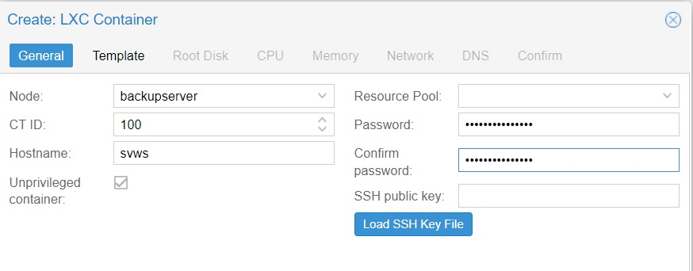

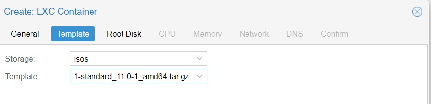

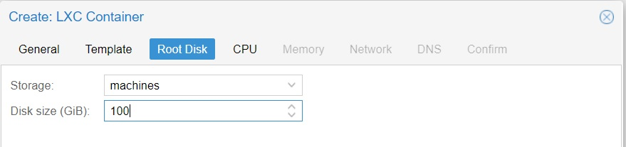

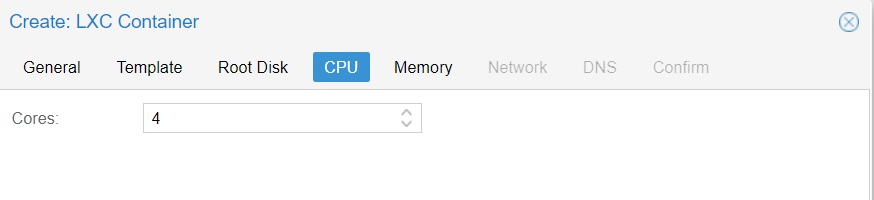

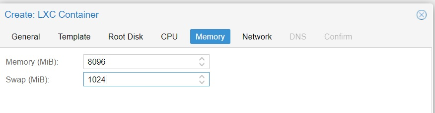

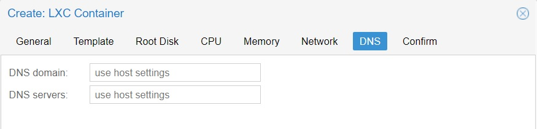

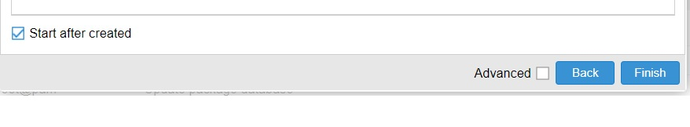

### Besonderheit bei Wireguard

Benutzt man einen LXH Container, wie oben beschrieben, muss für den Wireguard-VPN-Server noch Nachinstallationen auf em Proxmoxserver druchgeführt werden.
Alternativ kann man eine *echte* virtuelle Maschine in Proxmox einrichten:

## Virtuelle Maschine in Proxmox erstellen: 

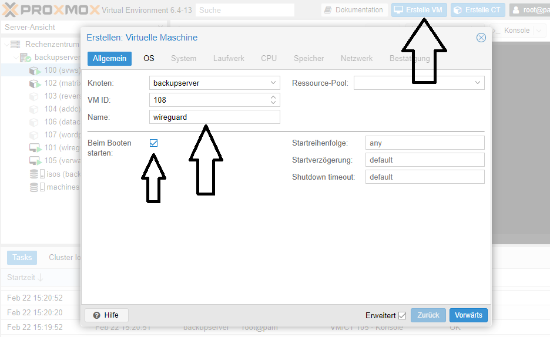

### Das entsprechende Iso auswählen

Falls das Iso-File noch nicht im Proxmox vorhanden ist,
müssen Sie dieses entsprechend vor dem Erstellen der VM auf den Speicher (Speicher-Symbol am linken rand) unter ISO-Images hochladen.

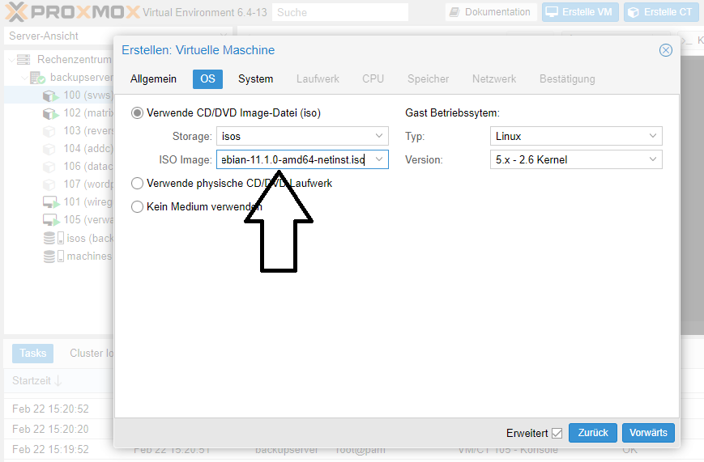

Nun können Sie nach Ressouce des Muttersystems Speicher, Arbeitsspeicher, CPU oder Netzwerkressourcen zuteilen. 
Bei einfachen Durchklicken werden zum Beispiel die folgenden Standartwerte gesetzt. 

### Abschließend auf "Erstellen" klicken:

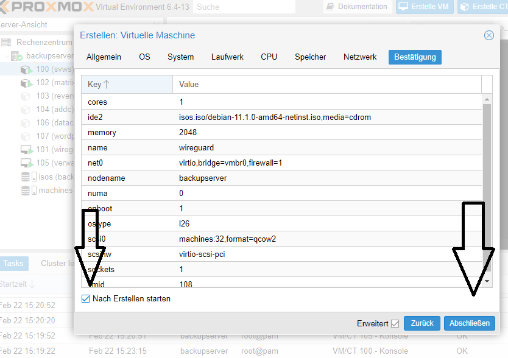