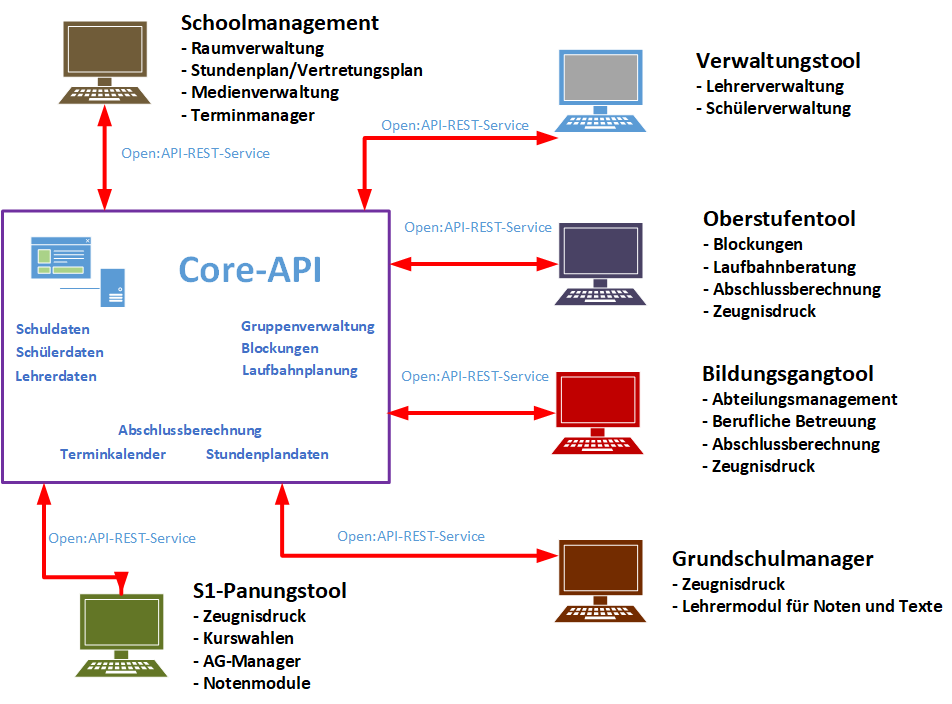

# SVWS-UI-Framework

## Open Source
Ziel des Projektes ist es, ein eigenes Framework für die UI-Komponenten zu benutzen 
und dieses mit Storybook.js in einem OpenSource-Repository zur Verfügung zu stellen.
Dabei kann das verwendete Repository mit GitHub-Pages als Grundlage für die Bereitstellung dienen:

[SVWS-UI-Framework-Repository auf GitHub](https://github.com/SVWS-NRW/SVWS-UI-Framework)

## Entwicklung der UI-Frameworks
Zu Beginn des Projekts wurde festgelegt, dass die Entwicklung des UI-Framework mit VUE.js erfolgen soll. 

[Auswahl des GUI-Frameworks](GUI-Auswahl.md)

Im Anschluss wurde zunächst ein "Storybook" erstellt. 
Die Vorteile von Storybook liegen in der zuverlässigen Bereitstellung und dem vom eigentlichen Code unabhängigen Testing.
Die Storybook-Umgebung kann auf einem Windows-Rechner wie folgt aus einem abonierten Repository aufgerufen werden:

* Im Stammordner von `git/SVWS-UI-Framework` eine Powershell öffnen.
* `.\gradlew clean build` ausführen
* `npm run storybook:start` eingeben

siehe auch: https://storybook.js.org

##  Styleguide und Bedienkonzept 

[Styleguide und Screendesign](Styleguide.md)

[Bedienkonzept der GUI-Komponenten](Bedienkonzept.md)

## Konzept der SVWS-GUI-Programmierung

### Übersicht GUI-Tools
Die folgende Grafik soll die verschiedensten Möglichkeiten darstellen, wie in Zukunft verschiedene GUI-Tools auf die Datenbanken zugreifen können. 
Durch die standartisierte Open-API-Schnittstelle ist es auch unerheblich, mit welchem Framework das GUI programmiert ist. Denkbar sind auch Desktop-Applikationen oder Web-Clients, die den REST-Server ansprechen.

