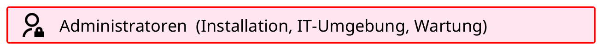
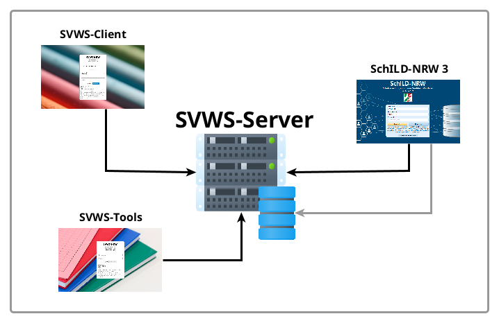

<!-- eslint-disable-next-line markdown/no-html -->

# SVWS-Dokumentation

:::info Erstellungsdatum {{ datum(data.buildDate) }}
:::

## SVWS-Server, SVWS-Client und weitere Projekte

Auf dieser Webseite finden Sie Dokumentationen zum **SVWS-Client** und zum **SVWS-Server** sowie diverser **SVWS-Tools**. Die Dokumentation zur Installation und Nutzung der Software **SchILD-NRW 3** finden Sie im [Wiki von SchILD-NRW-3](https://schulverwaltungsinfos.nrw.de/svws/wiki/index.php?title=SchILD-NRW_3)

Der SVWS-Client ist eine Webanwendung zur Unterstützung der Verwaltungsprozesse an den Schulen in Nordrhein-Westfalen. Er stellt eine plattformunabhängige Benutzeroberfläche bereit, die über alle gängigen Webbrowser genutzt werden kann. Dabei greift der SVWS-Client auf den SVWS-Server zu, sodass die bearbeiteten Daten unmittelbar auch anderen Client-Anwendungen zur Verfügung stehen, die mit dem SVWS-Server verbunden sind.

Während der ersten Übergangsphase wird der SVWS-Client parallel zu SchILD-NRW 3 eingesetzt.

In dieser Dokumentation finden Sie Informationen zur Installation, Entwicklung sowie die API-Dokumentation für die dezentrale Schulverwaltung in Nordrhein-Westfalen. Darüber hinaus stehen Dokumentationen zu weiteren Projekten zur Verfügung.

Das Gesamtprojekt _SVWS-Server_ ist ein Open-Source-Projekt des Landes Nordrhein-Westfalen.

Die Programme, die im Rahmen der Schulverwaltung NRW vom Ministerium für Schule und Bildung des Landes NRW zur Verfügung gestellt werden, erhalten Support durch das Fachberatersystem.

Weitere Informationen erhalten Sie unter https://www.svws.nrw.de/

## Datenschutzhinweis

Nehmen Sie den im SVWS-Client hinterlegten Datenschutzhinweis zur Kenntnis und beachten Sie den gültigen Rechtsrahmen.

Sie erreichen den Datenschutzhinweis über **Client Info** im **App**-Menü im Tab Datenschutz.

## Erklärung zur Barrierefreiheit

Dieses Angebot wird momentan auf Barrierefreiheit geprüft.

Die Ergebnisse werden hier veröffentlicht.

Stand: 21. Februar 2025

## Impressum

Ministerium für Schule und Bildung des Landes Nordrhein-Westfalen

Völklinger Straße 49, 40221 Düsseldorf

Telefon: +49 211 5867 40

https://www.schulministerium.nrw/
