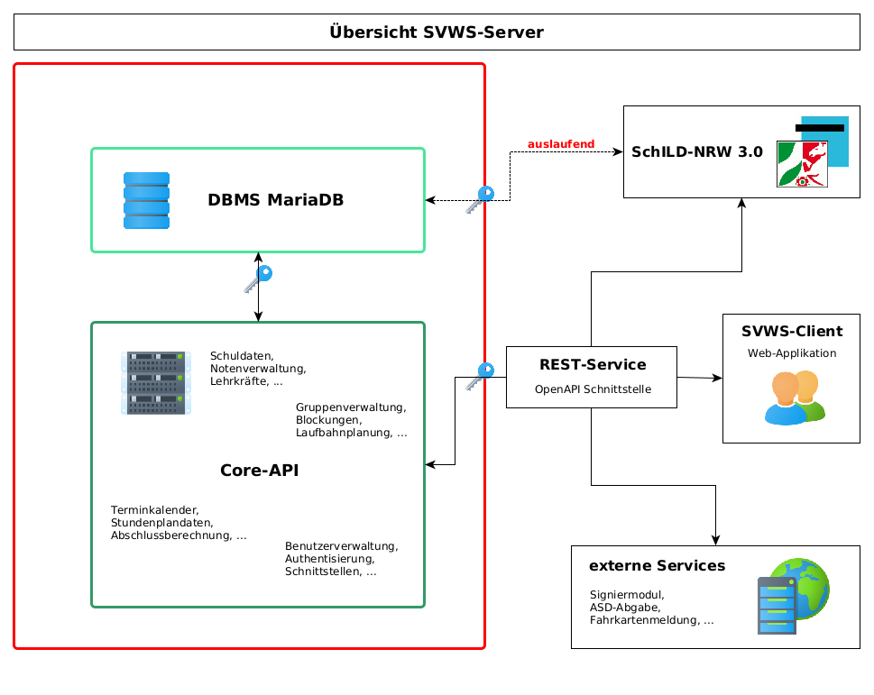

<!-- eslint-disable-next-line markdown/no-html -->

# SVWS Dokumentation

:::info Erstellungsdatum {{ datum(data.buildDate) }}
:::

Projekt zur Erstellung einer Schulverwaltungssoftware mit OpenAPI-Schnittstelle für die dezentrale Schulverwaltung in NRW.  

## Übersicht

In dieser Dokumentation können Sie sich über den technischen Aufbau des SVWS-Servers,
die Einrichtung einer Entwicklungsumgebung und den verschiedenen Deploymentszenarien informieren.

In der folgenden Übersicht soll ein erster Eindruck vom Aufbau des SVWS-Servers vermittelt werden.
Im Vordergrund steht die Kapselung von Datenbank und Core-API.

Externe Services können über die REST-Schnittstelle nach erfolgreicher Anmeldung Daten vom SVWS-Server erhalten. 
Ebenso greift die GUI auf die Daten zu und präsentiert diese dem jeweiligen Benutzer. 
Dieser Web-Client wird mit dem SVWS-Server zusammen ausgeliefert und steht mit Installation des Servers zur Verfügung. 

## Übergang von SchILD-NRW 2.0 zum SVWS-Server

Die Schulverwaltungssoftware SchILD-NRW des Landes NRW wurde im Jahr 2000 erstmalig in Auftrag gegeben.
Mittlerweile ist die Software 20 Jahre alt und es besteht dringender Bedarf an Modernisierung.
Unter den bisherigen Entwicklern besteht der Konsens, dass es extrem schwierig sein wird, eine neue Software 
mit den bestehenden Ressourcen zu entwickeln, die den gleichen Funktionsumfang bietet, wie das jetzige SchILD-NRW.

Aus diesem Grund entschied man sich zur Entwicklung eines REST-Servers, der eine offene API-Schnittstelle zur Verfügung stellt.
SchILD-NRW 3.0 kann dann weiterhin in einer Übergangsphase auf die Datenbank zugreifen.
Sobald alle Services der REST-Schnittstelle zur Verfügung stehen, wird SchILD-NRW 3.X auf diese Webservices umgestellt 
und vom direkten Datenbankzugriff abgekoppelt. Ebenso können weitere GUIs auf die API des SVWS-Servers zugreifen. 
Mit dem Update zu SchILD-NRW 3.0 wird im technischen Backend die Grundlage für diese Modernisierung geschaffen. 

## Hilfe und Handbuch 

Hier finden Sie eine Übersicht über die Funktionen des SVWS-Servers und Hilfen für den Anwender: [help.swvs-nrw.de](https://help.svws-nrw.de/)

## Github Quellen

Unser Projekt ist Open Source!  

Das Software Repository finden Sie hier: [Github Repository](https://github.com/SVWS-NRW/SVWS-Server)

Sie können unseren Quellcode und die Testdatenbanken unter dem o.g. Repository bzw. unter [Github - Schulverwaltung NRW](https://github.com/SVWS-NRW) finden.

## Mitarbeit

Wenn Sie an einer Mitarbeit am Projekt interessiert sind, so finden Sie in dieser Dokumentation unter [Teamarbeit](./Teamarbeit/) weitere Informationen. Per Github kann die Kontaktaufnahme zu unserem Entwicklerteam erfolgen. Ebenso können hier [Bugs oder Issues](./Teamarbeit/issues/) aus der Open Source Gemeinschaft gesammelt werden.

## [Projektanforderungen](Projektanforderungen.md)

## [FAQ](FAQ/index.md)

## [Impressum](https://www.schulministerium.nrw/impressum-haftungsausschluss-datenschutzbestimmungen)
