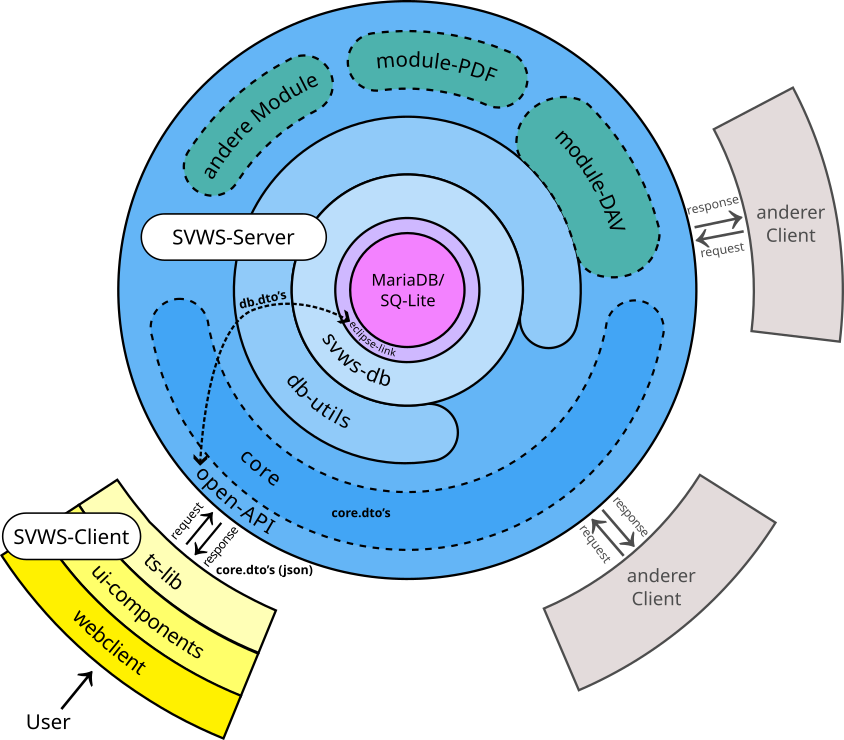

***SVWS - Dokumentation***
====================

Das Projekt zur Schaffung einer Open:API-Schnittstelle für die Schulverwaltung NRW.

# Übersicht

**Das Projekt:** 
Die Schulverwaltungssoftware des Landes NRW wurde im Jahr 2000 erstmalig in Auftrag gegeben.
Mittlerweile ist die Software 20 Jahre alt und es besteht dringender Bedarf an Modernisierung.
Unter den bisherigen Entwicklern besteht der Konsens, dass es extrem schwierig sein wird, eine neue Software mit den bestehenden Ressourcen zu entwicklen, die den gleichen Funktionsumfang bietet, wie das jetzige Schild-NRW.

Aus diesem Grund die Idee: Entwicklung eines REST-Servers, der eine offene API-Schnittstelle zur Verfügung stellt.
Schild-NRW kann dann weiterhin in einer Übergangsphase auf die Datenbank zugreifen.
Sobald aber alle Services der REST-Schnittstelle zur Verfügung stehen, kann Schild-NRW dann nach und nur noch als GUI dienen.

In der Übersicht soll einen erster Eindruck vom zukünftigen Aufbau vermitteln.
Im Vordergrund steht die Kapselung von Datenbank, Core-API und GUI.

# Zwiebelmodell Code-Ebenen / Komponenten-Hierarchie

Von innen nach außen übernehmen die Schichten die folgenden Rollen:

SVWS-Server:
- SVWS-Datenbank: Hier werden die Daten in eine(r) MariaDB geschrieben und gelesen.
- DB-Utils: Stellt Funktionalitäten zum Datenbank-Zugriff zur Verfügung.
- Core: (Hier passiert das Meiste)
- Open-API: Diese Schnittstelle nimmt Anfragen von Clients entgegen und liefert Antworten zurück.

- TS_Lib: Diese Komponente des Clients ist für die Kommunikation mit der Open-API verwantwortlich. Sie entält (auch) transpilierte Anteile aus den Server-Schichten 'Core' und 'Open-API'.
- Web-UI: Die graphische Benutzeroberfläche für den Benutzer (mit vue.js-Komponenten)

[Projektanforderungen](Projektanforderungen.md)

[FAQ](FAQ.md)

----
