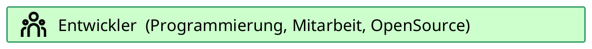

<!-- eslint-disable-next-line markdown/no-html -->
<script setup lang="ts">
import { data } from './build.data';

const datum = (t: number) => {
  // gibt ein Datum im deutschen Format zurück
  try {
    return new Date(t).toLocaleDateString('de', {day: '2-digit', month: '2-digit', year: 'numeric', timeZone: 'Europe/Berlin'});
  } catch (e) {
    console.log(e);
    return 'Datumsfehler';
  }
}
</script>
# SVWS Dokumentation

:::info Erstellungsdatum {{ datum(data.buildDate) }}
:::

[](./webclient/)
[](./deployment/)
[](./development/)

Für die Installation und Nutzung der Software **SchILD-NRW-3** findet sich deren Dokumentation im [Wiki von SchILD-NRW-3](https://schulverwaltungsinfos.nrw.de/svws/wiki/index.php?title=SchILD-NRW).

## SVWS-Server, SVWS-Webclient und weitere Projekte

Auf dieser Webseite finden Sie Dokumentationen zum *SVWS-Webclient* und zum *SVWS-Server*. Der **SVWS-Webclient** ist eine Web-Applikation zur Unterstützung der Verwaltungsprozesse an den Schulen Nordrhein-Westfalens. Er schafft eine plattformübergreifende Benutzeroberfläche, die mit allen gängigen Browsern aufgerufen werden kann.

Er wird in der ersten Übergangsphase parallel zu SchILD-NRW 3 benutzt.


Außerdem finden Sie hier Informationen zur Installation und zur Entwicklung und eine Dokumentation der API für die dezentrale Schulverwaltung in NRW. Ebenso gibt es eine Dokumentation zu weiteren Projekten.

Navigieren Sie zu den übergreifenden Bereichen dieser Webseite über die **Kopfzeile**. 

Unter dem ersten Punkt **Benutzerhandbücher** finden Sie die Dokumentationen für die **Anwender** in der Schule.

Die übrigen Punkte bieten Zugang zu technischen Informationen zu Installation, Administration und Entwicklung.

* Der SVWS-Webclient bietet eine Datenverwaltung für Schul-, Lehrkraft-, Schüler- und Schülerinnen- und Leistungsdaten.
* **WebLuPO** dient zur  Laufbahnberatung in der gymnasialen Oberstufe.
* Der Client unterstützt die Erstellung von **Blockungen** und **Klausurplänen** und
* die Verwaltung von **Stundenplänen**.

Das Gesamtprojekt _SVWS-Server_ ist ein Open-Source-Projekt des Landes Nordrhein-Westfalen.

Die Programme, die im Rahmen der Schulverwaltung NRW vom Ministerium für Schule und Bildung des Landes NRW zur Verfügung gestellt werden, erhalten Support durch das Fachberatersystem.

Nähere Informationen erhalten Sie hier:

https://www.svws.nrw.de/

## Datenschutzhinweis aus dem Webclient

Nehmen Sie den im SVWS-Webclient hinterlegten Datenschutzhinweis zur Kenntnis und beachten Sie den gültigen Rechtsrahmen.

Sie erreichen den Datenschutzhinweis über ````Client Info```` im **App**-Menü im Reiter Datenschutz.


## Erklärung zur Barrierefreiheit

Dieses Angebot wird momentan auf Barrierefreiheit geprüft.

Die Ergebnisse werden hier veröffentlicht.

Stand: 21. Februar 2025

## Impressum

Ministerium für Schule und Bildung des Landes Nordrhein-Westfalen

Völklinger Straße 49, 40221 Düsseldorf

Telefon: +49 211 5867 40

https://www.schulministerium.nrw/
