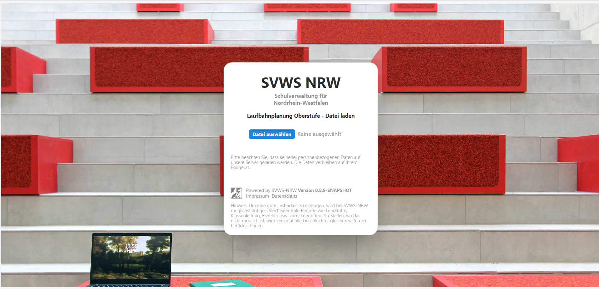
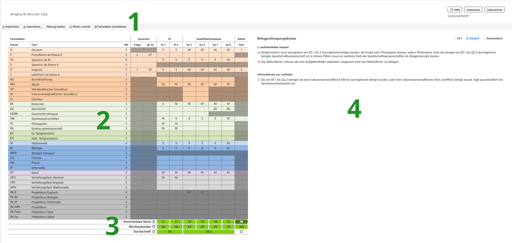

# WebLuPO 

WebLuPO ist ein webbasiertes Tool zur Laufbahnberatung und -planung iom Browser für die gymnasiale Oberstufe in NRW.

# Berabeitung im WebLuPO

Die Webanwendung WebLuPO ermöglicht das Laden individueller Schülerdateien im Format .lp.

Dabei wird das ausführbare Programm effektiv aus dem Netz geladen, sodass die Schülerdaten das Endgerät, an dem der Schüler arbeitet, nicht verlassen.

Die folgende Grafik zeigt die vier Bereiche der Laufbahnberatungstools.

Im ersten Bereich können Sie den Modus einstellen und haben Zugriff auf Speicher- und Bearbeitungsmöglichkeiten.   

Der Modus *normal* und *hochschreiben* füllt automatisch die im zweiten Bereich angegebenen Fachwahlen auf und passt sie sinnvoll an die höheren Jahrgänge an.

Durch einen Doppelklick auf die einzelnen Felder der Tabelle im zweiten Bereich können Sie zwischen Grundkurs, Leistungskurs, etc. wählen.  

Im dritten Bereich wird automatisch die Anzahl der belegten und anrechenbaren Kurse berechnet. Die Farbgebung von rot bis dunkelgrün gibt Ihnen direkt Feedback zur Anzahl der Kurse.

Im vierten Bereich werden die Regeln für die Oberstufenbelegung algorithmisch ausgewertet und die noch zu erfüllenden Bedingungen angezeigt. Hier kann der Modus EF.1, Gesamtprüfung oder automatisch gewählt werden.   

Interessant ist auch die Einstellung "Planung merken" im ersten Bereich, die das Festhalten einer Einstellung in der Tabelle ermöglicht.

Somit können Schülerinnen und Schüler von einem Ausgangspunkt aus schnell mehrere Planungen ausprobieren und wieder zurücksetzen. 

**TODO Prozessbeschreibung**