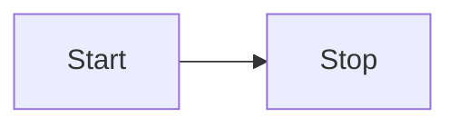
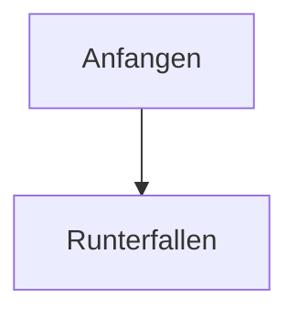
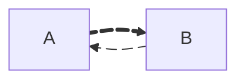
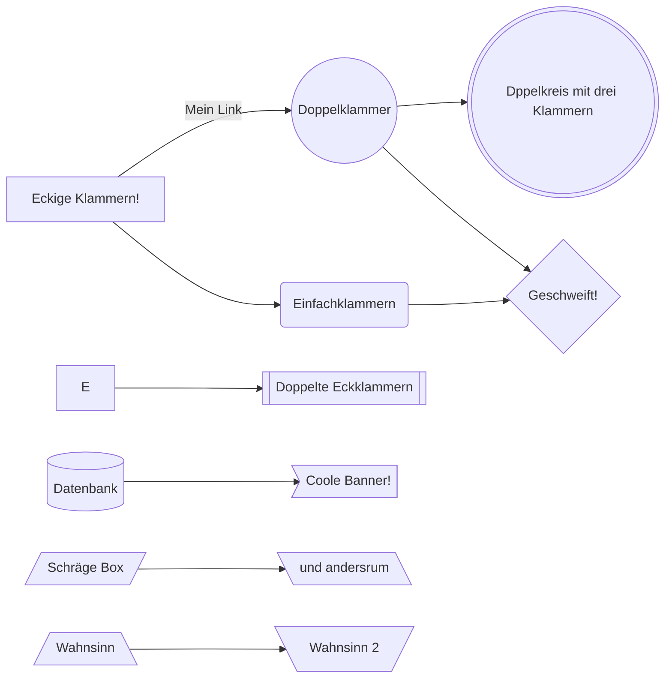
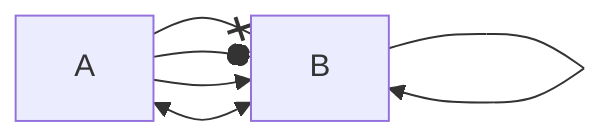
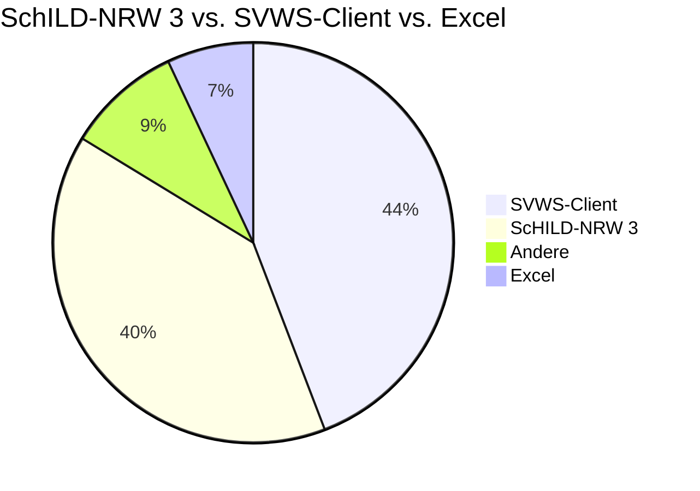
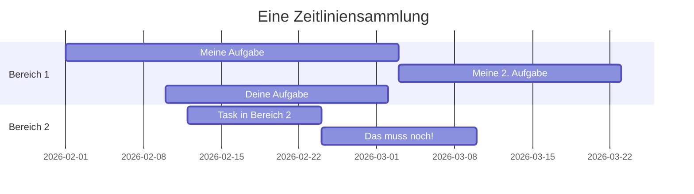
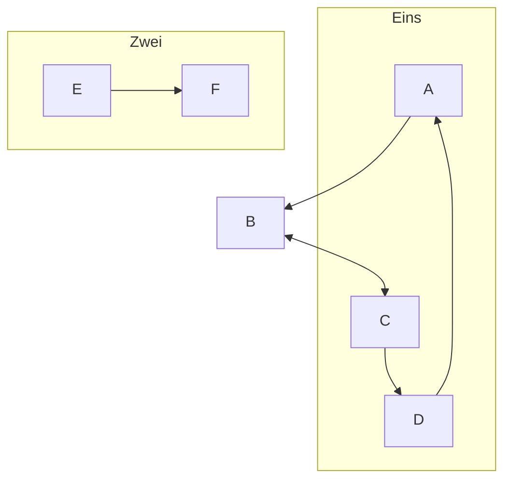
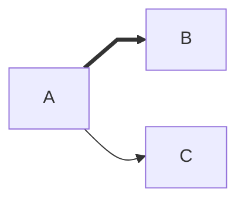
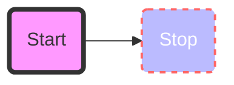

# Bereich zum Testen von Mermaid-Diagrammen

Basic Syntax

Wird nicht im Inhalt verlinkt

Kurzes HowTo:

* Pfeile
* Formen
* ...

* "Flowchart" und "Graph" machen das Gleiche.
* "o" und "x" nach Pfeilen sind besonders: Leerzeichen! "A---xB" -> "A--- xB", sonst gibt es Formen.
* Unicode-Text kommt "ABC UNICODE"

Einfach von links nach rechts

Und von oben nach unten (Mermaid kann TD (down) und TB (bottom), dann BT, RL und LR)

Mit Animation und auch dickem Pfeil!

Guck mal, die tollen Formen:

Mehr tolle Formen lassen sich direkt mit A@{ shape: rect } generieren. Shape-namen finden sich unter dem Link oben. Vorschlag: Wir nutzen die Namen?

Guck mal, ein paar Pfeile:

Boxen gehen mit "Subgraph", die Reihenfolge, wie was erzeugt wird und was am Ende passiert, ist etwas frickelig

"Flowchart" kann Pfeile von Subgraphen ausgehen lassen.

Pfeileformen:

Boxgrafik verändern:

Es können auch Klassen definiert werden.