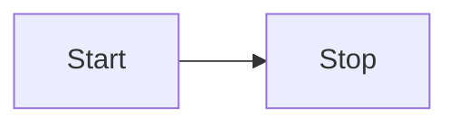
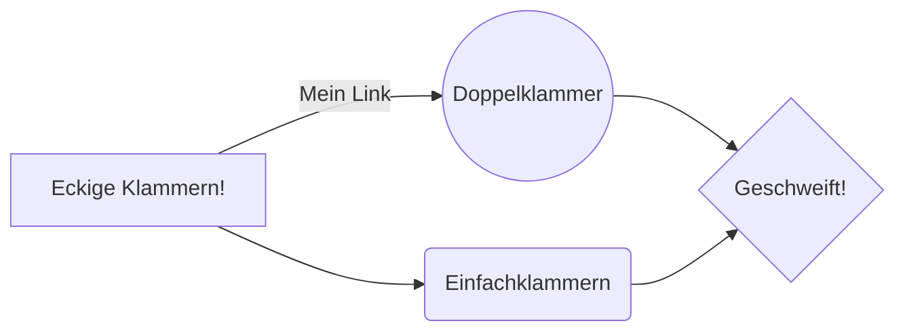
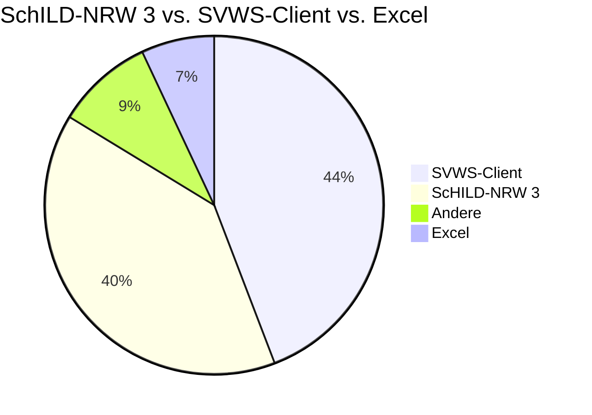
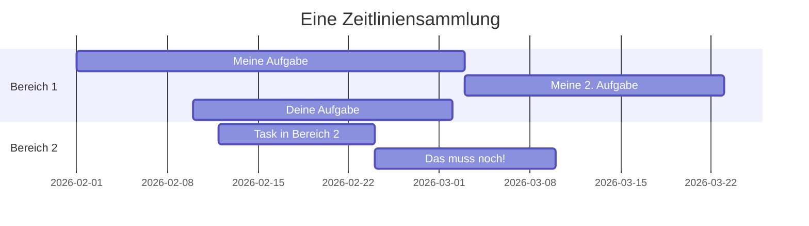

# Bereich zum Testen von Mermaid-Diagrammen

Wird nicht im Inhalt verlinkt

Kurzes HowTo:

* Pfeile
* Formen
* ...

```mermaid
flowchart LR
  Start --> Stop
```

```mermaid
graph LR
    A[Eckige Klammern!] -- Mein Link --> B((Doppelklammer))
    A --> C(Einfachklammern)
    B --> D{Geschweift!}
    C --> D
```

```mermaid
pie title SchILD-NRW 3 vs. SVWS-Client vs. Excel
  "SVWS-Client" : 95
  "ScHILD-NRW 3" : 85
  "Andere" : 20
  "Excel" : 15
```

```mermaid
gantt
    title Eine Zeitliniensammlung
    dateFormat YYYY-MM-DD
    section Bereich 1
        Meine Aufgabe       :a1, 2026-02-01, 30d
        Meine 2. Aufgabe    :after a1, 20d
        Deine Aufgabe       :a2, 2026-02-10, 20d
    section Bereich 2
        Task in Bereich 2 :2026-02-12, 12d
        Das muss noch!    :14d
```