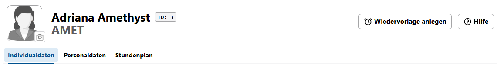
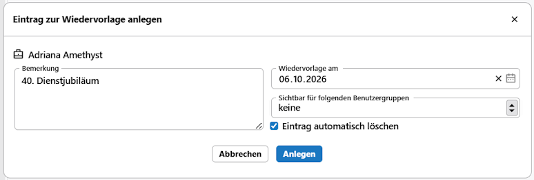

# Wiedervorlagen verwenden

In den **Apps zu Schülern** und der **App Lehrkräfte** lassen sich **Wiedervorlagen** definieren, um personenenbezogen zu einem gesetzten Datum wieder an einen Vorgang erinnert zu werden.

Klicken Sie bei einem Schüler oder einer Lehrkraft jeweils oben rechts auf `Wiedervorlage anlegen`.

Setzen Sie eine passenede **Bemerkung**, aus der die notwendigen Tätigkeiten am gesetzten Zeitpunkt hervorgehen.

Ebenso geben Sie in **Wiedervorlage am** an, wann die Wiedervorlage erscheinen soll.

Standardmäßig gilt die Wiedervorlage nur für Ihren aktuellen Benutzer. Sie können zusätzlich in einem Menü **Sichtbar für folgende Benutzergruppen** definieren, welche anderen Nutzer ebenfalls benachrichtigt werden.

Benutzer, die in einer dieser Benutzergruppen sind, werden dann ebenso benachrichtigt.

Geben Sie mit dem Haken bei **Eintrag automatisch löschen** an, ob ein Eintrag nach Erledigung automatisch gelöscht werden soll.

Todo: Nutzer: Allgemeine Wiedervorlage anlegen