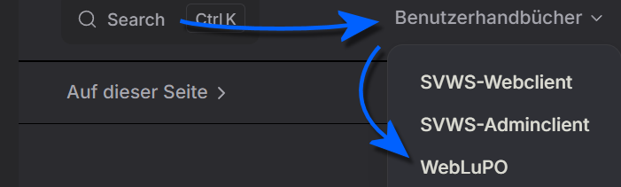

# Anleitungen zur Gymnasialen Oberstufe

In diesem Bereich finden sich Anleitungen zur Gynmasialen Oberstufe, die nicht einem konkreten Tab zuzuordnen sind.

Die Grundlagen zur Konfigurationen der Abiturjahrgänge mit den

* Fächern,
* den Vorlagen für die Beratungsbögen,
* der Laufbahnplanung,
* der Übersicht von erfolgten und eingesammelten Fachwahlen
* und dann die Blockung im Zuge der Kursplanung und
* anschließend die Klausurplanung

werden in der **App Oberstufe** beschrieben.

## Laufbahnwahlen mit SVWS-WebLuPO

Bezüglich der Laufbahnwahlen mit SVWS-WebLuPO finden Sie in diesem Bereich unter **Oberstufe ➜ SVWS-WebLuPO** die Anleitung, wie SVWS-WebLuPO durch die Abteilungsleitung GOSt/GOSt-Koordination oder durch Beratungslehrkräfte SVWS-WebLuPO für einen konkreten Abiturjahrgang aufzusetzen ist.

Im **Benutzerhandbuch SVWS-WebLuPO**, das in der Kopfzeile dieser Webseite verlinkt ist, finden Sie die Anleitung für Nutzer beziehungsweise die Installationsanleitung.

