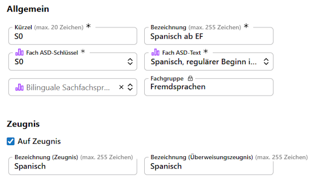
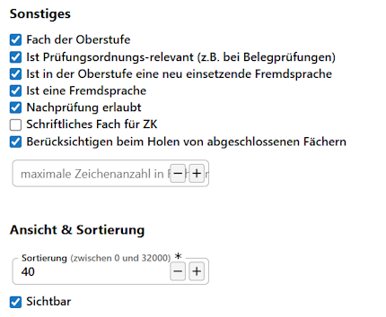

# I - Grundlegende Vorbereitungen der Datenbank

Zum einen sind korrekt definierte Fächer notwendig für das Funktionieren der diversen Algorithmen für Laufbahnen, Zulassungen und Prüfungen. Zum anderen dient ein Entfernen überflüssiger Fächer der Übersicht und verhindert Fehler im laufenden Betrieb, die korrigiert werden müssen.

## Fächer

Sie können die Fächer selbst im entsprechenden Katalog von SchILD-NRW 3 bearbeiten und per Haken ✔ als *"Fach der Oberstufe"* markieren. Die Einstellungen zu den Oberstufenfächern in Bezug auf Abiturjahrgänge sind nur im SVWS-Client enthalten, daher werden diese Arbeiten dort durchgeführt.

Zu den Basisdaten einfach Faches gehören die Kürzel, Bezeichnungen in der Schule und für Zeugnisse. Hier ist unbedingt die korrekte **ASD-Bezeichnungen** zu setzen.

Schauen Sie für aktuelle Details in die Schlüsseltabellen und Eintragungshilfen der ASD-Statistik von IT.NRW. Diese Dateien finden Sie auf der [Webseite für Schulverwaltungssoftware](https://svws.nrw.de) im Bereich zur Statistik.

In diesen ist auch aufgelistet, als welches Fach Projektkurse anzulegen sind oder als was ein eventuelles neues Fach einzupflegen ist.

## Eigenschafter der Fächer

Als nächstes sind die Detaileinstellungen durchzugehen:

Das Fach muss ein **Fach der Oberstufe** sein. Alle Fächer der Oberstufe stehen für die Laufbahnwahl zur Verfügung und können für bestimmmte Abiturjahrgänge aktiviert werden.

Setzen Sie den Haken bei **Ist prüfungsordnungsrelevant**, sobald das Fach in der Laufbahnplanung berücksichtigt werden soll. Dieser Haken ist beispielsweise bei den *Vertiefungskursen* zu setzen, damit deren Stunden in der Belegung angerechnet werden.

Die beiden nächsten Haken sind sehr wichtig: Die Markierung ✔, ein Fach sei eine **Neueinsetzende Fremdsprache** wird aufgerufen, um automatisch die Belegungspflichten für Fremdsprachen zu prüfen. Ohne den Haken lässt sich die Sprache in der Laufbahnwahl zwar wählen und alles sieht in Ordnung aus, jedoch werden mysteriöse Belegungsfehler gemeldet.

Gleichermaßen ist die Markierung ✔ bei allen Fremdsprechen als **Ist eine Fremdsprache** zu setzen, damit das Fach korrekt als Fremdsprache erkannt wird.

Die Haken, ob eine *Nachprüfung erlaubt* ist oder ob das Fach ein *Schriftlichen Fach für Zentrale Klausuren* ist, bezieht sich hauptsächlich auf die Sekundarstufe I und zum Zeitpunkt der Artikelverfassung auf die ZP10.

Oberstufenfächer sind grundsätzlich beim **Holen von angeschlossenen Fächern** zu berücksichtigen.

Schlussendlich können Sie Fächer durch Entfernen des Hakens bei **☐ Sichtbar** und damit auf *"nicht sichtbar"* stellen. Nutzen Sie dies für Fächer, die zwar noch in der Datenbank verbleiben sollen - etwa, weil Sie noch in alten Leistungsdaten vorhanden sind - perspektivisch aber nicht mehr gebraucht werden. Dies können zum Beispiel Sprachen sein, die an der Schule nicht mehr angeboten werden oder Fächer, die aufgrund einer neuen Prüfungsordnung wie früher oder mit dem alten ASD-Kürzel nicht mehr verplant werden. 

## Fremdsprachen

### Bezeichnung der Fremdsprachen

Fremdsprachen sind in ihrem ASD-Kürzel immer zweistellig: Der erste, große Buchstabe gibt die Sprache an, dann folgt der Jahrgang mit dem Beginn. Für *"Italienisch ab Jahrgang 7"* wäre das *"I7"*, für *"Spanisch ab Jahrgang 9"* entsprechend *"S9"*.

Für die in der EF neu einsetzende Fremdsprache wird immer der Jahrgang *"0"* gewählt, der neue Spanischkurs wäre damit *"S0"*.

Die Ausnahme ist *"Englisch"*, denn das ist immer nur *"E"*. Ein eventuelles "E5" ist falsch und wird nicht algorithmisch erkannt.

:::tip Nutzen Sie als Internes Fachkürzel das ASD-Kürzel
In der Praxis hat es sich als hilfreich erwiesen, als internes Kürzel direkt das ASD-Kürzel wie oben beschrieben zu verwenden. So können Fehler leichter gefunden oder gleich vermieden werden.

Gleichen Sie aber in jedem Fall die vorhanden ASD-Kürzel mit dem SOLL-Zustand ab. Mitunter finden sich Interne Kürzel die von den ASD-Kürzeln abweichen und so zu Verwechslungen führen.
:::

### Fortgeführte Fremdsprachen

Es ist zu empfehlen, dass Sie nur die an Ihrer Schule vorhandenen fortgeführten Fremdsprachen als tatächliches Fach anbieten. Legt man ein neues Fach an, um abzubilden, dass jemand von einer anderen Schule (Bundesland, Land) kommt und nicht wie bei Ihnen *"S7"* belegt hatte, sondern erst im achten Jahrgang mit *"S8"* begann, dieses Fach aber normal in der GOSt als "Spanisch, forgeführt" zählt, entsteht ein Problem.

Wird für die externen Schüler die in der SI, zur neuen EF oder im Laufe der GOSt bei Ihnen aufgenommen als Fach *"S8"* in der Laufbahnplanung eingetragen, haben Sie zwei fortgeführte Fächer mit der Fremdsprache und bei der späteren **Blockung der Kurse** werden auch Kurse für zwei Fächer angelegt: einmal für Ihre eigenen S7-Schüler und dann noch ein Kurs für die >1 Schüler mit S8, die sich aber nicht mehr ohne Weiteres zusammenführen lassen.

Erfassen Sie die S8er-Schülerinnen hingegen anders: Erzeugen Sie das *Fach "S8"* nicht, sondern tragen Sie die Schüler normal als *"S7"* ein, legen dann aber über die **Sprachenfolge** den Beginn der Sprache auf *"Jahrgang 8, 1. Halbjahr"*.

## Bereinigen 

Bereinigen Sie in Datenbanken mit gewachsenem Bestand die Fächer bezüglich der jeweils aktuellen Anforderungen.