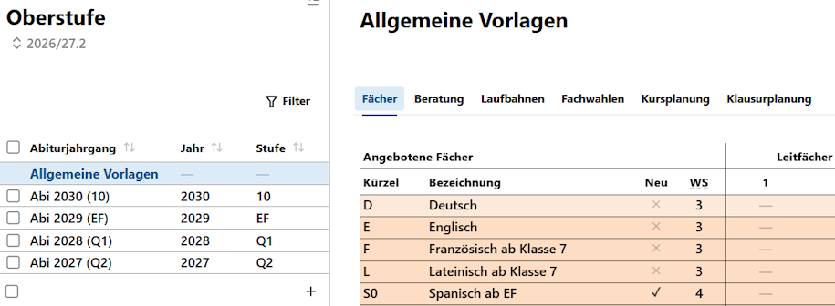
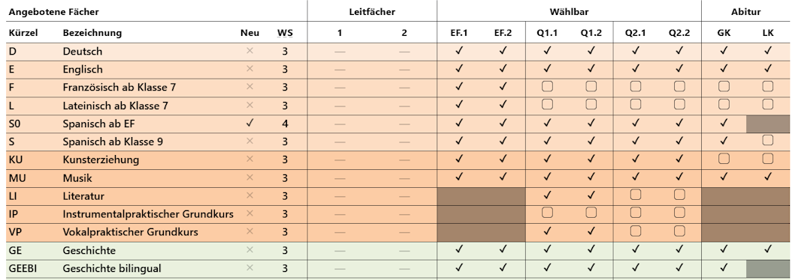
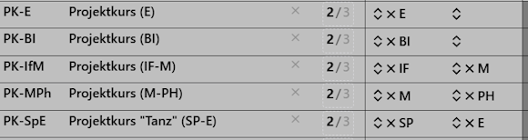
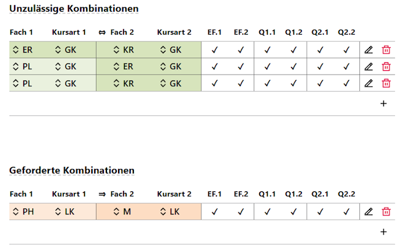
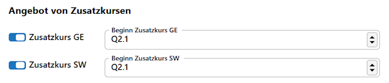
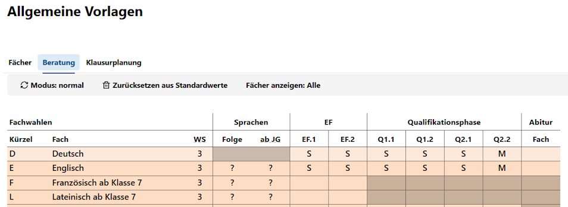
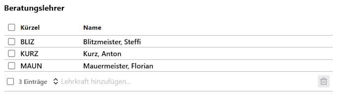

# II - Konfigurieren von Abiturjahrgängen

Um Schüler und Schülerinnen in ihre Laufbahnen wählen zu lassen, müssen die Rahmenbedingungen ihres Abitursjahrgangs konfiguriert werden.

In diesem Kapitel finden die hierzu notwendigen Informationen als Übersicht: zuerst sind die **Fächer** für ihren Jahrgang zu konfigurieren, dann kann für die **Beratung** der Beratungsbogen vorausgefüllt werden.

Über das Inhaltsverzeichnis werden daran anschließend die Artikel der **App Oberstufe** eingebunden, in der die **Fächer** und die **Beratung** dargestellt werden. Wurden diese Punkte bearbeitet, ist ein Abiturjahrgang bereit, dass Kurse gewählt werden.

## Allgemeine Vorlagen

Klicken Sie erst auf die **App Oberstufe**, es öffnet sich direkt der **Tab Fächer**.

Sie sehen in der Auswahhliste links die **Allgemeine Vorlage**, die übernommen wird, wenn Sie mit dem `Plus +` einen neuen Abiturjahrgang generieren. Darunter sind die schon erzeugten **Abiturjahrgänge**.

Beachten Sie hier, dass Sie direkt oben links den *aktuellen Lernabschnitt* wählen können und somit verändert sich die jeweilige Einordnung eines existierenden Abiturjahrgangs als Stufe *10, EF, Q1 oder Q2*. Interessant ist diese Möglichkeit zum Beispiel, um für den *zukünftigen Lernabschnitt* die korrekten Stufenbezeichnungen zugeordnet zu bekommen.

Die Ansicht zeigt direkt den **Fächer**. Zuerst soll hier die **Allgemeine Vorlage** erzeugt werden.

Hier im Screenshot ist nun zu sehen, dass es für Deutsch und Englisch LKs geben soll, während die ab der 7 einsetzenden Sprachen nur bis zur EF gewählt werden können. Musik wird auch als LK angeboten, Kunst hingegen ist nur als GK anwählbar. Der Instrumentalpraktischen Grundkurs soll nach der allgemeinen Vorlage erst einmal gar nicht zur Wahl stehen.

Ebenso ist zu sehen, dass Spanisch S0 neueinsetzend ist.

Im konkreten Abiturjahrgang sind nahezu alle Einstellungen noch anpassbar. Für Projektkurse gilt jedoch, dass die *Stundenzahl* und die *ein bis zwei Leitfächer* nur in der **Allgemeinen Vorlage** global für alle Jahrgänge definiert werden. Denken Sie auch daran, Projektkurse etwa in der Q2 zu blockieren, wenn diese dort nicht stattfinden.

Im Bereich **Unzulässige Kombinationen** und **Geforderte Kombinationen** legen Sie diese fest.

Es können Fächer mit einer Kursart gegenüber anderen Fächern mit einer Kursart gefordert und verboten werden.

Hier im Beispiel schließen sich KR, ER und Philo gegenseitig aus. Hierbei ist zu beachten: schließt KR das Fach ER aus, gilt das auch andersherum. Sie müssen die andere Kombination also nicht noch extra anlegen.

Ebenso können Sie Fächer- und Kurskombinationen fordern. Hier im Beispiel wird ein Physik-LK an einen Mathe-LK gekoppelt.

Aktivieren und deaktivieren Sie die angenbotenen Zusatzkurse.

Zusatzkurse sind ebenfalls als *geforderte* und/oder *unzulässige Kombinatationen* einstellbar.

## Vorlage für einen Jahrgang

Nachdem die *Allgemeine Vorlage* erzeugt wurde, kann mit dem `Plus +` ein tatsächlicher Abiturjahrgang erzeugt werden.

:::tip Halt!
Bevor Sie das nun tun: Lesen Sie bitte erst noch den **Tab Beratung** weiter unten! Die Allgemeine Vorlage für die Beratung wird nicht in den Abiturjahrgang übernommen, wenn Sie erst später ausgefüllt wird. 
:::

Es werden alle Einstellungen aus einer existierenden *Allgemeinen Vorlage* übernommen und können nun für den jeweiligen Jahrgang angepasst werden.

Typischerweise kann hier verändert werden, ob ein Fach nun als LK zusätzlic oder nicht mehr als LK wählbar ist. Ebenso wird hier eingestellt, welcher Projektkurs in diesem Jahrgang tatsächlich angeboten werden soll. Wählen Sie also alle anderen Projektkurse ab.

Hier können Sie für diesen Jahrgang spezifische geforderte und unzulässige Kombinationen anpassen.

:::tip Änderungen der Allgemeinen Vorlage
Ändern Sie im nachhinein die Allgemeine Vorlage, werden diese Änerungen nicht automatisch in schon erstelle Jahränge übernommen.
:::

## Tab Beratung

Um den Beratungsprozess zu entlasten können Sie den Wahlbogen auch schon vorausfüllen lassen. Auch hier wird erst eine **allgemeine Vorlage** erstellt, die dann für jeden Abiturjahrgang gesondert angepasst werden kann.

Zum Beispiel könnten Sie bei allen Schülerinnen und Schülern schon *"Sport" als "Mündlichen" GK* voreintragen oder allen schon *"Englisch Schriftlich"* geben. Ebenso haben alle schon Mathe angewählt. Sofern bei diesen Voreinstellungen Änderungen gewünscht sind, können diese dann in den indivduellen Wahlbögen vorgenommen werden.

Klicken Sie in in jeder Fach-Zeile in die Spalte für den Lernabschnitt, um ein M oder S einzustellen. In der Qualiafikationsphase werden die Einstellungen bei einem Klick auf Q1.1 automatisch für die übrigen Halbjahre hochgeschrieben.

Das Fenster zur Kurswahl wird im Detail in den Artikel zur Kurswahl noch beschrieben. Hier in Kürze: rechts werden Fehler dargestellt, unten Stundensummen. Da es sich um eine nicht vollständig ausgefüllte Vorlage handelt, werden hier naturgemäß noch viele Fehler stehenbleiben.

In einer Beratungsvorlage für einen konkreten Jahrgang können Sie die **Beratungslehrkräfte** für diesen speziellen Jahrgang einsetzen.

Legen Sie bei Wunsch noch einen **Mailtext** fest, falls Beratungsbögen per Email versandt werden sollen.

:::tip Nun kann gewählt werden
Nachdem ein Abiturjahrgang eingestellt wurde, können die Schülerinnen und Schüler ihre Kurswahlen vornehmen.
:::

Nehmen Sie bei Wunsch die über diese Einführung hinausgehenden Artikel in der **App Oberstufe** zur Einstellungen bezüglich der **Tabs Fächer und Beratung** Kenntnis.

Das Handbuch selbst geht in **Kapitel III - Vorbereiten eines Jahrgangs** weiter, in dem noch einmal sichergestellt wird, dass die Schülermenge des betreffenden Oberstufenjahrgangs aktuell ist. 