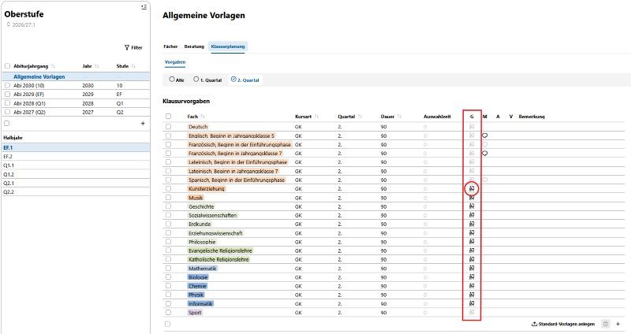

# Gleichwertig komplexe Leistungsnachweise (gkL) 

Hinweis: Die gkLs sind erst ab dem Schuljahr 2027/28 für den Abiturjahrgang 2030 einzurichten.
  
Damit die gkLs in der Laufbahnplanung zur Verfügung stehen, werden in der Klausurplanung zunächst für die jeweiligen Fächern in den Abschnitten die gkLs pro Quartal nach Vorgaben der Schule aktiviert.  

Die Eintragungen können in **Allgemeine Vorlage** oder für jeden Abiturjahrgang in dividuell eingetragen werden:

  
  Im obigen Beispiel sind in der allg. Vorlage für EF.1 im 2. Quartal für Ku, Mu, alle GL und alle NW inkl. Mathe gkL eingeplant.