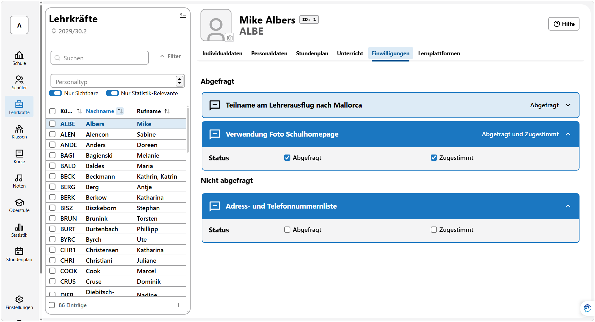

# Einwilligungen (Lehrer)

In diesem Bereich werden Ihnen die Einwilligungen der einzelen Lehrkraft bzw. des Personals angezeigt.

Unterteilt wird hier in die Kategorien *Nicht abgefragt*, wenn noch keine Einwilligung bearbeitet wurde und *Abgefragt*.

Um eine Einwilligung zu bearbeiten, klappen Sie mittels des kleinen Hakens rechts bei jeder Einwilligung den Status auf und setzen Sie einen Haken bei *Abgefragt* beziehungsweise bei *Zugestimmt*. Setzen Sie ihn nur bei *Zugestimmt*, wird der Haken bei *Abgefragt* automatisch gesetzt.

Wurde ein Haken gesetzt, wird im Titel der Einwilligung dieser Status als Text angezeigt, im Screenshot ist bei *Teilnahme am Lehrerausflug nach Mallorca* der Status *Abgefragt* und bei *Verwendung Foto Schulhomepage* der Status *Abgefragt und Zugestimmt* zu lesen. Bei *"*Adress- und Telefonnummernliste* ist gerade die Einwilligung aufgeklappt, um den Status zu setzen.

Neue Einwillungsarten werden über das Menü ***Schule*** unter ***Katalog*** **Einwilligungen** erzeugt und bearbeitet. Dort können keine Einwilligungen gelöscht oder verändert werden, die schon bei mindestens einer Lehrkraft/Person gesetzt sind. Ebenso lassen sich dort Einwilligungen für Schülerinnen und Schüler erfassen.