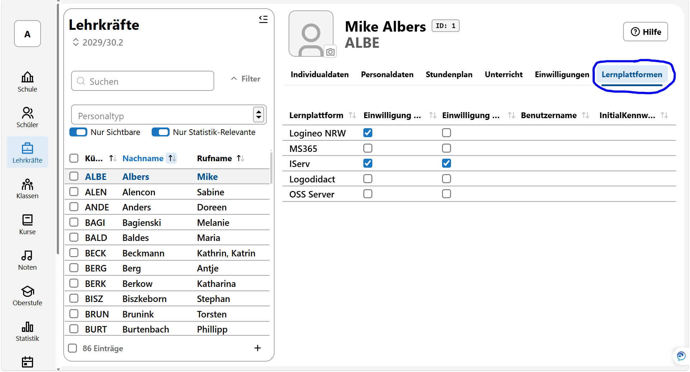

# Lernplattformen
Im Bereich der Lernplattformen kann für jede im SVWS-Server hinterlegte Lernplattform ausgewählt werden, ob eine Abfrage zur Einwilligung der Nutzung der Lernplattform erfolgte und ob der Nutzung zugestimmt wurde.

*Erst wenn eine Zustimmung erfolgt ist, wird bei einem Datenaustausch die Lehrkraft beziehungsweise die Person mit ausgegeben.*

Wurden *Benutzernamen* und *Initialkennworte* erzeugt, können diese hier ebenfalls eingesehen werden.

Sie können unter der **App Schule** ➜ **Kataloge** ➜ **Lernplattformen** weitere Lernplattformen anlegen oder umbenennen. ***Löschen*** können sie eine Lernplattform nur dann, wenn zu dieser bei keiner Person - Lehrkraft oder Schüler - ein Eintrag erfolgt ist.