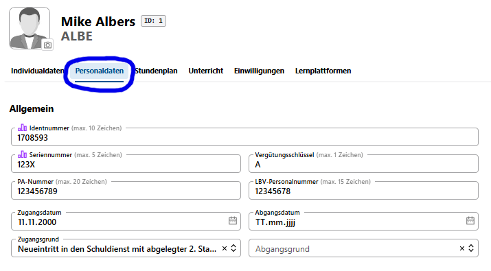
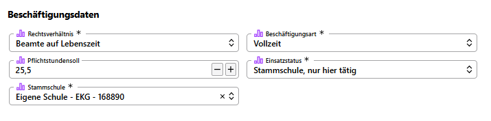
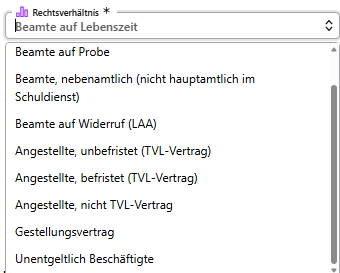
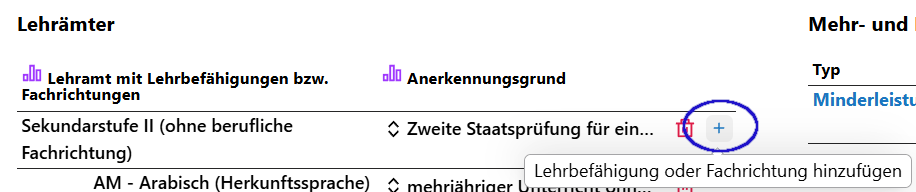
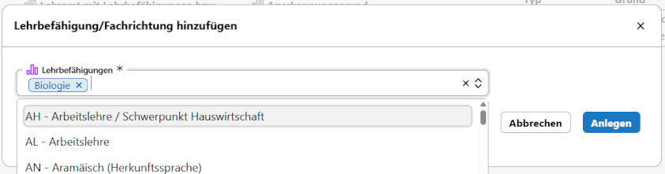
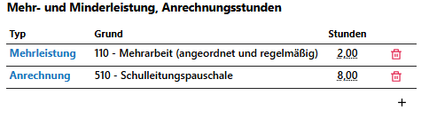
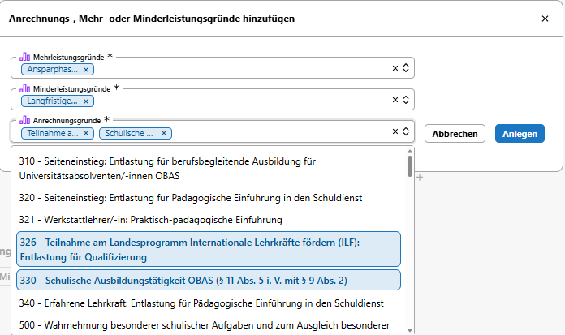
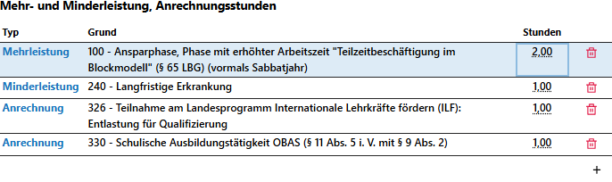

# Personaldaten

In den Personaldaten lassen sich die berufsbezogenen Daten der Lehrkräfte und sonstigen Personals erfassen.

Im Bereich **Allgemein** werden Daten wie die vom Geburtsdatum und dem Geschlecht abgeleitete *Identnummer* das *Zugangs-* und *Abgangsdatum* und deren Gründe erfasst. Beachten Sie hier, welche Daten für die **Statistik relevant** sind.

Bei den **Beschäftigungsdaten** werden die Daten zum Beschäftigungsverhältnis eingetragen, dies beinhaltet auch die die vertragliche **Pflichtstundenzahl**.

Ferner sind über ein Pulldown-Menü das **Rechtsverhältnis**

sowie die Beschäftigungsart und der Einsatzstatus und die Stammschule auszuwählen.

Felder, die nicht als *statistikrelevant* markiert sind, dienen informativen Zwecken.

Bei dem Abschnitt **Lehrämter** müssen für eine Lehrkraft das Lehramt beziehungsweise die Fachrichtung eingetragen werden.

Wurde ein Lehramt hinzugefügt, können Sie dahinter mit dem **Plus** dieser Lehramt die zugehörigen **Lehrbefähigungen** beziehungsweise **Fachrichtungen** hinzufügen.

Fügen Sie ebenfalls bei weitere **Unterrichtsfächer** hinzu. Beachten Sie, dass sich diese Maske je nach Schulform ändern kann.

Beim Abschnitt **Mehr- und Minderleistung, Anrechnungsstunden** werden alle ***statistikrelevanten*** Eintragungen vorgenommen, sodass die Lehrkraft zusammen mit dem erteilten Unterricht ihr Soll erfüllt.

Dazu mussen zuerst ein oder mehrere Anrechnungs- Mehr- oder Minderleistungsgründe über Auswahlfelder

ausgewählt werden, bei denen man dann im weiteren Verlauf die zugewiesene Stundenanzahl zuweist.

Beachten Sie dabei, dass sich manche Mehr- und Minderleistungsgründe auf die Statistik bezogen gegenseitig ausschließen.