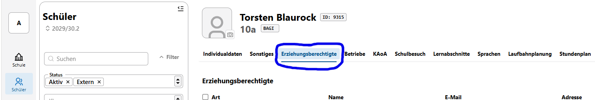
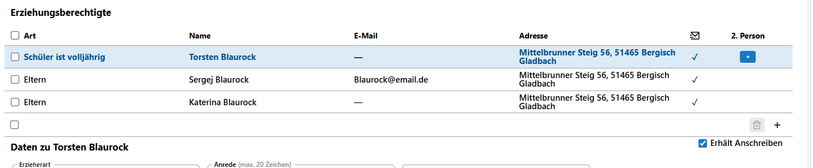
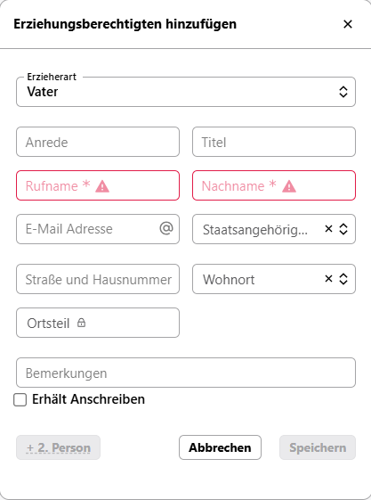
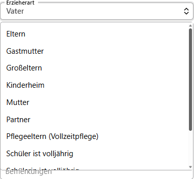
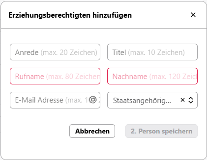

# Erziehungsberechtige
In diesem Bereich werden Ihnen die Erziehungsberechtigten einer Schülerin beziehungsweise eines Schülers angezeigt und bearbeitet.

Hier sehen Sie beispielhaft eingetragene Erziehungsberechtigte sowie einen eigenen Eintrag zum Schüler Torsten Blaurock, der volljährig ist.

Über das **+** ganz rechts können Sie weitere Erziehungsberechtigte hinzufügen. Es erscheint ein Pop-up-Fenster:

Wählen Sie zuerst die *Erzieherart* aus. Dazu können Sie unter den eingetragenen Erzieherarten per Auswahlmenü wählen.

Füllen Sie nach der Auswahl die restlichen Felder aus, wobei lediglich die Pflichtfelder *Rufname* und *Nachname* notwendig zufüllen sind.

::: tip
Beim Feld *Bemerkungen* kann man eintragen, ob diese Person nicht erziehungsberechtigt ist, oder ob sogar ein Kontaktverbot besteht.
:::

Als nächstes ist zu markieren, ob diese Person ein Anschreiben erhalten soll (***Erhält Anschreiben***).

Zum Schluss können Sie in Verbindung zu dieser Person eine weitere Person angeben, indem Sie auf ***+2. Person*** klicken. Es öffnet sich ein weiteres Pop-up-Fenster:

Auch hier sind der *Rufname* und *Nachname* Pflichtfelder, um die *2. Person speichern* zu können.

Zum Schluss auf den **Speichern**- beziehungsweise den **2. Person speichern**-Button drücken und die Erziehungsberechtigte Person wird angelegt.

## Unterschiedliche Arten von Erziehungsberechtigen

Wie Sie bereits in dem Auswahlmenü

gesehen haben, können unterschiedliche *Erzieherarten* ausgewählt werden. Diese können in der **App Schule** ➜ **Kataloge** ➜ **Erzieherarten** bearbeitet und bei Bedarf ergänzt werden.

::: tip
Es ist nur bei **Eltern**, **Pflegeeltern** etc. sinnvoll, eine *2. Person* einzugeben.
:::

## Weitere Arten von Ansprechpartnern

Bei weiteren Ansprechpartnern wie z.B. *Partner*, *Onkel* und *Tante*, die nicht erziehungs- beziehungsweise sorgeberechtigt sind, sollte stets das ***Anschreiben*** abgewählt bleiben.

::: tip
Der Eintrag ***Schüler ist volljährig*** ist dann einzutragen, wenn die Schülerin beziehungsweise der Schüler volljährig ist und demnach persönlich ein Anschreiben erhält. Wenn dieser Eintrag vorhanden ist, wird bei einem Reports an die Erziehungsberechtigten auch der Schüler automatisch adressiert.
:::