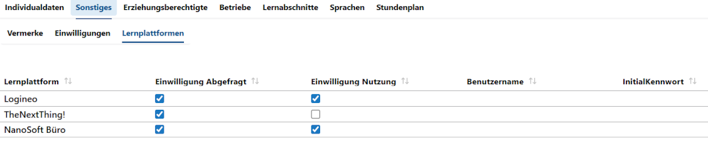

# Schüler -> Sonstiges -> Lernplattformen

Wurden im **Katalog Lernplattformen** eine oder mehrere Lernplattformen erfasst, kann in der **App Schüler ➜ Sonstiges** im **Untertab Lernplattformen** eingestellt und eingesehen werden, für welche Lernplattform eine Einwilligung abgefragt und erteilt wurde.

Wurden *Benutzernamen* und *Initialkennworte* erzeugt, können diese hier ebenfalls eingesehen werden.

Liegt für eine Lernplattform bei einer Person keine **Einwilligung** vor, wird für diesen Datensatz bei einem **Datenaustausch** kein Datensatz exportiert.