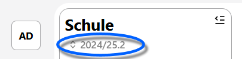

# Datenaustausch

Hier können Sie Daten im- und exportieren. Sofern externe Dienste bestimmte Formate benötigen oder bereitstellen, dienen die Importe und Exporte hier als passende Schnittstelle.

Entnehmen Sie bitte dem Inhaltsverzeichnis in dieser Doku und dem SVWS-Client selbst, welche Dienste zum Datenaustausch aktuell zur Verfügung stehen.

Unter Umständen ist beim Datenaustausch der Lernabschnitt relevant. Der zu Im- oder Exportierende Lernabschnitt kann oben links unter der Überschrift "Schule" geändert werden.
