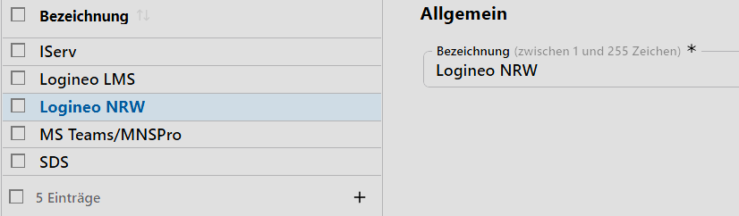
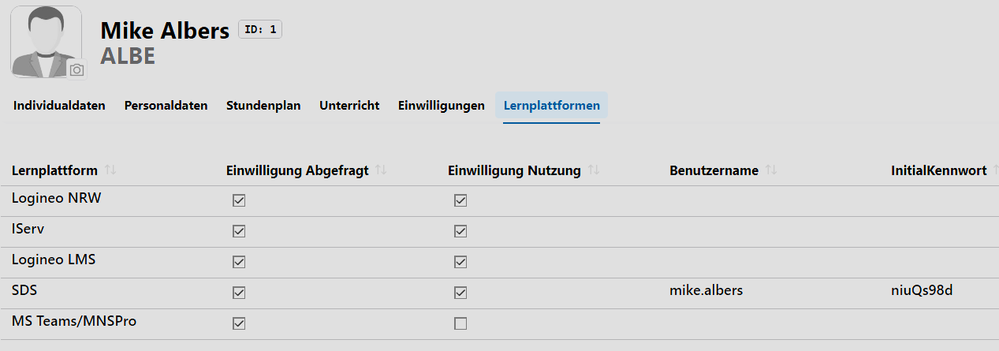
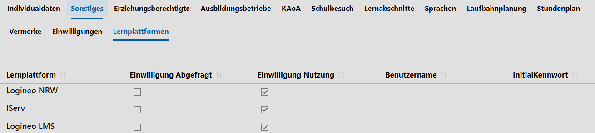

# Lernplattformen

Definieren Sie die **Lernplattformen**, die in der Schule genutzt werden und für die Einwilligungen erfasst werden sollen.

Neben der Erfassung der Einwilligungen stehen die definierten Lernplattformen über die **App Schule** zum **Datenaustausch** zur Verfügung.

## Anwendungen als Beispiel

Erfassen Sie Lernplattformen und Einwilligungen in der **App Lehrkräfte**:

Entsprechend funktioniert auch die Erfassung in der **App Schüler ➜ Sonstiges ➜ Lernplattformen**

Die im Katalog eingetragenen und bei den Schülern erfassten Lernplattformen sind beim **Datenexport** relevant: Ohne eine im Katalog existierende Lernplattform kann für diese kein Datenaustausch angestoßen werden und ohne für die Lernplattform vorliegende Einwilligung bei einer Schüler oder einer Schülerin wird für diesen Datensatz kein Export herausgeschrieben.