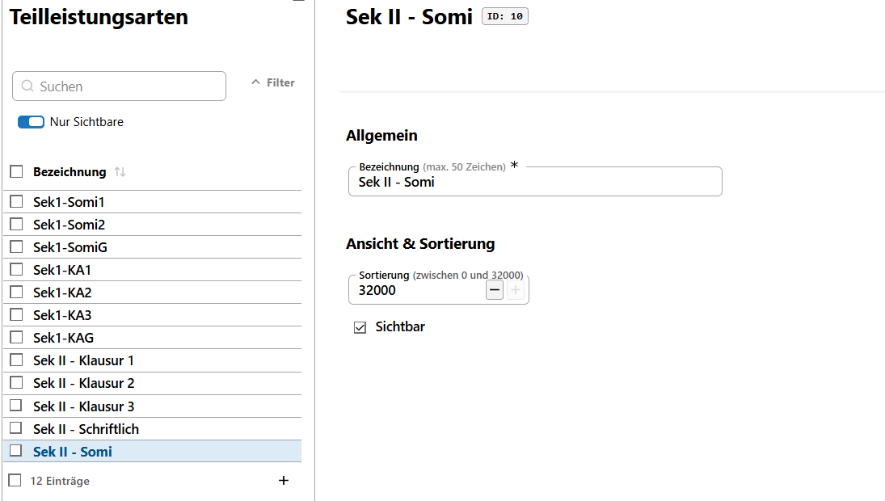

# Teilleistungsarten

Mit **Teilleistungen** lassen sich in den *Leistungsdaten eines Lernabschnitts* für Fächer weitere Teilnoten neben den eigentlichen Noten erfassen.

Die **Teilleistungsarten**, die an der Schule verwendet werden können, werden in der **App Schule** über **Kataloge Teilleistungsarten** erzeugt, sortiert und entfernt.

Nicht in jedem Fach beziehungsweise in jeder Jahrgangsstufe wird auch jede Teilleistung verwendet, hier im Beispiel sind gesonderte Teilleistungen für die Sekundarstufe I und II definiert worden.

Es kann sein, dass Arbeiten/Klausuren in den unteren Jahrgangsstufen an einer Schule nicht gesondert erfasst werden, an einer anderen aber schon.

Neben diesen Beispielen lassen sich noch beliebige andere Teilleistungsarten erzeugen.

::: tip Müssen wir das machen?
Die Verwendung von Teilleistungen ist nicht verpflichtend.
:::

## Anwendungsfall

Derzeit werden die Teilleistungen in den Leistungsdaten der Schülerinnen noch über SchILD-NRW 3 verwaltet.
