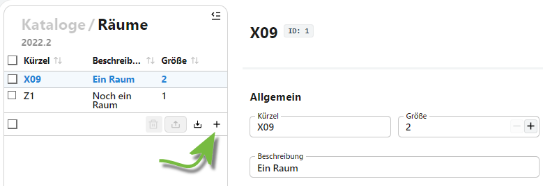
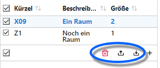

# Räume

Die Vorlageneinträge für *Räume*, *Pausenzeiten*, *Zeitraster*, *Klassen* und *Aufsichtsbereiche* werden bei der Stundenplanerstellung zusammengeführt.

## Räume anlegen und verwalten

Über diese Vorlage lassen sich *Räume* erfassen, die dann über den Stundenplan verplant werden können.



Erzeugen Sie über das **+** neue Räume, im Screenshot wird es durch den grünen Pfeil gezeigt.

In jedem Raum können ein **Kürzel** und eine **Größe** für einen Raum vergeben werden.

Bei der **Größe** ist die maximale Personenzahl anzugeben, die in diesem Raum verplant werden kann. Kleinere Besprechungsräume könnten mit einer Größe von *12* hinterlegt sein, Klassenräume könnten beispielsweise eine Größe von *34* haben, Turnhallen *90* und eine Aula *300*.

Weitere Informationen lassen sich in der **Beschreibung** hinterlegen.

## Export, Import und Löschen

Über die Auswahlliste steht ein **Import** zur verfügung, über den eine `json`-Datei mit Rauminformationen eingelesen werden kann.



Hat man Räume über die Checkboxen angewählt, können diese **exportiert** oder über das Mülleimer-Icon 🗑 gelöscht werden.

Bei der Datei handelt es sich um eine  `JSON`-Datei.

```json
[{"id" : 2,"kuerzel" : "R2","beschreibung" : "Ein zweiter Raum","groesse" : 1},{"id" : 1,"kuerzel" : "R1","beschreibung" : "Ein erster Raum","groesse" : 2}]
```
