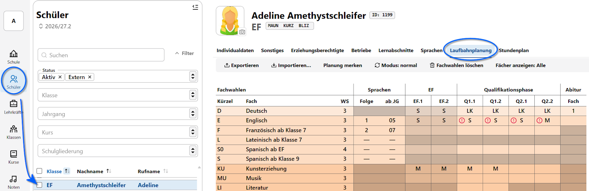
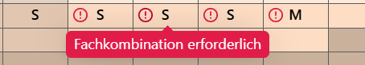
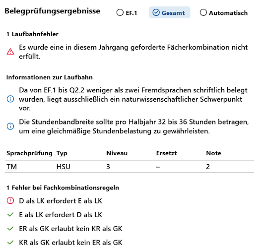
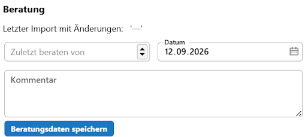
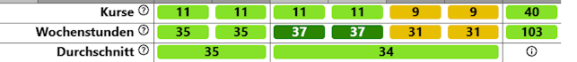

# Laufbahnplanung

# IV. Laufbahnplanung

In der Laufbahnplanung werden die Schülerinnen und Schüler durch Jahrgangskoordinatoren beraten und durch den Wahlprozess der Oberstufenlaufbahn begleitet. Oftmals werden hier auch Wahlalternativen besprochen.

Typische Alternativen sind die Wahl der Leistungskurse, der Abiturfächer, eventuelle spätere Abwwahlen von "dem einen Fach" oder "dem anderen Fach" oder die mündliche oder schriftliche Belegung von Grundkursen, woran auch die Wahl möglicher Abiturfächer hängt.

Gleichzeitig werden die Laufbahnen durch die Jahrgangskoordinationen und die dafür verantwortliche **Oberstufenkoordination** auf Gültigkeit geprüft, so dass alle Schüler mindestens eine garantiert zulässige Laufbahn von der EF über die Q2 bis zum Abitur haben und diese auch so vollständig - natürlich vorbehaltlich später eventuell möglicher Umwahlen - gewählt ist. 

:::tip APO GOSt und Kommmentare
Konsultieren Sie unbedingt zusätzlich zu diesem Handbuch die jeweils für einen Jahrgang gültige APO GOSt und die zugehörigen Verwaltungsvorschriften und Kommentare. Die Oberstufenkoordination klärt eventuelle Unklarheiten mit der zuständigen übergeordneten Stelle. Dieses Handbuch versteht sich als praktische Anleitung, nicht als rechtlich belastbare Erläutung einer Prüfungsordnung.

Sind Sie neu in der Oberstufenberatung, ist an dieser Stelle zu empfehlen, die Paragrahpen der APO GOSt bezüglich der Belegpflichten und vorgesehenen Kurse/Kursarten zu lesen.

Auch die in Schulverwaltungssoftware enthaltenen Prüfalgorithmen sind als Unterstützung zu verstehen: die Verantwortung für die Korrektheit der Beratungsprozesse liegt immer bei den zuständigen Menschen.
:::

## Im SVWS-Client 

Öffenen Sie im SVWS-Client eine Schülerin aus dem *Jahrgang 10* oder aus *einem der Oberstufenjahrgänge*.

Es erscheint nun der **Tab Laufbahnplanung**.

Hier im Screenshot ist zu sehen, dass die **Sprachenfolgen** korrekt eingetragen sind, da der Bereich mit den **Sprachen** korrekt mit der 1. und 2. Fremdsprache mit ihren jeweiligen Beginnen korrekt erscheint.

Handelt es sich bei diesen Sprachen um Fächern, die in der Oberstufe weiterbelegt werden können, ist nun auch eine Wahl in den **Spalten der Jahrgänge** möglich.

**Fächer** werden belegt, indem Sie in der Spalte der zwei Halbjahre für EF, Q1 und Q2 eine Kursart anwählen. Dies geschieht durch einen Klick in das jeweilige Feld.

Kursarten sind in der EF *M* und *S* für mündliche und schriftliche Belegungungen. Ab der Q-Phase kann weiterhin die Kursart *LK* angewählt werden.

Weitere Kursarten wie *ZK* für Zusatzkurse sind möglich.

In der Spalte ganz rechts werden schließlich die **Abiturfächer** eingetragen. Hier im Beispiel ist der Deutsch-LK das 1. Abiturfach.

### Belegfehler und Stundensummen

Schauen Sie im Screenshot auf die Zeile **E Englisch**: die roten Symbole geben einen Belegungsfehler an.

Wird der Mauszeiger über das Fehlersymbol bewegt, erscheint die Fehlerinformation:

Weitere Informationen zu Fehlern und auch erfolgreichen Laufbahnprüfungen finden Sie auf der rechten Seite unter **Belegoprüfungsergebnisse**:

In dieser Zusammenfassung sehen Sie, welche **Laufbahnfehler** gefunden werden, welche **Informationen zur Laufbahn** zu geben sind und ob alle für diesen Jahrgang definierten **Fachkombinationsregeln** erfüllt oder nicht erfüllt sind.

In diesem Fall wird bei den Informationen angezeigt, dass eine Prüfung im *Herkunftssprachlichen Unterricht* in Türkisch abgelegt wurde.

Ebenfalls auf der rechten Seite ist ein Feld, um den **Beratung**sprozess mit der letzten Beratung und Kommentaren festzuhalten.
 
 

 Halten Sie hier zum Beispiel fest, dass Sie noch einmal über "SoWi oder Geschichte" sprechen wollten oder dass von den "44-Wochenstunden in der Q-Phase" dringend abgeraten wurde, der Schüler das aber so unbedingt einfordert. 

Im Fuß des Beratungsbogens ist eine Zusammenfassung der belegten Kurse und der Wochenstunden über alle Halbjahre von der EF bis zur Q2.2 zu sehen.

Zusätzlich sind die durchschnittlichen Stundensummen einmal über die *zwei Halbjahre der EF* und über die *vier Halbjahre der Q-Phase* zu sehen.

Hierbei kennzeichnet
* eine rote Einfärbung, dass die notwendigen Kurse und Stundensummen nicht erreicht wurden. Es müssen weitere Kurse belegt werden.
* eine gelbe Einfärbung, dass die Zahl der Kurse/Wochenstunden gerade ausreichend ist, bei einem Ausfall des Kurses wären die geforderten Kriterien nicht mehr erfüllt. Eine Abwahl eines Kurses ist somit nicht mehr möglich.
* eine dellgrün Einfärbung deutet auf eine leichte Überbelegung hin, bei der auch die Kurszahl und Stundenzahl nicht zu einer erheblichen Arbeitsbelastung führt.
* eine dunkelgrüne Einfärbung ist eine Belegung mit Abwahlmöglichkeiten. Hier ist zu beachten, dass die Kurse und Stunden mitunter viel Arbeit sind, oftmals sind hier aber auch noch Alternativen angewählt, die zum Übergang von der EF zur Q1 abgewählt werden oder die im Laufe der Q-Phase abgewählt werden. Bei Kurswahlen mit 39 Wochenstunden oder mehr könnte über eine weiteren Beratungstermin nachgedacht werden.

## Schalter und Funktionen Hochschreiben usw, Planung merken

# Laufbahnplanung WebLuPO

## Dateien Im- und Exportieren

## Einzeln, Jahrgangsweise