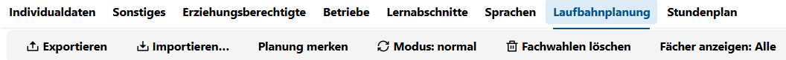
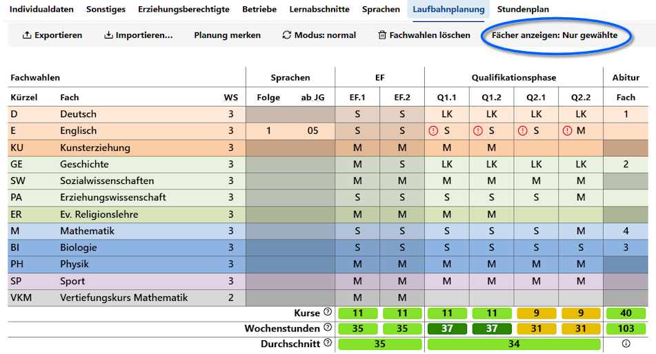
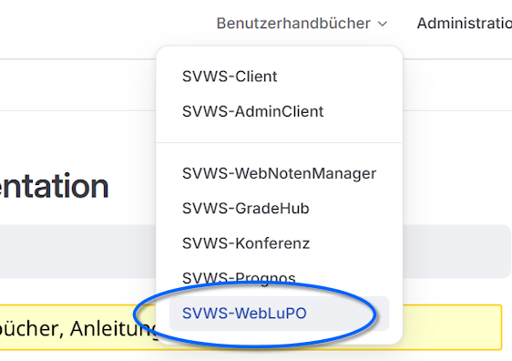
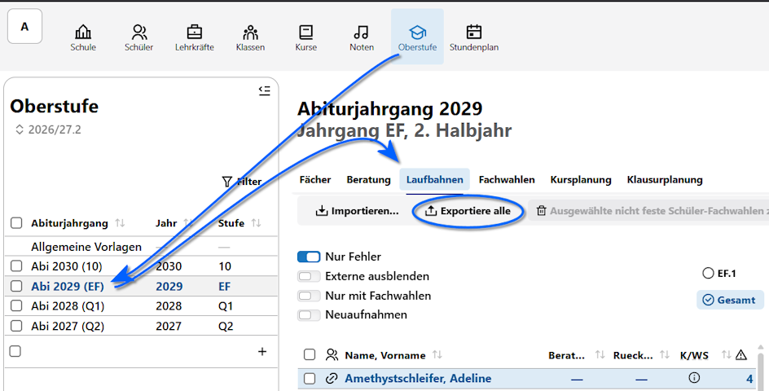
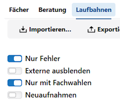
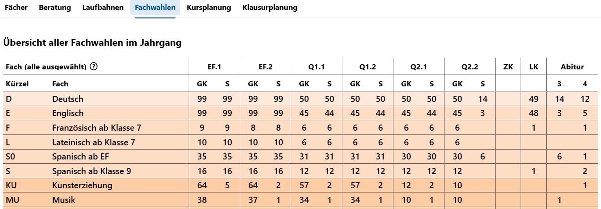

# Laufbahnplanung

# IV. Laufbahnplanung

In der Laufbahnplanung werden die Schülerinnen und Schüler durch Jahrgangskoordinatoren beraten und durch den Wahlprozess der Oberstufenlaufbahn begleitet. Oftmals werden hier auch Wahlalternativen besprochen.

Typische Alternativen sind die Wahl der Leistungskurse, der Abiturfächer, eventuelle spätere Abwwahlen von "dem einen Fach" oder "dem anderen Fach" oder die mündliche oder schriftliche Belegung von Grundkursen, woran auch die Wahl möglicher Abiturfächer hängt.

Gleichzeitig werden die Laufbahnen durch die Jahrgangskoordinationen und die dafür verantwortliche **Oberstufenkoordination** auf Gültigkeit geprüft, so dass alle Schüler mindestens eine garantiert zulässige Laufbahn von der EF über die Q2 bis zum Abitur haben und diese auch so vollständig - natürlich vorbehaltlich später eventuell möglicher Umwahlen - gewählt ist. 

:::tip APO GOSt und Kommmentare
Konsultieren Sie unbedingt zusätzlich zu diesem Handbuch die jeweils für einen Jahrgang gültige APO GOSt und die zugehörigen Verwaltungsvorschriften und Kommentare. Die Oberstufenkoordination klärt eventuelle Unklarheiten mit der zuständigen übergeordneten Stelle. Dieses Handbuch versteht sich als praktische Anleitung, nicht als rechtlich belastbare Erläutung einer Prüfungsordnung.

Sind Sie neu in der Oberstufenberatung, ist an dieser Stelle zu empfehlen, die Paragrahpen der APO GOSt bezüglich der Belegpflichten und vorgesehenen Kurse/Kursarten zu lesen.

Auch die in Schulverwaltungssoftware enthaltenen Prüfalgorithmen sind als Unterstützung zu verstehen: die Verantwortung für die Korrektheit der Beratungsprozesse liegt immer bei den zuständigen Menschen.
:::

## Schulische Rahmenbedingungen

Weiterhin wichtig ist, sich unter entsprechenden Umständen schon vor der Laufbahnwahl durch die Schüler und Schülerinnen einer neuen EF über das zukünftige Kursangebot Überlegungen anzustellen. Es gibt zahlreiche Fragen und jede Schule ist hier individuell.

Die folgenden Punkte sollen nur als Beispiel verstanden werden: Sollen Profile angeboten werden, bei denen bestimmte Kurse aneinander gekoppelt wird? Wird ein Chemie-LK eingerichtet - oder findet der ohnehin nicht statt? Wird eine Belegung von allen drei Naturwissenschaften zugelassen oder lässt sich das in der Stundenplankopplung aller anderen Kurse praktisch nicht einrichten? Haben Sie Kooperationsschulen und können damit rechnen, dass darüber Kurse eingerichtet werden können, die Ihre Schule alleine nicht füllen könnte? Gehen Sie davon aus, dass jedes Nebenfach in zwei oder drei Kursen angeboten werden kann? Welche Sprachen werden angeboten?

Lassen Sie zu viele freie Wahlen oder Konstellationen zu, die nicht zu Stande kommen, folgen eventuell notwendige Beratungen, bei denen aufwendig Umwahlen beraten oder verfügt werden müssen.

Planen Sie im Vorfeld und räumen Sie ausreichend Vorlauf ein.

## Im SVWS-Client 

Öffenen Sie im SVWS-Client eine Schülerin aus dem *Jahrgang 10* oder aus *einem der Oberstufenjahrgänge*.

Es erscheint nun der **Tab Laufbahnplanung**.

Hier im Screenshot ist zu sehen, dass die **Sprachenfolgen** korrekt eingetragen sind, da der Bereich mit den **Sprachen** korrekt mit der 1. und 2. Fremdsprache mit ihren jeweiligen Beginnen korrekt erscheint.

Handelt es sich bei diesen Sprachen um Fächern, die in der Oberstufe weiterbelegt werden können, ist nun auch eine Wahl in den **Spalten der Jahrgänge** möglich.

**Fächer** werden belegt, indem Sie in der Spalte der zwei Halbjahre für EF, Q1 und Q2 eine Kursart anwählen. Dies geschieht durch einen Klick in das jeweilige Feld.

Kursarten sind in der EF *M* und *S* für mündliche und schriftliche Belegungungen. Ab der Q-Phase kann weiterhin die Kursart *LK* angewählt werden.

Weitere Kursarten wie *ZK* für Zusatzkurse sind möglich.

In der Spalte ganz rechts werden schließlich die **Abiturfächer** eingetragen. Hier im Beispiel ist der Deutsch-LK das 1. Abiturfach.

### Belegfehler und Stundensummen

Schauen Sie im Screenshot auf die Zeile **E Englisch**: die roten Symbole geben einen Belegungsfehler an.

Wird der Mauszeiger über das Fehlersymbol bewegt, erscheint die Fehlerinformation:

Weitere Informationen zu Fehlern und auch erfolgreichen Laufbahnprüfungen finden Sie auf der rechten Seite unter **Belegoprüfungsergebnisse**:

In dieser Zusammenfassung sehen Sie, welche **Laufbahnfehler** gefunden werden, welche **Informationen zur Laufbahn** zu geben sind und ob alle für diesen Jahrgang definierten **Fachkombinationsregeln** erfüllt oder nicht erfüllt sind.

In diesem Fall wird bei den Informationen angezeigt, dass eine Prüfung im *Herkunftssprachlichen Unterricht* in Türkisch abgelegt wurde.

Ebenfalls auf der rechten Seite ist ein Feld, um den **Beratung**sprozess mit der letzten Beratung und Kommentaren festzuhalten.
 
 

 Halten Sie hier zum Beispiel fest, dass Sie noch einmal über "SoWi oder Geschichte" sprechen wollten oder dass von den "44-Wochenstunden in der Q-Phase" dringend abgeraten wurde, der Schüler das aber so unbedingt einfordert. 

Im Fuß des Beratungsbogens ist eine Zusammenfassung der belegten Kurse und der Wochenstunden über alle Halbjahre von der EF bis zur Q2.2 zu sehen.

Zusätzlich sind die durchschnittlichen Stundensummen einmal über die *zwei Halbjahre der EF* und über die *vier Halbjahre der Q-Phase* zu sehen. 

Übliche Stundensummen liegen zwischen 33 und 36, besonders Überschreitungen in der Planungsphase sind mitunter möglich. 

Hierbei kennzeichnet

* eine rote Einfärbung, dass die notwendigen Kurse und Stundensummen nicht erreicht wurden. Es müssen weitere Kurse belegt werden.
* eine gelbe Einfärbung, dass die Zahl der Kurse/Wochenstunden gerade ausreichend ist, bei einem Ausfall des Kurses wären die geforderten Kriterien nicht mehr erfüllt. Eine Abwahl eines Kurses ist somit nicht mehr möglich.
* eine dellgrün Einfärbung deutet auf eine leichte Überbelegung hin, bei der auch die Kurszahl und Stundenzahl nicht zu einer erheblichen Arbeitsbelastung führt.
* eine dunkelgrüne Einfärbung ist eine Belegung mit Abwahlmöglichkeiten. Hier ist zu beachten, dass die Kurse und Stunden mitunter viel Arbeit sind, oftmals sind hier aber auch noch Alternativen angewählt, die zum Übergang von der EF zur Q1 abgewählt werden oder die im Laufe der Q-Phase abgewählt werden. Bei Kurswahlen mit 39 Wochenstunden oder mehr könnte über eine weiteren Beratungstermin nachgedacht werden.

Der Schnitt über jeweils die EF und die Q-Phase wird als letzte Zeile angezeigt. In der EF werden oftmals Vertiefungskurse belegt, um auch noch die notwendige Stundenzahl zu erreichen. 

## Schalter und Funktionen Hochschreiben usw, Planung merken

Die Laufbahnplanung bietet einige Funktionen, die hier als Übersicht aufgelistet werden:

* Mit einem Klick auf **Exportieren** können Sie eine WebLuPO-Datei von genau der einen Laufbahnwahl genau dieser Schülerin erzeugen, die den aktuellen Wahlstand wiedergibt. Es öffent sich der Dialog Ihres Webbrowsers und Sie können einen Speicherort für die Datei wählen. Die Datei wird nach dem Schema `Laufbahnplanung_2029_EF_Amethystschleifer_Adeline_1199.lp` genanntbenannt werden, wobei die letzte Zahl die eindeutige SVWS-ID dieser Person in der Datenbank ist.

* Entsprechend können Sie über **Importieren...** eine persönliche WebLuPO-Datei einlesen.

* Ein Klick auf **Planung merken** färbt den Untertab rot ein und blendet zusätzlich den Untertab **Planung wiederherstellen** ein. Sie haben nun einen Modus aktiviert, in dem Sie andere Wahlen ausprobieren können und ein Klick auf `Planung wiederherstellen` lädt den originalen Stand zurück. Nutzen Sie die Möglichkeit zur Wiederherstellung nicht, sondern arbeiten weiter, werden die Änderungen als neue Planung behalten.

* Im **Modus: normal** werden Fachwahlen automatisch hochgeschrieben, das bedeutet bei einer Anwahl von *M* in der Q1.1 werden die übrigen Halbjahre der Q-Phase ebenfalls mit *M* befüllt. Im **Modus: manuell** können und müssen Sie jedes Halbjahr einzeln konfigurieren.

* **Fachwahlen löschen** erzeugt einen Dialog der nachfragt, ob Sie dies wirklich tun wollen und bei einer Bestätigung wird der Wahlbogen geleert.

* **Fächer anzeigen: alle** ist zum Abschluss der Wahl sehr nützlich, da alle nicht angewählten Fächer ausgeblendet werden und sich die Zeilenanzahl stark reduziert. Nachdem die ersten Fachwahlen abgeschlossen sind, sollten Sie die Darstellung *Nur gewählte* nutzen.

## Laufbahnplanung mit WebLuPO

Sie können Laufbahnplanungen von Schülern auch mit dem externen Programm **WebLuPO** durchführen lassen. WebLuPo nutzt die gleiche Laufbahnwahl-Oberfläche, die hier in diesem Artikel besprochen wurde.

Schauen Sie hierzu in das im Kopf dieser Dokumentation verlinkte **Handbuch zu WebLuPO**.

Hier im Handbuch der Oberstufenkoordination folgt in Kürze der Im- und Export von WebLuPO-Datein im SVWS-Client, um anschließend in der App Oberstufe die Laufbahnwahlen zu sichten und zu kontrollieren.

Bei WebLuPO handelt es sich über ein mit einem Browser aufrufbares Werkzeug für die **L**aufbahn **u**nd **P**lanung in der **O**berstufe. Sie können WebLuPO im pädagogischen Netz laufen lassen oder auch über das Internet erreichbar machen. Es werden keine Daten zu einem Server geschickt, sondern nur lokal auf einem Client verarbeitet.

Der Vorteil hier ist, dass es keine Datenschutzbedenken bezüglich des Servers gibt - der Nachteil hingegen ist, dass die Laufbahnwahlen verteilt und wieder eingesammelt werden müssen.

Es gibt mehrere Möglichkeiten, mit WebLuPO zu arbeiten

* **Gar nicht**. Führen Sie die Beratungen in der Schule zusammen mit den Schülerinnen und Schülern in einem Beratungsbüro, dem Lehrerzimmer Sek II an Rechnern oder dem Koordinatorenbüro aus, wo überwachte Rechner mit Zugang zum Verwaltungsnetz stehen, können Sie die Beratungen direkt am SVWS-Client durchführen. Sie müssen somit kein WebLuPO betreiben.
* Die Schülerinnen und Schüler verwenden WebLuPO von zu Hause aus. Machen Sie **WebLuPO über das Internet** zugänglich und nutzen Sie einen datenschutzkonformen Weg, die *Schüler-Web-LuPO-Dateien* (.lp-Dateien) zu verteilen und einzusammeln, werden die Wahlbögen im Anschluss wieder im SVWS-Client eingesammelt. Der Vorteil ist, dass die SuS sich in aller Ruhe mit der Wahl beschäftigen können - der Nachteil ist hingegen, dass man das Verteilen und Einsammeln organisieren und die Fern-Verwendung supporten muss.
* Die Verwendung von **WebLuPO im Computerraum**. Sie installieren WebLuPO im pädagogischen Netz oder im Internet und greifen 10er-klassenweise oder mit kleineren Gruppen, zum Beispiel halbe Klassen, auf WebLuPO zu und führen dann zusammen mit Jahrgangskoordinatoren die Wahlen durch. Der Vorteil hier ist, dass die .lp-Dateien an einem festen Speicherplatz im Computerraum liegen und dort auch wieder auflaufen und leicht zur Weiterarbeit eingesammelt werden können.

Nutzen Sie die obigen Wege alleine oder in Kombination oder andere Möglichkeiten so, wie es an Ihrer Schule sinnvoll erscheint.

:::tip Dateiendungen und MS Windows
Hier im Handbuch werden die Schüler-Laufbahnwahldateien als ".lp"-Datei bezeichnet. Beachten Sie, dass MS Windows per Standard Dateienungen ausblendet, Sie diese also nicht sehen.

WebLuPO selbst läuft im Browser und setzt somit kein MS Windows voraus.
:::

Abschließend finden sich oben rechts zwei Schaltflächen:

Über **Laufbahnwahlbogen** wird ein druckbarer Wahlbogen als .pdf-Datei generiert. Dieser fasst die Laufbahn wie beraten zusammen und behinhaltet ebenfalls die sehr wichtigen Felder für **Unterschriften**.

:::tip Lassen Sie sich wichtige Meilensteine der Laufbahnberatung unterschreiben
Werden wichtige Meilensteine der Laufbahnwahl erreicht, könnte es empfehlenswert sein, sich die jeweiligen Laufbahnwahlbögen unterschreiben zu lassen. Zeitpunkte hierfür könnte die abschließende Wahl zur EF sein, dann die Wahl der Leistungskurse in der Q-Phase oder der Abiturfächer.

Mitunter fallen auch individuelle Beratungsprozesse an, bei denen darüber nachgedacht werden kann, eine Bemerkung einzutragen und sich den Bogen ebenfalls noch einmal unterschreiben zu lassen. Mitunter werden Laufbahnen gewünscht und trotz Beratung angestrebt, die eine erhebliche Arbeitsbelastung darstellen.  

Weisen Sie die Schülerinnen und Schüler eventuell auch darauf hin, selbst ihre Wahlen - auch die Mündlichkeit und Schriftlichkeit - zu kontrollieren und die Laufbahnwahlbögen weiterhin im Blick zu haben.
:::

Der Knopf **Hilfe** bietet eine zusammenfassende Übersicht über den aktuellen Tab zur Laufbahnwahl.

### WebLuPO-Dateien erzeugen

Um die WebLuPO-Datei für eine Person zu exporieren und später wieder einzulesen, gehen Sie vor, wie hier oben beim Schalter **Exportieren** und **Importieren** beschrieben. Für einen kompletten Jahrgang nutzen Sie einen besseren Weg:

Gehen Sie über die `App Oberstufe`, dann wählen Sie Ihren gewünschten **Abiturjahrgang**.

Klicken Sie im **Tab Laufbahnen** auf `Exportiere alle`.

Es wird eine gepackte Datei mit allein Laufbahnwahlen generiert, die Sie über die Download-Mechanik Ihres Browsers speichern. Per Standard heißt die Datei `Laufbahnplanungen.zip`, die Sie noch umbennnen können, etwa, in dem Sie den Abiturjahrgang und den Jahrgang hinzufügen.

Diese Datei können Sie im Anschluss entpacken.

:::tip Enpacken Sie die Dateien
Wie Sie dies machen, hängt vom verwendeten Betriebssystem ab. Unter MS Windws klicken Sie im Windows-Explorer mit der rechten Maustaste auf die Datei und wählen Sie "Alle Extrahieren..."
:::

Lassen Sie nun die Fachwahlen in einem Ihnen passenden WebLuPO-Modus durchführen. Am Ende von diesem Prozess haben Sie viele WebLUPO-Wahldateien, die wieder in den SVWS-Client eingelesen werden müssen.

### WebLuPO Schüler-Laufbahnwahldateien wieder einlesen

Im Anschluss an den Beratungs- und Wahlprozess können Sie in der **App Oberstufe** bei **Laufbahnen** auf `Importieren...` klicken.

Es öffnet sich ein Auswahldialog.

Typischerweise können Sie die oberste Datei einmal anklicken, dann scrollen sie nach unten, halten `SHIFT` gedrückt und klicken die unterste Datei an. Dann haben Sie alle Dateien ausgewählt. Bestätigen Sie die Auswahl und die Dateien werden eingelesen.

Alternativ halten Sie `STRG` gedrückt und wählen Sie alle Dateien einzeln an, die Sie nun importieren möchten.

Die Laufbahnwahlen sind nun im SVWS-Client eingelesen und können weiterverarbeitet werden.

## Laufbahnplanung abschließen

Um den Wahlprozess der Laufbahnen abzuschließen, müssen Sie alle Laufbahnen kontrollieren. Gehen Sie hierzu in der **App Oberstufe** in den **Tab Laufbahnen**.

Achten Sie darauf, den jeweils zu bearbeitenden Abiturjahrgang auszuwählen.

Finden Sie alle Fehler, prüfen Sie, ob alle Beratungsprozesse abgeschlossen sind. Ebenso sind auch noch später hinzugekommene Schüler mit gültigen Laufbahnen zu versehen. 

:::tip Jahrgang 10
Im Jahrgang 10 haben Sie mitunter noch Schüler in der Übersicht, die nicht in die gymnasiale Oberstufe weitergehen. Dies ist besonders an Gesamtschulen der Fall. Klickne Sie hier auf den Schalter **Nur mit Fachwahlen**, dann werden alle Personen ausgefiltert, die keine Laufbahn gewählt haben - also grundsätzlich 10er, die nicht in die GOSt gehen werden. 
:::

Wie im Tipp oben ausführt, können Sie die Schülerliste weiter filtern:

Zusätzlich zum oben erwähnten Filter können Sie die Personen auf Schülerinnen und Schüler reduzieren, indem Sie über **Nur Fehler** nur die mit Fehlern anzeigen lassen. Alternative können Sie **Externe Schüler** ausblenden oder nur **Neuaufnahmen** anzeigen lassen.

### Fachwahlen sichten und Entscheidungen treffen

Werfen Sie an dieser Stelle schon einen Blick in die **Zusammenfassung der Fachwahlen**.

In dieser Tabelle werden alle aufgelistet. Jede Spalte zeigt erst die *Teilnehmer eines GKs*, dann die *Zahl der Schriftlichkeit* in diesen GKs. Für die Q-Phase werden hierzu noch die *LK* gerechnet. In der letzten Spalte sehen Sie eine Übersicht über die *Abiturfächer*.

Stellen Sie fest, dass sich Kurskombinationen nicht umsetzen lassen oder zeichnen sich an dieser Stelle Probleme mit dem Stundenplan oder auch dem vorhandenen Lehrpersonal ab, müssen eventuell Umwahlen beraten werden.

Weiterhin lässt schon absehen, ob etwa ein Fach wie Musik bis zur Q2.2 angeboten werden muss oder ob es möglich ist, das Fach nur bis zu einem vorherigen Halbjahr laufen zu lassen.

:::tip Ziele
Das Ziel ist an dieser Stelle, zum einen eine Fachwahl für einen Jahrgang vorliegen zu haben, die sich tatsächlich in der Schule planen lässt. Sprechen Sie hierzu mit der Stundenplan-Erstellung oder anderen beteiligten Personen. Entscheidungen sind unter Umäständen mit der Schulleitung abzustimmen.

Das andere Ziel ist, dass jeder Schüler und jede Schüler mindestens eine garantiert gültige Laufbahn bis zum Abitur hat und über diese informiert ist.

Eventuell sind auch Zielsetzungen des Schulkonzepts als wesentlicher Faktor zu beachten.
:::

Sind alle Fachwahlen zufriedenstellend eingegangen und kontrolliert, können Sie daran gehen, eine **Blockung** für den Jahrgang zu berechnen, die dem neuen Stundenplan zur Grunde liegt.